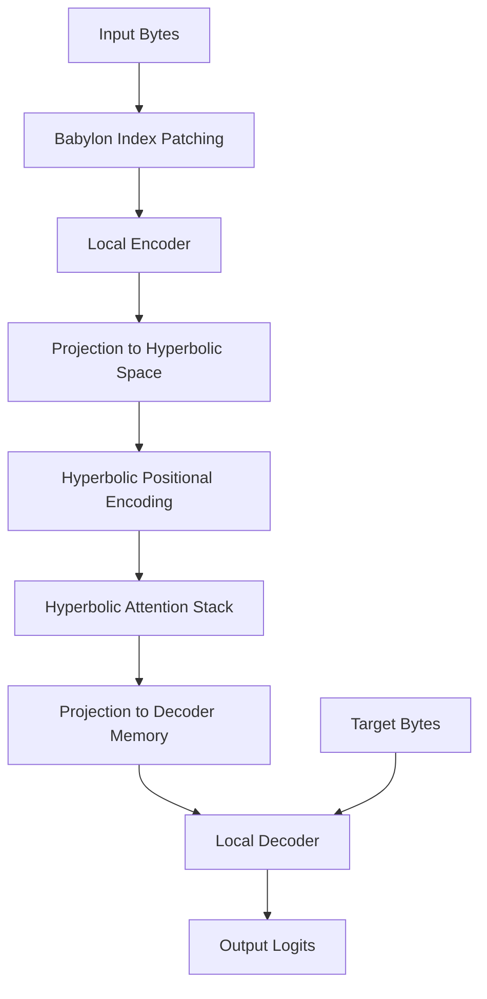
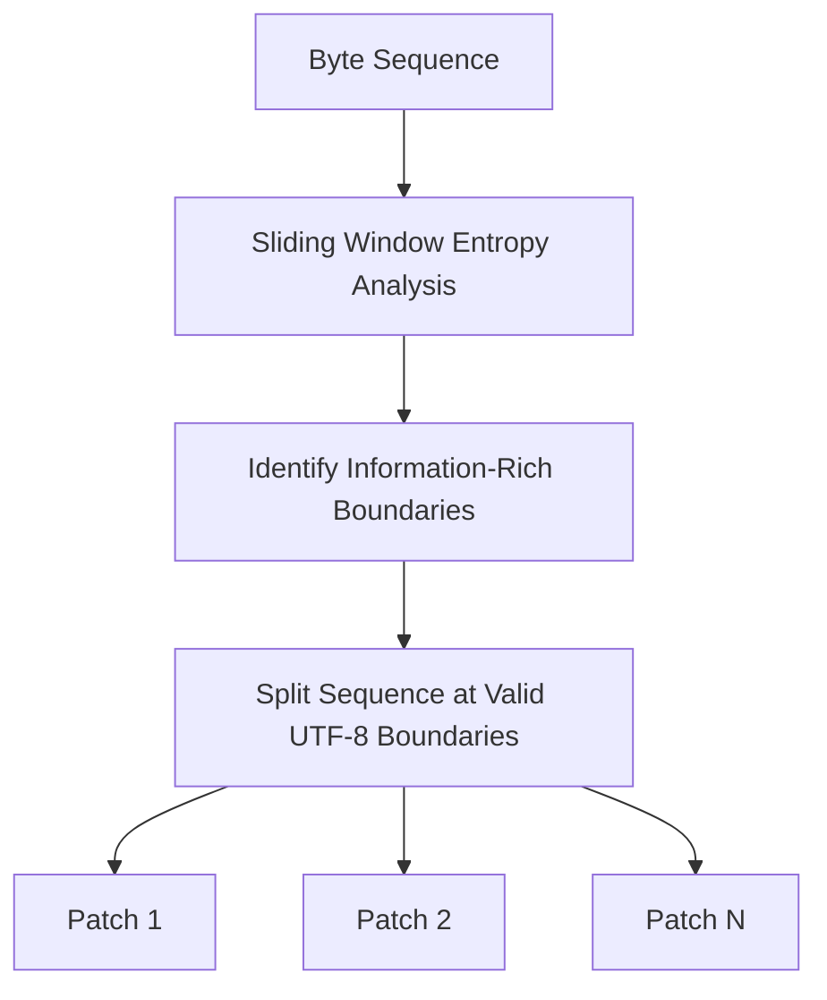
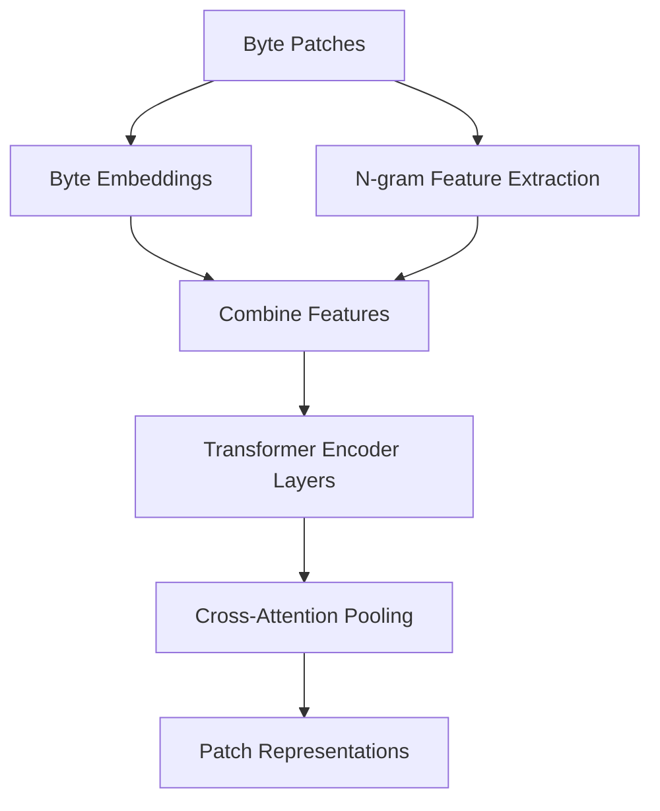
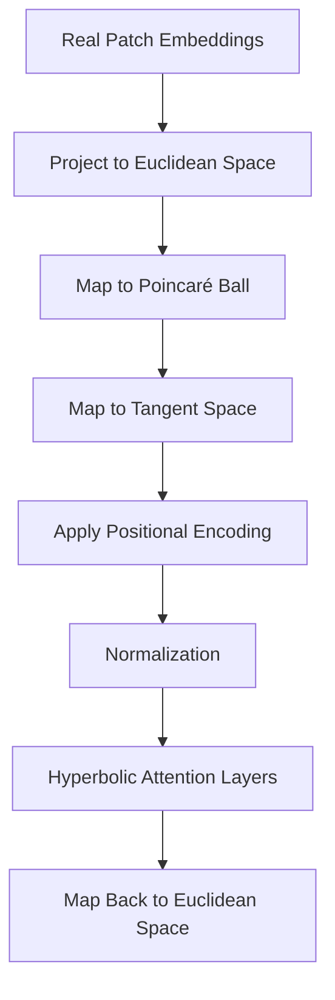
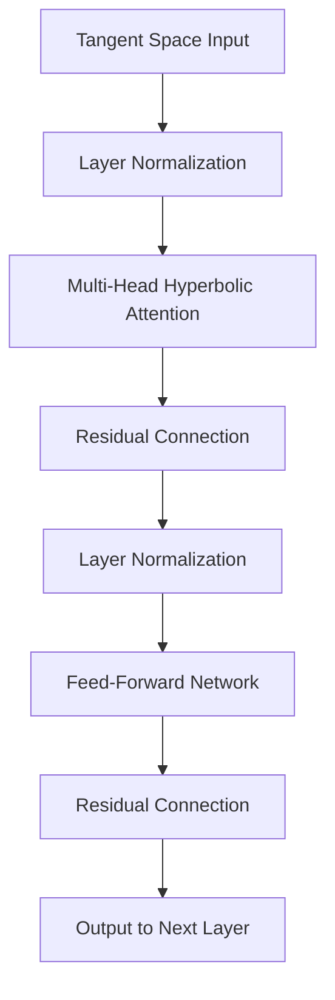
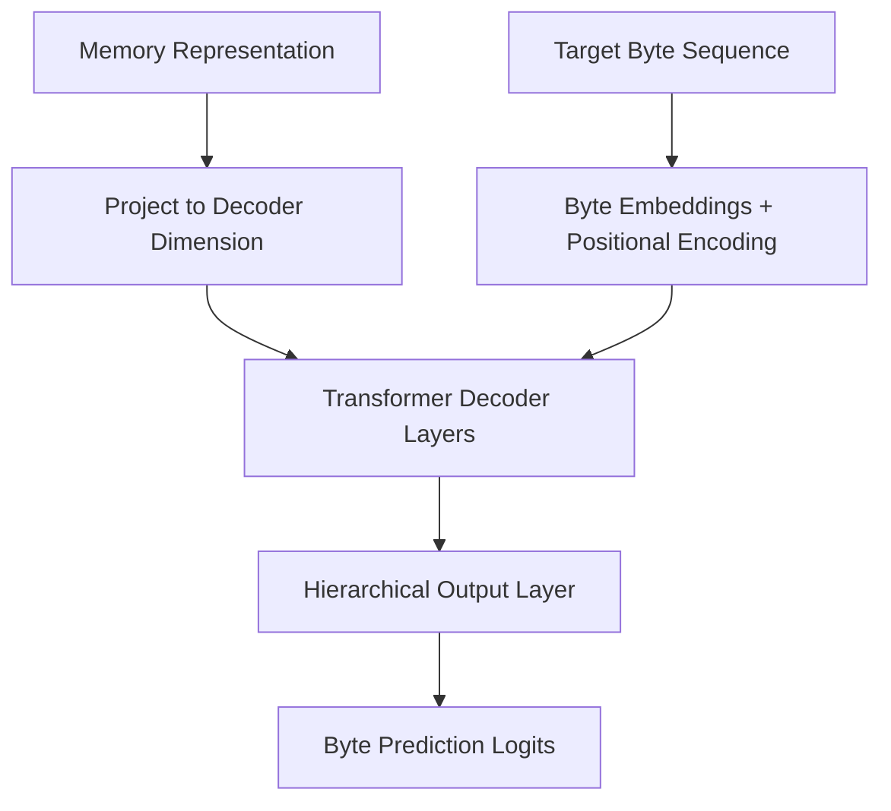
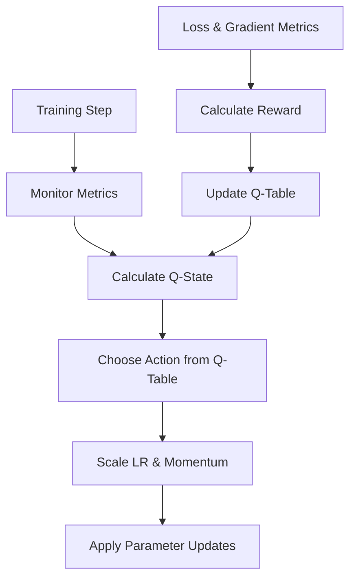

# Bytropix Integrated HyperHAKMEM - Hyperbolic Attention for Byte-Level Modeling

An advanced byte-level language model utilizing hyperbolic geometry, Babylon Index patching, and reinforcement learning optimization for next-generation language understanding and generation.

## Overview

The Integrated HyperHAKMEM model (Hyperbolic Attention Knowledge Memory Enhancer Model) is a cutting-edge language model architecture that operates directly at the byte level rather than using tokens. This design offers several advantages:

- **Tokenizer-Free Architecture**: Processes raw UTF-8 bytes directly, removing vocabulary limitations and working with any language or format natively
- **Babylon Index Patching**: Dynamically identifies semantically meaningful patches in byte streams using entropy-based analysis
- **Hyperbolic Attention**: Leverages hyperbolic geometry to better represent hierarchical relationships in language data
- **Q-Learning Enhanced Optimization**: Uses reinforcement learning to dynamically tune hyperparameters during training
- **Gradient Monitoring**: Implements sophisticated gradient statistics tracking to ensure stable training

This implementation is designed for enhanced representation of hierarchical structures in text, making it well-suited for complex language understanding tasks, multi-lingual text processing, and specialized domains where traditional tokenizers struggle.

## Architecture

The Integrated HyperHAKMEM model combines several innovative components:



### 1. Babylon Index Patching

This module performs entropy-based segmentation of byte sequences:



- Calculates Shannon entropy over sliding windows to identify information density patterns
- Finds optimal patch boundaries at entropy transitions while respecting UTF-8 character boundaries
- Creates variable-length patches that preserve meaningful units (words, symbols, etc.)

### 2. Local Encoder

Transforms byte patches into fixed-dimension representations:



- Embeds individual bytes into a learned vector space
- Extracts n-gram features to capture multi-byte patterns
- Processes with transformer layers to contextualize information
- Uses cross-attention with a learned query to pool each patch into a fixed-size representation

### 3. Hyperbolic Processing

Maps and processes embeddings in hyperbolic space:



- Projects real embeddings to hyperbolic-compatible dimensions
- Maps representations to the Poincaré ball model of hyperbolic space
- Processes in the tangent space using specialized hyperbolic attention
- Leverages hyperbolic geometry to efficiently represent hierarchical relationships

### 4. Hyperbolic Attention Layers

The core information processing component:



- Computes attention using hyperbolic distance metrics
- Applies exponential mapping to project query and key vectors to Poincaré ball
- Uses logarithmic mapping to bring results back to tangent space
- Maintains stable gradients through careful normalization and clipping

### 5. Local Decoder

Generates output predictions:



- Projects hyperbolic space representations to real-valued memory
- Uses standard transformer decoder architecture with memory cross-attention
- Employs an optional hierarchical prediction head (16 coarse classes × 16 specific values)
- Produces next-byte prediction logits

### 6. Q-Learning Enhanced SGD Optimizer

Adaptively tunes hyperparameters during training:



- Discretizes the training state based on loss trends, gradient norms, and current hyperparameters
- Learns optimal scaling actions for learning rate and momentum via Q-learning
- Calculates rewards based on loss improvement and gradient stability
- Balances exploration vs. exploitation via dynamic epsilon adjustment

## Installation

```bash
git clone https://github.com/yourusername/integrated-hyperbsfin.git
cd integrated-hyperbsfin

# Create and activate virtual environment
python -m venv venv
source venv/bin/activate  # On Windows: venv\Scripts\activate.bat

# Install dependencies
pip install torch numpy tqdm
# Optional: For logging
pip install wandb
```

## Requirements

- Python 3.8+
- PyTorch 2.0+ (CUDA recommended for performance)
- NumPy
- tqdm
- wandb (optional, for experiment tracking)

## Usage

### Data Preparation

Generate byte-level datasets using the included conversion utilities:

```bash
python convertdata.py
# This creates train and validation .npy files with raw byte data
```

Or use the poem dataset generator for quick testing:

```bash
python poem_dataset_generator.py
# Creates small poem datasets for testing in the data/poems directory
```

### Training

Train the model using the provided script:

```bash
# Basic training
python integrated_hyper_hakmem_model.py \
    --data_path data/wikitext_train.npy \
    --val_data_path data/wikitext_val.npy \
    --batch_size 16 \
    --learning_rate 5e-4 \
    --grad_accum_steps 4 \
    --epochs 12 \
    --local_hidden_size 384 \
    --hyperbolic_embedding_dim 384 \
    --num_hyperbolic_layers 8 \
    --num_hyperbolic_heads 8 \
    --decoder_memory_dim 768 \
    --checkpoint_dir ./checkpoints \
    --max_grad_norm 1.0

# Or use the convenience batch file
run_integrated.bat
```

For faster testing with the poem dataset:

```bash
# Quick testing with poems dataset
run_poem_model.bat
```

### Inference (Text Generation)

Use the model for text generation:

```bash
python inference.py \
    --checkpoint_path checkpoints/checkpoint_epoch_5_step_10000.pt \
    --input_text "The ancient manuscript revealed" \
    --max_length 200 \
    --temperature 0.8 \
    --num_hyperbolic_layers 8 \
    --local_hidden_size 384
```

### Hyperparameters

Key hyperparameters for model configuration:

| Parameter | Description | Default |
|-----------|-------------|---------|
| local_hidden_size | Dimension of local encoder/decoder | 384 |
| hyperbolic_embedding_dim | Dimension of hyperbolic space | 384 |
| num_hyperbolic_layers | Number of hyperbolic attention layers | 8 |
| num_hyperbolic_heads | Number of attention heads per layer | 8 |
| decoder_memory_dim | Dimension of decoder memory | 768 |
| curvature | Hyperbolic space curvature | 0.8 |
| clipping_radius | Poincaré ball clipping radius | 0.99 |
| n_gram_sizes | N-gram sizes for local encoder | [3, 4] |
| n_gram_vocab_size | Vocabulary size for N-gram hashing | 30000 |

Training hyperparameters:

| Parameter | Description | Default |
|-----------|-------------|---------|
| learning_rate | Initial learning rate | 5e-4 |
| weight_decay | L2 regularization strength | 0.01 |
| grad_accum_steps | Gradient accumulation steps | 4 |
| max_grad_norm | Maximum gradient norm for clipping | 1.0 |
| q_learning_rate | Learning rate for Q-controller | 0.01 |
| q_discount | Discount factor for Q-learning | 0.95 |
| q_epsilon | Initial exploration rate | 0.2 |

## Features

- **Byte-Level Processing**: Native handling of any UTF-8 text without vocabulary limitations
- **Dynamic Patching**: Focuses computation on semantically meaningful segments
- **Hyperbolic Geometry**: Better representation of hierarchical structures in language
- **Q-Learning Optimization**: Self-adapting hyperparameters for optimal training
- **Hierarchical Decoder**: Optional two-stage prediction for improved byte distribution modeling
- **Gradient Monitoring**: Advanced tracking of gradient statistics for training stability

## Advanced Components

### Hyperbolic Geometry

The model leverages the Poincaré ball model of hyperbolic geometry to represent hierarchical relationships more efficiently:

- **Exponential Mapping**: Projects from tangent space to Poincaré ball
- **Logarithmic Mapping**: Projects from Poincaré ball back to tangent space
- **Hyperbolic Distance**: Computes attention scores using hyperbolic metrics
- **Stability Techniques**: Ensures numerical stability through proper clipping and normalization

### Q-Learning Controller

The EnhancedSGD optimizer incorporates a Q-learning controller that:

- Monitors training dynamics (loss trends, gradient norms)
- Learns optimal hyperparameter adjustments based on observed performance
- Adapts learning rate and momentum dynamically during training
- Balances exploration and exploitation through epsilon-decay scheduling

### Gradient Statistics

The training infrastructure includes detailed gradient monitoring:

- Tracks clipping rates and magnitudes
- Identifies and handles non-finite gradients
- Provides insights into training dynamics
- Helps inform the Q-controller's decision-making

## Limitations

- **Computational Requirements**: More intensive than traditional token-based models
- **Hyperbolic Sensitivity**: May require careful tuning of hyperbolic parameters
- **Training Stability**: Complex geometry requires robust stability measures
- **Memory Usage**: Processing at byte level can increase memory requirements

## Contributing

Contributions are welcome! Please feel free to submit a pull request or open an issue for bugs, features, or improvements.

1. Fork the repository
2. Create your feature branch (`git checkout -b feature/amazing-feature`)
3. Commit your changes (`git commit -m 'Add some amazing feature'`)
4. Push to the branch (`git push origin feature/amazing-feature`)
5. Open a Pull Request

## License

This project is licensed under the MIT License - see the LICENSE file for details.

## Acknowledgments

- The hyperbolic attention mechanism is inspired by research in hyperbolic neural networks
- Babylon Index patching draws on information theory concepts
- Q-learning optimization builds on reinforcement learning approaches to hyperparameter tuning
- The model architecture incorporates elements from transformer-based language models

## Citation

If you use this code or ideas from this project in your research, please consider citing:

```
@software{Bytropix,
  author = {WaefreBeorn},
  title = {Bytropix,
  year = {2025},
  url = {https://github.com/waefrebeorn/bytropix}
}
```