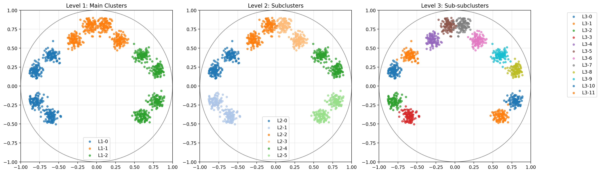
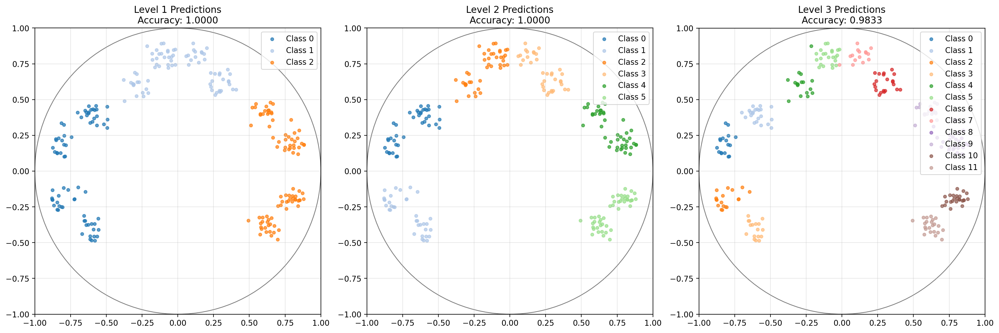

# Bytropix - Byte-Level Modeling with WuBu Nesting

An advanced byte-level language model utilizing **WuBu Nesting** for adaptive multi-scale hyperbolic geometry, integrated with Babylon Index patching and reinforcement learning optimization for next-generation language understanding and generation.

## Overview

**Bytropix** is a cutting-edge language model architecture designed to operate directly at the byte level, bypassing traditional tokenizers. It incorporates the novel **WuBu Nesting (層疊嵌套 - "layered nesting")** framework to capture complex hierarchical structures and rotational dynamics within data.

Key features include:

-   **Tokenizer-Free Architecture**: Processes raw UTF-8 bytes directly, removing vocabulary limitations and working natively with any language or format.
-   **Babylon Index Patching**: Dynamically identifies semantically meaningful patches in byte streams using entropy-based analysis.
-   **WuBu Nesting**: Leverages a hierarchy of nested, adaptive hyperbolic spaces (`H^n_i_{c_i, s_i}`) with learnable geometry (curvature `c_i`, scale `s_i`), boundary manifolds, tangent space rotations, and relative vector computations to model complex, multi-scale, and rotationally-aware structures. Visualizations like the "Nested Spheres" plot (see below) illustrate this layered concept.
-   **Q-Learning Enhanced Optimization**: Uses reinforcement learning (via `HAKMEMEnhancedSGD`) to dynamically tune optimizer hyperparameters (learning rate, momentum) during training.
-   **Gradient Monitoring**: Implements sophisticated gradient statistics tracking for stable training.

This implementation is designed for enhanced representation of deep, nested hierarchical structures, potentially involving rotations or transformations between levels, making it well-suited for complex language understanding, multi-lingual text processing, bioinformatics, robotics, and specialized domains where traditional models struggle.

## Architecture

The Bytropix model integrates WuBu Nesting into a byte-level processing pipeline:

1.  **Input Bytes** are processed by the **Babylon Index Patching** module, segmenting the raw byte stream into variable-length patches based on information density (entropy) while respecting UTF-8 boundaries.
2.  These patches are fed into the **Local Encoder**, which transforms them into fixed-dimension Euclidean representations using byte embeddings, optional N-gram features, and a Transformer encoder, followed by cross-attention pooling.
3.  The resulting patch embeddings are **Projected to the Tangent Space** of the first WuBu Nesting level (`L0`).
4.  The representations then pass through the **WuBu Nesting Stack**, the core geometric processing engine where data flows sequentially through nested, adaptive hyperbolic levels. (See WuBu Nesting Components below).
5.  The **Tangent Outputs** from all WuBu levels are collected and **Aggregated** (e.g., via concatenation).
6.  This aggregated tangent space representation is **Projected to the Decoder Memory** dimension.
7.  The **Local Decoder** (a Transformer decoder) attends to this projected memory and uses the **Target Bytes** sequence (during training or generation) to produce **Output Logits** for the next byte prediction.

### WuBu Nesting Components

The WuBu Nesting stack processes representations through a series of adaptive geometric levels. The core idea is a recursive structure where information is refined at multiple scales, incorporating geometric transformations between scales. Key components include:

-   **Adaptive Nested Geometry (`H^n_i_{c_i, s_i}`):** Each level `i` operates conceptually within a Poincaré ball of dimension `n_i`, learnable curvature `c_i`, and learnable scale `s_i`. The "Nested Spheres" visualization provides a 3D projection of these conceptual levels.
    
    *(Path relative to project root)*
-   **Boundary Manifolds (`B_{i,j}`):** Learnable points within each level representing substructures or landmarks (parameterized in the tangent space).
-   **Tangent Space Processing:** Complex operations (rotation, mapping, relative vector calculation) occur in the Euclidean tangent spaces associated with each level. The "Poincaré Disk" visualizations show 2D tangent space embeddings for applicable levels.
-   **Inter-Level Transformations (`T_{i → i+1} = T̃_i ∘ R_i`):** Data is mapped from level `i` to its tangent space (Log Map), undergoes a learnable **Rotation (`R_i`)**, then a learnable non-rotational **Mapping (`T̃_i`)** to the tangent space of level `i+1`. **Relative Vectors (`d_{i+1}`)** are computed in the target tangent space based on transformed boundary points.
-   **Intra-Level Processing:** Within each level, inputs (incoming vector, relative vectors, level descriptor, spread context) are combined, potentially processed by an **Intra-Level Tangent Flow (`F_i`)**, and mapped between tangent space and the Poincaré ball using scale-aware Exponential/Logarithmic maps.
-   **Level Information:** Each level learns and passes forward a **Level Descriptor (`ld_i`)** vector and a **Level Spread (`σ_i`)** scalar.
-   **Aggregation:** Tangent space outputs from all levels are collected and aggregated (e.g., concatenated) before projection to the decoder.

### Q-Learning Enhanced SGD Optimizer

The `HAKMEMEnhancedSGD` optimizer adaptively tunes learning rate and momentum scales during training based on observed training dynamics. It operates in a cycle:
1.  **Monitor Metrics:** Observe loss trends and gradient norms.
2.  **Determine State:** Discretize the observed metrics into a state representation.
3.  **Choose Action:** Select scaling factors for learning rate and momentum using an epsilon-greedy strategy based on the Q-table for the current state.
4.  **Apply Action:** Modify the optimizer's base learning rate and momentum using the chosen scaling factors.
5.  **Perform Update:** The optimizer takes a step using the adjusted hyperparameters.
6.  **Calculate Reward:** Compute a reward based on loss improvement and gradient stability.
7.  **Update Q-Table:** Update the Q-value for the state-action pair using the observed reward and the estimated value of the next state (Bellman equation).

This process allows the optimizer to learn potentially better hyperparameter schedules dynamically.

## Installation

```bash
# Clone the repository
git clone https://github.com/waefrebeorn/bytropix.git
cd bytropix

# Create and activate virtual environment (recommended)
python -m venv venv
source venv/bin/activate  # On Windows: venv\Scripts\activate

# Install dependencies
pip install torch numpy tqdm scikit-learn matplotlib
# Optional: For logging and visualization enhancements
pip install wandb
```

## Requirements

- Python 3.8+
- PyTorch 2.0+ (CUDA recommended for performance)
- NumPy
- tqdm
- scikit-learn (for PCA in `visualize_nested_spheres`)
- matplotlib (for all visualizations)
- wandb (optional, for experiment tracking)

## Usage

### Data Preparation

Use standard byte-level datasets (e.g., `.npy` files containing sequences of uint8 values). Ensure your data path points to such a file. Example using `enwik8`: download and preprocess it into a 1D `.npy` file.

*(Note: The previous `convertdata.py` and `poem_dataset_generator.py` scripts are not present in the provided file list. Ensure you have appropriate data preparation methods.)*

### Training

Train the model using the `WuBuNest_Trainer.py` script:

```bash
# Example training command (adjust paths and hyperparameters)
# Assumes DDP launch with torchrun if multiple GPUs are used
# Example for 2 GPUs: torchrun --nproc_per_node=2 WuBuNest_Trainer.py [ARGS]

# Single GPU / CPU example:
python WuBuNest_Trainer.py \
    --data_path /path/to/your/train_data.npy \
    --val_data_path /path/to/your/val_data.npy \
    --checkpoint_dir ./wubu_results \
    --batch_size 16 \
    --grad_accum_steps 4 \
    --epochs 10 \
    --learning_rate 5e-4 \
    --weight_decay 0.01 \
    --max_grad_norm 1.0 \
    --context_window 512 \
    --num_workers 4 \
    --local_hidden_size 384 \
    --decoder_memory_dim 768 \
    --num_levels 3 \
    --hyperbolic_dims 128 64 32 \
    --boundary_points_per_level 5 4 3 \
    --rotation_types so_n so_n \
    --transform_types mlp mlp \
    --dropout 0.1 \
    --wandb # Optional: Enable WandB logging
    # Add other WuBu config args as needed (--initial_curvatures, etc.)
    # Add Q-Learning args if desired (--q_learning_rate, etc.)
```

Training progress, checkpoints, logs, and **visualizations** will be saved in the specified `--checkpoint_dir` (e.g., `./wubu_results`).

### Inference (Text Generation)

Use the `WuBuNest_Inference.py` script for text generation from a trained checkpoint:

```bash
python WuBuNest_Inference.py \
    --checkpoint_path wubu_results/checkpoint_epoch_X_step_Y_metricZ.pt \
    --seed_text "The concept of WuBu Nesting involves" \
    --max_length 250 \
    --temperature 0.75 \
    --repetition_penalty 1.15 \
    --top_k 40
```

### Visualizations

During training, visualizations of the WuBu Nesting model's internal state and training progress are generated and saved to the checkpoint directory (`--checkpoint_dir / visualizations /`).

-   **Nested Spheres (3D Projection):** Visualizes the boundary manifolds of all levels projected into 3D space using PCA. Inner spheres represent deeper levels in the nesting hierarchy. Generated periodically (e.g., `nested_spheres_epoch_20.png`).
    
    *(Path relative to project root)*

-   **Training Metrics:** Plots training loss over epochs/steps.
    
    *(Path relative to project root)*

-   **Data Visualization (Example):** Shows the structure of the input data (if using the example script).
    
    *(Path relative to project root)*

-   **Test Predictions (Example):** Visualizes model predictions on test data (if using the example script).
    
    *(Path relative to project root)*


## Hyperparameters

*(Hyperparameter tables remain the same as the previous version, referencing CLI arguments and config keys)*

### WuBu Nesting Configuration (`wubu_config` - see `DEFAULT_CONFIG_WUBU` in Trainer)

| Parameter                       | Description                                                         | Default        | CLI Argument                     |
| :------------------------------ | :------------------------------------------------------------------ | :------------- | :------------------------------- |
| `num_levels`                    | Number of nested hyperbolic levels                                  | 3              | `--num_levels`                   |
| `hyperbolic_dims`               | List of dimensions for each level                                   | `[128, 64, 32]`  | `--hyperbolic_dims`              |
| `boundary_points_per_level`     | List of numbers of learnable boundary points per level              | `[5, 5, 5]`    | `--boundary_points_per_level`    |
| `initial_curvatures`            | List of initial curvature values (`c_i`) per level                  | `[1.0, 1.0, 1.0]`| `--initial_curvatures`           |
| `initial_scales`                | List of initial scale values (`s_i`) per level                      | `[1.0, 1.0, 1.0]`| `--initial_scales`               |
| `initial_spread_values`         | List of initial spread values (`σ_i`) per level (opt.)              | `None`         | `--initial_spread_values`        |
| `learnable_curvature`           | Whether to learn curvature `c_i`                                    | `True`         | `--no_learnable_curvature`       |
| `learnable_scales`              | Whether to learn scale `s_i`                                        | `True`         | `--no_learnable_scales`          |
| `learnable_spread`              | Whether to learn spread `σ_i`                                       | `True`         | `--no_learnable_spread`          |
| `curvature_min_value`           | Minimum value constraint for curvature                              | `1e-5`         | *Set in Config*                  |
| `scale_min_value`               | Minimum value constraint for scale                                  | `1e-5`         | *Set in Config*                  |
| `spread_min_value`              | Minimum value constraint for spread                                 | `1e-5`         | *Set in Config*                  |
| `use_level_descriptors`         | Enable learnable Level Descriptor vector `ld_i`                     | `True`         | `--no_level_descriptors`         |
| `level_descriptor_init_scale` | Initialization scale for `ld_i`                                     | `0.01`         | *Set in Config*                  |
| `use_level_spread`              | Enable learnable Level Spread parameter `σ_i`                       | `True`         | `--no_level_spread`              |
| `rotation_types`                | List of rotation types (`so_n`, `quat`, `identity`) for transitions | `["so_n", ...]`  | `--rotation_types`               |
| `transform_types`               | List of mapping types (`mlp`, `linear`, `quat`) for transitions     | `["mlp", ...]`   | `--transform_types`              |
| `transform_hidden_dims`         | List of hidden dims for MLP mappings (opt.)                         | `[None, ...]`  | `--transform_hidden_dims`        |
| `use_tangent_flow`              | Enable Intra-Level Tangent Flow `F_i`                               | `True`         | `--no_tangent_flow`              |
| `tangent_flow_type`             | Type of flow map (`mlp`, `linear`, `none`)                          | `mlp`          | `--tangent_flow_type`            |
| `tangent_flow_scale`            | Scaling factor applied to flow displacement                         | `1.0`          | `--tangent_flow_scale`           |
| `relative_vector_aggregation` | Method to aggregate relative vectors (`mean`, `sum`, `none`)          | `mean`         | `--relative_vector_aggregation`  |
| `aggregation_method`            | Method to aggregate level outputs (`concat_tangent`)                | `concat_tangent` | `--aggregation_method`           |
| `dropout`                       | General dropout rate used within components                         | `0.1`          | `--dropout`                      |

*(Note: List arguments require `num_levels` or `num_levels - 1` values as appropriate.)*

### Sequence Model Configuration (`sequence_config`)

| Parameter                  | Description                                                | Default | CLI Argument                |
| :------------------------- | :--------------------------------------------------------- | :------ | :-------------------------- |
| `local_hidden_size`        | Hidden dim for Local Encoder/Decoder Transformers          | 256     | `--local_hidden_size`       |
| `decoder_memory_dim`     | Dimension of input memory for Local Decoder                | 512     | `--decoder_memory_dim`    |
| `context_window`         | Input sequence length                                      | 256     | `--context_window`        |
| `n_gram_sizes`             | N-gram sizes for Local Encoder features                    | `[3, 4]`  | `--n_gram_sizes`            |
| `n_gram_vocab_size`      | Vocab size for N-gram hashing                              | 30000   | `--n_gram_vocab_size`     |
| `use_hierarchical_decoder` | Use hierarchical prediction head in decoder              | `True`  | `--no_hierarchical_decoder` |
| `num_encoder_layers`     | Number of layers in Local Encoder Transformer              | 2       | `--num_encoder_layers`    |
| `num_decoder_layers`     | Number of layers in Local Decoder Transformer              | 4       | `--num_decoder_layers`    |
| `num_encoder_heads`      | Number of heads in Local Encoder Transformer               | 8       | `--num_encoder_heads`     |
| `num_decoder_heads`      | Number of heads in Local Decoder Transformer               | 8       | `--num_decoder_heads`     |

### Training Hyperparameters

| Parameter            | Description                                    | Default | CLI Argument          |
| :------------------- | :--------------------------------------------- | :------ | :-------------------- |
| `learning_rate`      | Base learning rate for optimizer               | `5e-4`  | `--learning_rate`     |
| `weight_decay`       | L2 regularization strength                   | `0.01`  | `--weight_decay`      |
| `grad_accum_steps`   | Gradient accumulation steps                    | 2       | `--grad_accum_steps`  |
| `max_grad_norm`      | Max gradient norm for clipping (0=disable)     | `1.0`   | `--max_grad_norm`     |
| `batch_size`         | Global batch size across all GPUs              | 32      | `--batch_size`        |
| `epochs`             | Number of training epochs                        | 10      | `--epochs`            |
| `num_workers`        | DataLoader workers                             | 2       | `--num_workers`       |
| `no_amp`             | Disable Automatic Mixed Precision            | `False` | `--no_amp`            |
| `seed`               | Random seed                                    | 42      | `--seed`              |
| `detect_anomaly`     | Enable autograd anomaly detection (slow)       | `False` | `--detect_anomaly`    |

### Q-Learning Controller Hyperparameters (Optional)

| Parameter         | Description                        | Default | CLI Argument          |
| :---------------- | :--------------------------------- | :------ | :-------------------- |
| `q_learning_rate` | Q-Table learning rate (alpha)      | `0.1`   | `--q_learning_rate`   |
| `q_discount`      | Q-Learning discount factor (gamma) | `0.9`   | `--q_discount`        |
| `q_epsilon`       | Initial exploration rate           | `0.2`   | `--q_epsilon`         |
| `q_epsilon_decay` | Epsilon decay rate (multiplicative)| `0.995` | `--q_epsilon_decay` |
| `q_min_epsilon`   | Minimum epsilon value              | `0.05`  | `--q_min_epsilon`   |
| `disable_q_controller` | Disable Q-Controller completely | `False` | `--disable_q_controller` |

## Features

-   **Byte-Level Processing**: Native handling of any UTF-8 text without vocabulary limitations.
-   **Dynamic Patching**: Babylon Index focuses computation on semantically meaningful byte segments.
-   **WuBu Nesting**: Models complex, multi-scale hierarchies with adaptive geometry.
    -   **Adaptive Geometry**: Learns curvature (`c_i`) and scale (`s_i`) per level.
    -   **Boundary Manifolds**: Explicitly models substructures (`B_{i,j}`) within each level.
    -   **Tangent Space Transitions**: Performs rotations (`R_i`) and mappings (`T̃_i`) between levels in Euclidean tangent spaces.
    -   **Explicit Rotations**: Models orientational changes between levels using `SO(n)` or Quaternions.
    -   **Relative Vectors**: Computes rotation-aware spatial relationships (`d_{i+1}`) between main representation and boundaries.
    -   **Level Descriptors & Spread**: Captures intrinsic level characteristics (`ld_i`) and uncertainty (`σ_i`).
    -   **Intra-Level Flow**: Models dynamics or adjustments within a level's tangent space (`F_i`).
-   **Q-Learning Optimization**: Self-adapting optimizer hyperparameters (LR, Momentum) for potentially improved training dynamics.
-   **Hierarchical Decoder**: Optional two-stage byte prediction for improved modeling of byte distributions.
-   **Gradient Monitoring**: Advanced tracking of gradient statistics for training stability analysis.
-   **Integrated Visualizations**: Generates plots of internal WuBu structures (Poincaré disks, nested spheres) during training.

## Limitations

-   **Computational Intensity**: WuBu Nesting adds complexity compared to standard architectures; byte-level processing is inherently more intensive than token-based models.
-   **Training Stability**: The complex geometry and numerous learnable parameters require careful initialization, optimization, and stability measures (e.g., gradient clipping, normalization).
-   **Hyperparameter Tuning**: Requires careful tuning of both sequence model and WuBu Nesting configuration parameters. The Q-Controller aims to reduce tuning effort for LR/Momentum but adds its own hyperparameters.
-   **Memory Usage**: Processing at byte level can increase memory requirements, especially with long context windows.

## Contributing

Contributions are welcome! Please feel free to submit a pull request or open an issue for bugs, features, or improvements.

1.  Fork the repository (`https://github.com/waefrebeorn/bytropix`)
2.  Create your feature branch (`git checkout -b feature/amazing-feature`)
3.  Commit your changes (`git commit -m 'Add some amazing feature'`)
4.  Push to the branch (`git push origin feature/amazing-feature`)
5.  Open a Pull Request

## License

This project is licensed under the MIT License - see the `LICENSE` file for details (assuming one exists).

## Acknowledgments

-   The WuBu Nesting framework synthesizes ideas from hyperbolic geometry, geometric deep learning, and rotation representations (Quaternions/SO(n)).
-   Hyperbolic components inspired by research in hyperbolic neural networks [Nickel & Kiela, 2017; Ganea et al., 2018].
-   Babylon Index patching draws on information theory concepts.
-   Q-learning optimization builds on reinforcement learning approaches to hyperparameter tuning.
-   The model architecture incorporates elements from Transformer-based language models.

## Citation

If you use this code or ideas from the WuBu Nesting framework in your research, please consider citing:

```
@software{BytropixWuBuNesting,
  author = {WaefreBeorn},
  title = {Bytropix: Byte-Level Modeling with WuBu Nesting},
  year = {2024},
  url = {https://github.com/waefrebeorn/bytropix}
}
