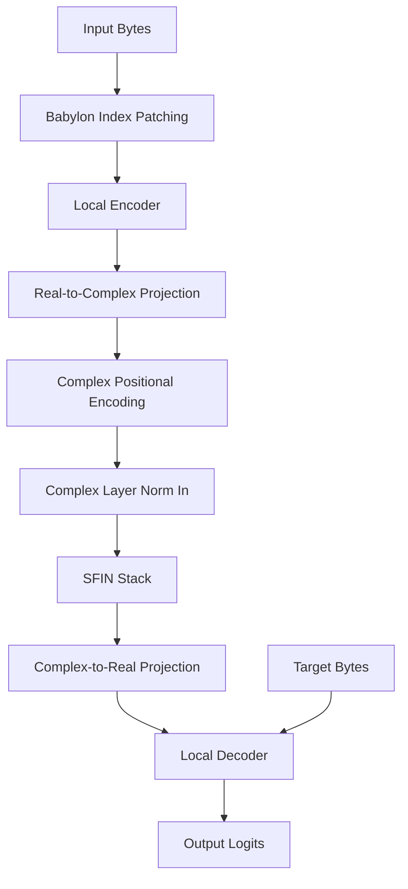
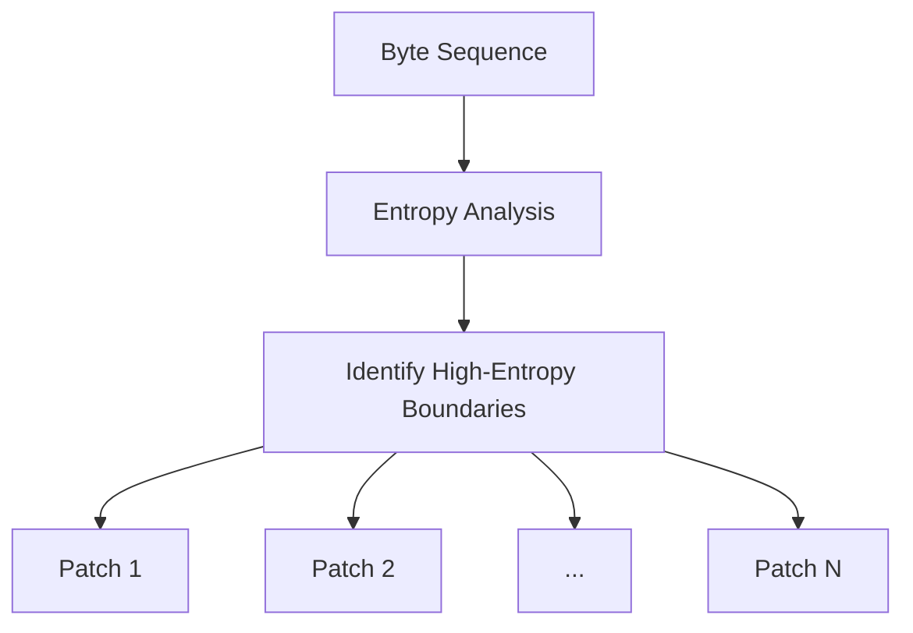
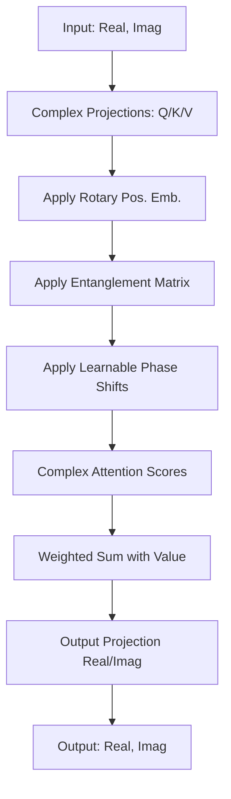
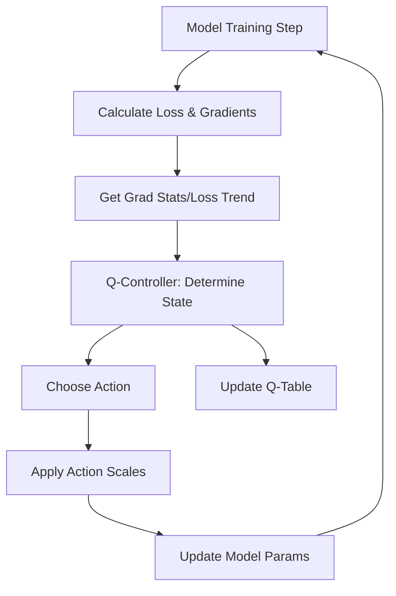
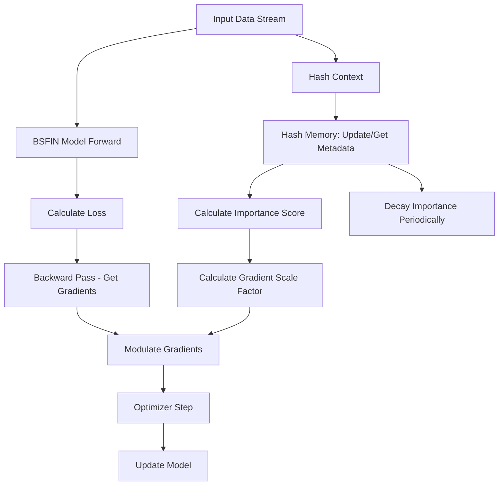

# Bytropix BSFINModel - Semantic Field Interference Network

A quantum-inspired byte-level language model with adaptive patching, reinforcement learning optimization, and hash-indexed continual learning capabilities.

## Overview

BSFINModel (Babylon Index Semantic Field Interference Network) is an experimental language model that operates directly on byte sequences rather than tokens. This approach offers several potential advantages:

- **Tokenizer-Free Architecture**: Works directly with raw UTF-8 bytes, eliminating the need for a predefined vocabulary and handling any language, code, or data format naturally.
- **Adaptive Patching (Babylon Index)**: Dynamically identifies meaningful segments (patches) within the byte stream based on entropy analysis, allowing the model to focus on information-dense regions.
- **Semantic Field Interference (SFIN)**: Utilizes quantum-inspired complex-valued representations (real and imaginary parts) and interference-based attention mechanisms to potentially capture richer semantic relationships.
- **Reinforcement Learning Optimization (EnhancedSGD)**: Employs a Q-Learning controller integrated into the SGD optimizer to dynamically adapt hyperparameters like learning rate and momentum during training based on observed performance.
- **Continual Learning Framework (LIVEBSFIN)**: Includes an optional framework for online adaptation using hash-indexed memory to modulate learning based on data importance and recency.

This implementation features a hybrid architecture making it potentially well-suited for multilingual text, source code, and specialized byte-level data where traditional tokenizers might struggle.

## Architecture

The BSFIN model integrates several distinct components:



### 1. Babylon Index Patching

This module preprocesses the input byte sequence before encoding.



- Analyzes byte sequences using sliding windows to compute local Shannon entropy
- Identifies potential patch boundaries at points of significant entropy change
- Filters and merges boundaries to ensure minimum patch sizes and valid UTF-8 sequences
- Outputs a list of variable-length byte tensors (patches)

### 2. Local Encoder

- Encodes each byte patch into a fixed-size real-valued vector representation
- Uses a standard Transformer Encoder architecture operating on byte embeddings
- Optionally incorporates N-gram features alongside single-byte embeddings
- Pools the information from each patch sequence into a single vector per patch

### 3. Real-to-Complex Projection

- Linearly projects the real-valued patch representations into the complex domain
- Creates separate real and imaginary components

### 4. SFIN Stack (Complex Processing)

- Complex Positional Encoding: Adds positional information suitable for complex representations
- Complex Layer Norm: Normalizes the complex vectors
- Entangled Interference Layers: The core of the SFIN. These layers perform attention-like operations in the complex domain



- Projects inputs to complex Q, K, V
- Applies Rotary Positional Embeddings (RoPE) if enabled
- Mixes information across attention heads using a learnable "entanglement" matrix
- Applies learnable phase shifts to Q and K
- Calculates attention scores using complex multiplication ("quantum interference")
- Computes a weighted sum using the complex Value vectors
- Projects the result back to the complex dimension
- Includes residual connections and dropout

### 5. Complex-to-Real Projection

- Projects the processed complex representations back into a real-valued space
- Methods include concatenating real/imag parts or using magnitude

### 6. Local Decoder

- A standard Transformer Decoder that attends to the projected real memory representations
- Takes the target byte sequence as input
- Predicts the logits for the next byte in the sequence

### 7. Q-Learning Enhanced SGD Optimizer

An adaptive optimizer that adjusts its own hyperparameters during training.



- Monitors loss trends, gradient variance, and current LR/momentum to define a state
- Uses a Q-table to learn the best scaling factors for LR and momentum in each state
- Computes a reward based on loss improvement and gradient stability
- Updates the Q-table based on the reward received
- Applies the chosen scaling factors to the optimizer's parameters before the update step

### 8. Hash-Indexed Continual Learning (LIVEBSFIN)

An optional framework for adapting the model to new data streams without full retraining.



- Hashes incoming data contexts
- Stores metadata associated with each hash in a memory buffer
- Retrieves importance score from memory when encountering data
- Calculates a gradient_scale_factor based on importance
- Multiplies the gradients by this factor before the optimizer step
- Periodically decays the importance scores of items in memory

## Installation

```bash
git clone https://github.com/waefrebeorn/bytropix.git
cd bytropix
# It's recommended to use a virtual environment
python -m venv venv
source venv/bin/activate  # Linux/macOS
# venv\Scripts\activate  # Windows
pip install torch torchvision torchaudio numpy tqdm datasets py-cpuinfo
# Optional: Install wandb for logging
# pip install wandb
```

Note: Ensure your PyTorch installation matches your CUDA version if using GPU.

## Requirements

- Python 3.8+
- PyTorch 2.0+ (CUDA recommended for performance)
- NumPy
- tqdm
- datasets (for convertdata.py)
- py-cpuinfo
- wandb (optional, for experiment tracking)

## Usage

### Data Preparation

Use the convertdata.py script to download and preprocess datasets:

```bash
python convertdata.py
# This will create wikitext_train.npy and wikitext_val.npy in ./data by default
```

### Training

Train the BSFIN model using bsfin_main.py:

```bash
python bsfin_main.py \
    --data_path ./data/wikitext_train.npy \
    --val_data_path ./data/wikitext_val.npy \
    --batch_size 16 \
    --grad_accum_steps 4 \
    --epochs 5 \
    --learning_rate 1e-4 \
    --local_hidden_size 256 \
    --complex_dim 512 \
    --num_complex_layers 6 \
    --num_complex_heads 8 \
    --decoder_memory_dim 768 \
    --n_gram_sizes 3 4 \
    --context_window 256 \
    --checkpoint_dir ./bsfin_checkpoints_v2 \
    --save_interval 1000 \
    --log_interval 50 \
    --num_workers 2
    # --wandb # Uncomment to enable WandB logging
    # --resume path/to/checkpoint.pt # Uncomment to resume training
```

### Inference (Text Generation)

Use the sfin_inference.py script for generating text.

#### Standard Mode (Single Prompt):

```bash
python sfin_inference.py standard \
    --checkpoint_path ./bsfin_checkpoints_v2/checkpoint_step_XXXX.pt \
    --input_text "The ancient spaceship drifted through the void" \
    --max_length 150 \
    --temperature 0.75 \
    --local_hidden_size 256 \
    --complex_dim 512 \
    --num_complex_layers 6 \
    --num_complex_heads 8 \
    --decoder_memory_dim 768 \
    --n_gram_sizes 3 4
```

#### Interactive Mode:

```bash
python sfin_inference.py interactive \
    --checkpoint_path ./bsfin_checkpoints_v2/checkpoint_step_XXXX.pt \
    --temperature 0.8 \
    --max_length 100 \
    --local_hidden_size 256 \
    --complex_dim 512 \
    --num_complex_layers 6 \
    --num_complex_heads 8 \
    --decoder_memory_dim 768 \
    --n_gram_sizes 3 4
```

Important: Ensure the architecture arguments match those used for training the loaded checkpoint.

### Continual Learning (Experimental)

Use the LIVEBSFIN.py script to adapt a pre-trained model to a new data stream:

```bash
python LIVEBSFIN.py \
    --base_checkpoint ./bsfin_checkpoints_v2/checkpoint_step_XXXX.pt \
    --data_stream_file ./new_data.txt \
    --context_size 256 \
    --batch_size 8 \
    --max_steps 10000 \
    --learning_rate 1e-6 \
    --importance_factor 0.6 \
    --save_interval 500 \
    --checkpoint_dir ./bsfin_live_checkpoints_v1 \
    --local_hidden_size 256 \
    --complex_dim 512 \
    --num_complex_layers 6 \
    --num_complex_heads 8 \
    --decoder_memory_dim 768 \
    --n_gram_sizes 3 4
```

## Features

- **Byte-Level Processing**: Native handling of any UTF-8 text or byte data
- **Adaptive Patching**: Focuses computation on information-rich segments via entropy analysis
- **Quantum-Inspired Architecture**: Leverages complex numbers and interference for richer representations
- **Self-Tuning Optimization**: EnhancedSGD adapts LR and momentum dynamically
- **Flexible Generation**: Entropy-aware sampling strategies based on output distribution uncertainty
- **Continual Learning**: Experimental framework for online adaptation using hash-indexed memory

## Included Scripts

- **bsfin_main.py**: Main model definition and training logic
- **sfin_inference.py**: Script for text generation (standard and interactive modes)
- **convertdata.py**: Utilities for preprocessing text data into byte arrays
- **LIVEBSFIN.py**: Implements the hash-indexed continual learning framework

Note: EnhancedSGD optimizer is implemented within bsfin_main.py and LIVEBSFIN.py

## Limitations

- **Experimental**: May require careful tuning for optimal performance
- **Computational Cost**: Complex-valued operations might be more computationally intensive
- **Sensitivity**: Complex-valued networks can be sensitive to initialization and training dynamics
- **Continual Learning Stability**: The hash-indexed approach may face challenges like catastrophic forgetting

## Contributing

Contributions, issues, and feature requests are welcome! Please feel free to submit a Pull Request or open an issue on the GitHub repository.

## License

MIT License

## Acknowledgments

This project draws inspiration from various research areas:
- Byte-level language modeling (e.g., ByT5, CANINE)
- Quantum-inspired machine learning concepts
- Reinforcement learning for hyperparameter optimization
- Continual learning techniques

## Citation

If you use this code or ideas from this project in your research, please consider citing:

```
@software{bsfin_model_2025,
  author = {WaefreBeorn},
  title = {BSFINModel: Babylon Index Semantic Field Interference Network},
  year = {2025},
  url = {https://github.com/waefrebeorn/bytropix}
}
```