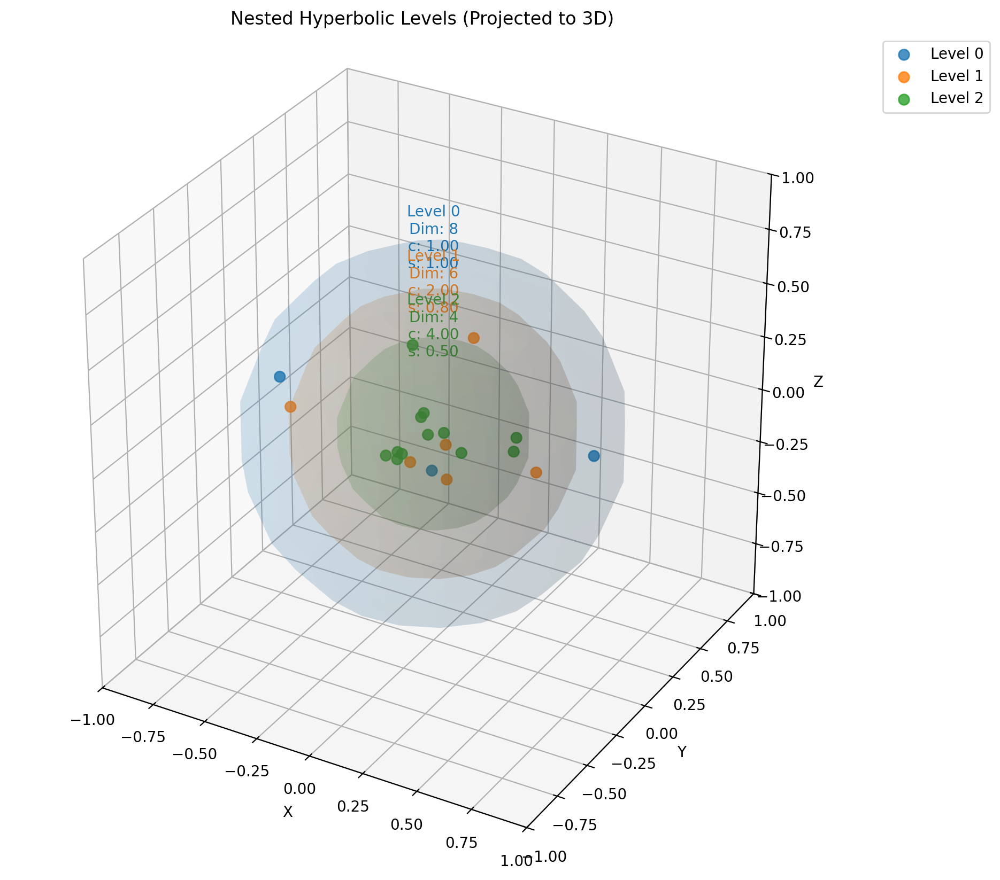
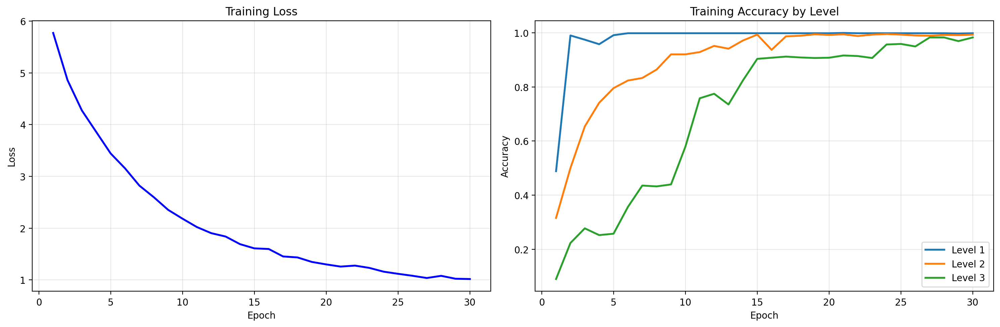

# Bytropix: Hyperbolic WuBu Nesting for Byte-Level Modeling

An advanced byte-level language model utilizing the **Fully Hyperbolic WuBu Nesting** framework for adaptive multi-scale geometric representation, integrated with Babylon Index patching and reinforcement learning optimization for next-generation language understanding and generation. This repository also includes the research paper `WuBu Nesting.pdf` detailing the conceptual framework.

## Overview

**Bytropix** represents a significant evolution in byte-level modeling, replacing its previous Euclidean core with a **Fully Hyperbolic WuBu Nesting** architecture. This approach aims to more naturally capture complex hierarchical structures and relationships often found in real-world data by leveraging the properties of adaptive hyperbolic geometry.

Key features include:

-   **Tokenizer-Free Architecture**: Processes raw UTF-8 bytes directly, removing vocabulary limitations and working natively with any language or format.
-   **Babylon Index Patching**: Dynamically identifies semantically meaningful patches in byte streams using entropy-based analysis.
-   **Fully Hyperbolic WuBu Nesting**: Implements the core geometric processing using a hierarchy of nested Poincaré ball manifolds (`H^n_i_{c_i, s_i}`) with dynamically **adaptive geometry** (learnable curvature `c_i` and scale `s_i`). It features hyperbolic boundary points and inter-level transitions primarily orchestrated via **tangent space mappings**. (See details below and in the accompanying paper).
-   **Riemannian-Aware Optimizer**: Employs an enhanced SGD optimizer (`RiemannianEnhancedSGD`) aware of parameter manifolds, integrating momentum and Q-learning for dynamic hyperparameter tuning.
-   **Sequence Modeling (Tangent Space Compromise)**: Integrates the hyperbolic core with sequence processing using Local Encoder/Decoder modules that operate on **tangent space vectors** via standard Transformer layers.
-   **Accompanying Paper**: The conceptual framework and mathematical details are described in `WuBu Nesting.pdf`, included in this repository.

This implementation focuses on leveraging adaptive hyperbolic geometry for deep hierarchical modeling. While the accompanying paper details a conceptual framework including explicit tangent space rotations (`R_i`), the current code implementation (`v0.04`) primarily uses learnable MLP/Linear transformations (`HyperbolicInterLevelTransform`) within the tangent spaces to map between levels.

## Architecture

The Bytropix model integrates the Hyperbolic WuBu Nesting core into a byte-level processing pipeline:

1.  **Input Bytes** → **Babylon Index Patching** → Meaningful Byte Patches.
2.  Byte Patches → **Hyperbolic Local Encoder** (Hyperbolic Embeddings → Tangent Vectors → Standard Transformer) → **Tangent Space Patch Representations** (`[B, NumPatches, LocalHiddenDim]`).
3.  Tangent Patch Representations → **Fully Hyperbolic WuBu Nesting Model** (Core geometric processing across adaptive hyperbolic levels) → **Aggregated Tangent Memory** (`[B, NumPatches, DecoderMemoryDim]`).
4.  Aggregated Tangent Memory + Target Bytes → **Hyperbolic Local Decoder** (Hyperbolic Target Embeddings → Tangent Vectors + Tangent Memory → Standard Transformer Decoder) → **Output Logits** (`[B, TargetLen, VocabSize]`).

### Hyperbolic WuBu Nesting Components

The `FullyHyperbolicWuBuNestingModel` orchestrates data flow through `HyperbolicWuBuNestingLevel` modules:

-   **Adaptive Geometry (`H^n_i_{c_i, s_i}`):** Each level `i` operates on a Poincaré ball manifold whose curvature `c_i` and mapping scale `s_i` are learnable parameters, adapting the geometry to the data during training.
-   **Hyperbolic Boundary Manifolds (`BoundaryManifoldHyperbolic`):** Learnable points (`B_{i,j}`) *directly parameterized within the Poincaré ball* of level `i`, representing scale-specific landmarks. The optimizer uses Riemannian updates for these points.
-   **Tangent Space Processing:** Key operations occur in the Euclidean tangent spaces (`T_p H^n_i`) associated with each level's origin (or other points). This includes:
    -   **Inter-Level Transitions (`HyperbolicInterLevelTransform`):** Points are mapped from level `i`'s manifold to its origin tangent space (LogMap0), transformed by a learnable Euclidean mapping (MLP or Linear), and then mapped back to level `i+1`'s manifold (ExpMap0). *Note: This differs from the paper's conceptual `T̃_i ∘ R_i` formulation by omitting an explicit rotation module (`R_i`) in the current code.*
    -   **Relative Vector Calculation:** Relative positions between the main representation and boundary points are computed *within the tangent space* of the *target* level (`i+1`) and aggregated (e.g., mean, sum).
    -   **Input Combination:** Incoming tangent vectors (main, relative, descriptor) and spread context are combined using a standard MLP (`tangent_combiner`).
    -   **Intra-Level Tangent Flow (`F_i`):** An optional learnable MLP or Linear function applied to tangent vectors *within* a level to model local dynamics or adjustments.
-   **Manifold-Aware Parameters:** Learnable parameters like level descriptors (`ld_i`) and boundary points are marked with their associated manifold for the `RiemannianEnhancedSGD` optimizer.
-   **Level Information:** Learnable spread (`σ_i`) is passed between levels. Learnable level descriptors (`ld_i`) are processed within the tangent space.
-   **Aggregation (`concat_tangent`):** Tangent space outputs (`tangent_out`) from all levels are collected and concatenated before a final linear projection to the decoder memory dimension.

### Sequence Model Components (Tangent Space Compromise)

-   **HyperbolicLocalEncoder/Decoder:** These modules use `HyperbolicEmbedding` layers but perform subsequent sequence processing (Transformer layers, positional encoding addition, memory projection, attention) on **Euclidean tangent space vectors** derived via `logmap0`. This is a common practical approach for integrating hyperbolic representations with standard sequence architectures. The final prediction head is also Euclidean.

## Paper: WuBu Nesting Framework

The conceptual framework underpinning this model is detailed in the included paper: **`WuBu Nesting.pdf`**.

The paper provides a comprehensive theoretical description of:
-   The recursive nested structure of adaptive hyperbolic spaces.
-   The role of boundary sub-manifolds.
-   Tangent space transitions including **explicit learnable rotations (`R_i`)** and non-rotational mappings (`T̃_i`).
-   The computation of rotation-aware relative vectors (`d_{i+1}`).
-   The function of level descriptors (`ld_i`), spread parameters (`σ_i`), and tangent flows (`F_i`).

Please refer to the paper for the full mathematical details and conceptual motivation. *Note potential differences between the full conceptual framework in the paper and the specific implementation choices in the current `v0.04` codebase.*

## Installation

```bash
# Clone the repository
git clone https://github.com/waefrebeorn/bytropix.git
cd bytropix

# Create and activate virtual environment (recommended)
python -m venv venv
source venv/bin/activate  # On Windows: venv\Scripts\activate

# Install dependencies
pip install torch numpy tqdm matplotlib
# Optional: For logging and visualization enhancements
# pip install wandb scikit-learn # scikit-learn needed for PCA visualization
```

## Requirements

- Python 3.8+
- PyTorch 2.0+ (CUDA recommended for performance)
- NumPy
- tqdm
- matplotlib (for visualizations)
- wandb (optional, for experiment tracking)
- scikit-learn (optional, for PCA in `visualize_nested_spheres`)

## Usage

### Data Preparation

Use standard byte-level datasets (e.g., `.npy` files containing sequences of uint8 values).

### Training

Train the model using the `WuBuNest_Trainer.py` script (v0.04).

```bash
# Example training command (adjust paths and hyperparameters)
# Assumes DDP launch with torchrun if multiple GPUs are used
# Example for 2 GPUs: torchrun --standalone --nproc_per_node=2 WuBuNest_Trainer.py [ARGS]

# Single GPU / CPU example:
python WuBuNest_Trainer.py \
    --data_path /path/to/your/train_data.npy \
    --val_data_path /path/to/your/val_data.npy \
    --checkpoint_dir ./wubu_results_hyp_v04 \
    --batch_size 8 \
    --grad_accum_steps 8 \
    --epochs 5 \
    --learning_rate 3e-4 \
    --weight_decay 0.01 \
    --max_grad_norm 1.0 \
    --context_window 512 \
    --num_workers 2 \
    --local_hidden_size 256 \
    --decoder_memory_dim 512 \
    --num_levels 3 \
    --hyperbolic_dims 128 64 32 \
    --initial_curvatures 1.0 0.5 0.25 \
    --boundary_points_per_level 5 4 3 \
    --transform_types linear linear \
    --dropout 0.1 \
    --enable-q-controller \
    --q_learning_rate 0.02 \
    --wandb # Optional: Enable WandB logging
    # Add other WuBu config args as needed (--learnable-curvature, etc.)
```

Checkpoints, logs, and visualizations will be saved in the `--checkpoint_dir`.

### Inference (Text Generation)

Use the `WuBuNest_Inference.py` script with a checkpoint saved by the v0.04 trainer:

```bash
python WuBuNest_Inference.py \
    --checkpoint_path wubu_results_hyp_v04/checkpoint_epoch_X_step_Y_metricZ.pt \
    --seed_text "Hyperbolic geometry provides" \
    --max_length 200 \
    --temperature 0.7 \
    --repetition_penalty 1.1 \
    --top_k 40
```

### Visualizations

During training, visualizations are generated in the checkpoint directory (`--checkpoint_dir / visualizations /`). *Note: Ensure `matplotlib` and `scikit-learn` are installed.*

-   **Nested Spheres (3D Projection):** Visualizes the *hyperbolic boundary points* (`B_{i,j}`) from all levels projected into 3D Euclidean space using PCA. Inner structures conceptually represent deeper nesting levels. (e.g., `nested_spheres_epoch_X.png`).
    
-   **Training Metrics:** Plots training loss, learning rate, gradient norm, Q-controller stats, and potentially learned geometric parameters (curvatures, scales) over steps/epochs. Saved periodically and logged to WandB if enabled.
    

## Hyperparameters

*(Refer to the argparse definitions in `WuBuNest_Trainer.py` for the most up-to-date list)*

### WuBu Nesting Configuration (`wubu_config` - see `DEFAULT_CONFIG_WUBU` in Trainer)

Key Hyperbolic Parameters:

| Parameter                       | Description                                                         | Default         | CLI Argument                     |
| :------------------------------ | :------------------------------------------------------------------ | :-------------- | :------------------------------- |
| `num_levels`                    | Number of nested hyperbolic levels                                  | 3               | `--num_levels`                   |
| `hyperbolic_dims`               | List of dimensions for each level's Poincaré ball                   | `[128, 64, 32]` | `--hyperbolic_dims`              |
| `initial_curvatures`            | List of initial curvature values (`c_i > 0`) per level              | `[1.0,...]`     | `--initial_curvatures`           |
| `initial_scales`                | List of initial scale values (`s_i > 0`) per level (tangent mapping)| `[1.0,...]`     | `--initial_scales`               |
| `boundary_points_per_level`     | List of numbers of learnable boundary points per level              | `[5, 4, 3]`     | `--boundary_points_per_level`    |
| `learnable_curvature`           | Whether to learn curvature `c_i`                                    | `True`          | `--learnable-curvature` (Action) |
| `learnable_scales`              | Whether to learn scale `s_i`                                        | `True`          | `--learnable-scales` (Action)    |
| `learnable_spread`              | Whether to learn spread `σ_i`                                       | `True`          | `--learnable-spread` (Action)    |
| `curvature_min_value`           | Minimum value constraint for curvature                              | `1e-6`          | `--curvature_min_value`          |
| `scale_min_value`               | Minimum value constraint for scale                                  | `1e-6`          | `--scale_min_value`              |
| `transform_types`               | List of mapping types (`mlp`, `linear`) for tangent transitions     | `["linear",...]`| `--transform_types`              |
| ...                             | *(Other WuBu parameters like flow, descriptors, aggregation)*        | ...             | *(See Trainer Args)*             |

### Sequence Model Configuration (`sequence_config`)

| Parameter                  | Description                                                 | Default | CLI Argument                  |
| :------------------------- | :---------------------------------------------------------- | :------ | :---------------------------- |
| `local_hidden_size`        | Hidden dim for Local Encoder/Decoder (Tangent Transformers) | 256     | `--local_hidden_size`         |
| `decoder_memory_dim`       | Output dim of WuBu model (Tangent space)                    | 512     | `--decoder_memory_dim`      |
| ...                        | *(Other sequence parameters like layers, heads, N-grams)*   | ...     | *(See Trainer Args)*          |

### Training Hyperparameters

*(Standard training parameters like LR, WD, Batch Size, Epochs - see Trainer Args)*

### Q-Learning Controller Hyperparameters

*(Optional Q-Controller tuning parameters - see Trainer Args)*

## Features

-   **Byte-Level Processing**: Native UTF-8 handling.
-   **Dynamic Patching**: Babylon Index focuses computation.
-   **Fully Hyperbolic WuBu Nesting**: Models hierarchies with adaptive geometry.
    -   **Adaptive Geometry**: Learns curvature (`c_i`) and scale (`s_i`) per level via `HyperbolicWuBuNestingLevel`.
    -   **Hyperbolic Boundaries**: Explicitly models landmarks (`B_{i,j}`) within each level's Poincaré ball using `BoundaryManifoldHyperbolic`.
    -   **Tangent Space Transitions**: Maps between levels using learnable Euclidean transformations (`HyperbolicInterLevelTransform`) in tangent space.
    -   **Riemannian-Aware Parameters**: Boundary points and level descriptors are optimized respecting their manifold structure.
    -   **Relative Vectors (Tangent)**: Computes spatial relationships in the target tangent space.
    -   **Level Spread**: Captures uncertainty/density context (`σ_i`).
    -   **Intra-Level Flow (Tangent)**: Models local dynamics (`F_i`).
-   **Riemannian-Aware Optimization**: `RiemannianEnhancedSGD` handles hyperbolic parameters and uses Q-Learning for LR/Momentum tuning.
-   **Tangent Space Sequence Models**: Uses standard Transformers on tangent vectors for encoder/decoder (practical compromise).
-   **Gradient Monitoring & Stability**: Includes gradient statistics and clipping.
-   **Integrated Visualizations**: Generates plots of hyperbolic boundary points and training metrics.
-   **Accompanying Paper**: Provides the full conceptual framework (`WuBu Nesting.pdf`).

## Limitations

-   **Computational Cost**: Hyperbolic operations and the nested structure increase computational demands.
-   **Training Stability**: Requires careful tuning and stability measures due to the complex geometry and optimization landscape (Riemannian optimization is complex).
-   **Implementation Complexity**: The hyperbolic components and their interactions are intricate.
-   **Tangent Space Compromise**: The sequence encoder/decoder currently operate in tangent space, not leveraging fully hyperbolic sequence models (which are an active research area). The inter-level transform also currently omits explicit rotations described conceptually in the paper.
-   **Interpretability**: Understanding the learned geometries and transformations can be challenging.

## Contributing

Contributions are welcome! Please refer to the process outlined in the original README.

## License

This project is licensed under the MIT License - see the `LICENSE` file for details.

## Acknowledgments

-   The WuBu Nesting framework synthesizes ideas from hyperbolic geometry [Nickel & Kiela, 2017; Ganea et al., 2018], geometric deep learning, and rotation representations. See `WuBu Nesting.pdf` for detailed background.
-   Optimizer enhancements draw from Q-Learning and gradient monitoring techniques.
-   Sequence modeling components build upon the Transformer architecture.

## Citation

If you use this code or the WuBu Nesting framework in your research, please cite the accompanying paper and this repository:

```
@techreport{WaefreBeornWuBuNesting2024,
  author = {Wubu WaefreBeorn},
  title = {WuBu Nesting: A Comprehensive Geometric Framework for Adaptive Multi-Scale Hierarchical Representation with Integrated Rotational Dynamics},
  year = {2025},
  institution = {GitHub Repository},
  url = {https://github.com/waefrebeorn/bytropix},
  note = {Accessed [Date]}
}

@software{BytropixWuBuNestingCode,
  author = {WaefreBeorn},
  title = {Bytropix: Hyperbolic WuBu Nesting for Byte-Level Modeling},
  year = {2025},
  url = {https://github.com/waefrebeorn/bytropix},
  version = {0.04-hyp}
}
