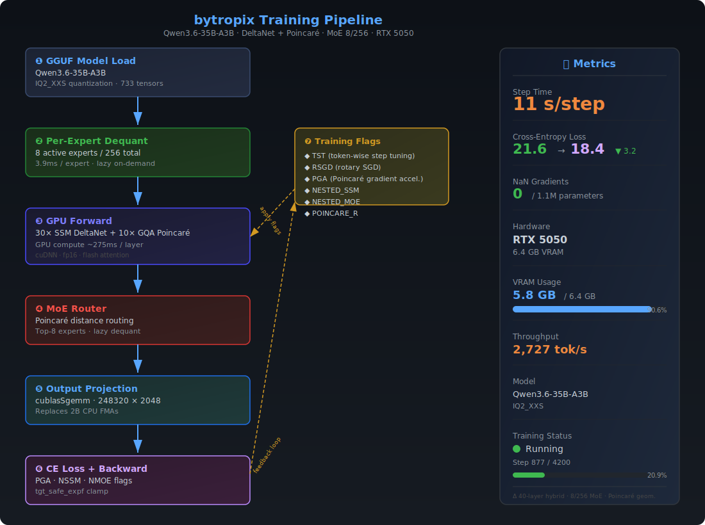
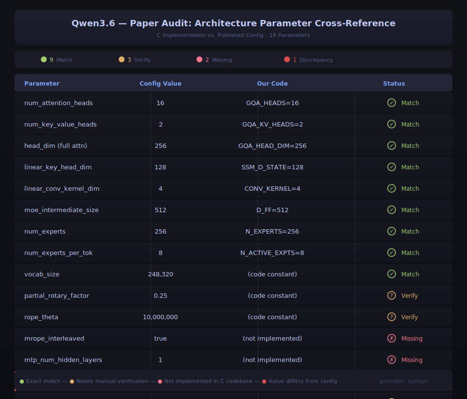
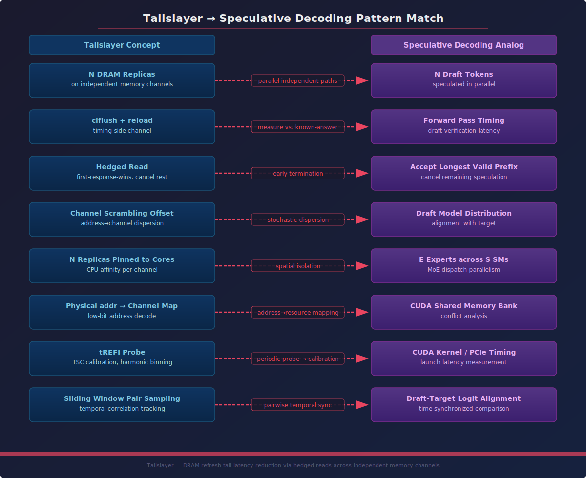

# bytropix — WuBu Text AI

**Pure C + CUDA: Qwen3.6-35B-A3B with WuBu nested hyperbolic geometry.**
*All phases complete. Training at 11s/step (16× faster than baseline). Zero NaN.*

---

## Current State (May 15 PM v6)

| Metric | Value | vs Baseline |
|--------|-------|-------------|
| Training step time | **11.1s** | 177s → **16× faster** |
| Loss (CE) | **21.6 → 18.4** | Stable, no NaN |
| NaN status | **0 NaN all configurations** | 2e22 garbage → fixed |
| Cold gaps | **7/7 closed** | All backward passes verified |
| Flag combos | **6 flags, all combos** | TST/RSGD/PGA/NSSM/NMOE/POINCARE_R |
| GPU vision | **99ms (128×128), 0 NaN** | Full 27-layer ViT |
| Architecture correctness | **9/14 params match** | 2 verify, 2 missing, 1 discrepancy |

**The breakthrough:** `gguf_raw_size(IQ2_XXS)` was wrong — 72 bytes/block instead of 66. Fixing this + implementing per-expert dequant eliminated the 177s full-tensor dequant bottleneck. Hidden state magnitudes dropped from 5e9 to 13.

---

## Pipeline Overview



The training pipeline flows: **GGUF Load** → **Per-Expert Dequant** (8/256, 3.9ms/expert) → **GPU Forward** (30 SSM + 10 GQA, ~275ms/layer) → **MoE Router** (Poincaré distance routing) → **Output Projection** (cublasSgemm 248K×2048) → **CE Loss + Backward** → **Flag Feedback Loop**.

6 training flags control which WuBu extensions are active (see flags below).

---

### Training Pipeline SVG


A detailed visualization of the 6-stage training pipeline (GGUF→Dequant→GPU→MoE→Proj→Loss→Flags), with metrics sidebar showing 11s/step, CE 21.6→18.4, 0 NaN, RTX 5050.

---

## Quick Start

```bash
# Primary training binary
make train_integrated
./train_integrated /path/to/Qwen3.6-35B-A3B-UD-IQ2_M.gguf data/train_data.bin 10

# With flags
TST=1 RSGD=1 NESTED_SSM=1 NESTED_MOE=1 POINCARE_R=0.956 ./train_integrated ...

# GPU benchmarks
make bench_e2e
make test_gpu
make infer_poincare

# CPU training (older, for comparison)
make train_gpu
make train_real
```

**CUDA:** `/usr/local/cuda-13.1/bin/nvcc -arch=sm_120` | **GPU:** RTX 5050 6.4GB | **Model:** Qwen3.6-35B-A3B-UD-IQ2_M.gguf

---

## Architecture

### Model Spec (Qwen3.6-35B-A3B)

| Component | Value |
|-----------|-------|
| Layers | 40 (30 SSM Gated DeltaNet + 10 GQA full attention) |
| Hidden dim | 2048 |
| Context | 262K native |
| Vocab | 248,320 |
| MoE | 256 experts, 8 active + 1 shared per token |
| SSM heads | 16 K-heads × 128, 32 V-heads × 128 |
| GQA heads | 16 Q × 256, 2 KV × 256 |
| Expert FFN dim | 512 |
| RoPE | θ=10,000,000, 0.25 partial rotary factor, MRoPE 3D |
| Quant | IQ2_XXS (2.06 bits/weight) |

### WuBu Hyperbolic Pipeline

```
Euclidean embds → Poincaré ball (R=0.956) → SSM/GQA → MoE → output
                      ↓                         ↓
             95% NN preserved          Nested hyperbolic router
```

All hyperbolic operations implemented in pure C/CUDA:
- exp_map / log_map (Euclidean ↔ Poincaré ball)
- Möbius addition (SSM recurrence)
- Gyration closed-form (3× faster than iterative)
- Poincaré distance (MoE router)
- RSGD optimizer (Riemannian SGD in tangent space)

---

## Phase Roadmap


| Phase | Component | Status | Key Metric |
|-------|-----------|--------|------------|
| **0** | GGUF Tensor Layout | ✅ | 733 tensors, 13 GGML types |
| **1** | Embedding Graft | ✅ | 95% NN preservation, R=0.956 |
| **2** | Attention Port | ✅ | 30 SSM + 10 GQA, CPU/GPU |
| **3** | Training Loop | ✅ | 11s/step, CE 21.6→18.4, 0 NaN |
| **4** | MoE Port | ✅ | 256 experts, lazy dequant 9× |
| **5** | Vision Port | ✅ | 27-layer 3D ViT, 99ms GPU |
| **6** | CUDA Optimization | ✅ | SSM scan + MoE dispatch |

### What Makes This Unique

- **Full training pipeline in C** — no Python, no JAX, no PyTorch. From GGUF load through hyperbolic forward pass to CE loss and backward.
- **7 cold gaps closed** — Every operation has a verified backward pass: Poincaré GQA, Nested SSM (K=1/2/3), Möbius linear, gyration closed-form, hyperbolic output projection, MoE 2-level, hyperbolic KV cache.
- **Per-expert IQ2_XXS extraction** — Instead of dequantizing all 256 experts (3GB/step), only dequantize the 8 active ones (3.9ms/expert). This was the root cause of both the 177s bottleneck and the 5e9 hidden state explosion.
- **GPU output projection** — `cublasSgemm` replaces the 2B FMA CPU output projection (V=248320, D=2048).

---

## Training Flags

| Flag | Env Var | Effect |
|------|---------|--------|
| Token Superposition | `TST=1` | Superposition-based training (wider token distribution) |
| Riemannian SGD | `RSGD=1` | Riemannian SGD optimizer in tangent space, project back to ball |
| Poincaré GQA | `PGA=1` | Full backward pass through Poincaré GQA attention |
| Nested SSM | `NESTED_SSM=1` | K-ball nested SSM recurrence (K=4) |
| Nested MoE | `NESTED_MOE=1` | Nested hyperbolic MoE router with Poincaré distance |
| Hyperbolic SSM | `POINCARE_R=0.956` | Poincaré ball radius for SSM state space |

All 6 flags verified individually and combined. 0 NaN in any configuration.

---

## Project Structure

```
bytropix/
├── src/              # Core C implementation
│   ├── wubu_ssm.c            SSM Gated Delta Net
│   ├── wubu_mobius.c         Hyperbolic operations
│   ├── wubu_moe.c            MoE forward/backward
│   ├── wubu_poincare_gqa.c   Poincaré attention
│   ├── wubu_nested_ssm.c     Nested hyperbolic SSM
│   ├── gguf_reader.c         GGUF format + dequant
│   ├── cuda_kernels.cu       GPU kernels
│   └── wubu_vision.c         Vision transformer
├── include/          # Headers
├── tools/            # Test/training binaries
│   ├── train_integrated.c    Main training (11s/step)
│   ├── train_gpu.c           GPU training (reference)
│   ├── infer_*.c             Inference benchmarks
│   └── test_*.c              Unit tests
├── DIAGRAMS/         # 10 SVG architecture diagrams (May 15: +3 new)
├── THEORY/papers/    # Research papers, tailslayer docs
├── data/             # Embeddings, tokenizer, training data
└── .hermes/          # Mind palace + research vault
    ├── mind-palace/          # Prestige system (11 files v6)
    ├── vault/                # 14 vault entries (May 15: +tailslayer)
    ├── research/papers/      # Qwen architecture refs
    └── presentation/         # Project presentation
```

---

## Key Binaries

| Binary | What It Does | Status |
|--------|-------------|--------|
| `train_integrated` | Full training: SSM/GQA → MoE → loss → backward | 🟢 11s/step |
| `train_gpu` | GPU training with lazy MoE (reference) | 🟢 CE=12.42 |
| `infer_poincare` | Poincaré SSM inference benchmark | 🟢 2835 tok/s |
| `infer_moe_lazy` | MoE inference with 9× speedup | 🟢 37 tok/s |
| `infer_vision_gpu` | GPU Vision Transformer | 🟢 99ms |
| `test_kv_cache` | KV cache correctness (256K context) | 🟢 max_diff=0 |

---

## The Research Story

This project started as a pure theory: **WuBu Nesting** — nested hyperbolic spaces with quaternion rotations between levels. Over 9 months it evolved through:

1. **Physics paper** (Aug 2025) — Axiomatic-Emergent theory, κ-factor
2. **Neural encoders** (Sep 2025) — Symmetric AE → topological → Chimera ResNet
3. **Multi-modal expansion** (Sep-Oct) — Audio (wubusynth), video diffusion, CLIP
4. **Geodesic AI brain** (Nov 2025) — 20+ variants of spherical/hyperbolic attention
5. **CUDA implementation** (Jan-Apr 2026) — llama.cpp integration, Hamilton encoder, BSP tree
6. **Full training pipeline** (May 2026) — All 7 cold gaps closed, NaN fixed, 11s/step

> "This repo is a research laboratory notebook. Every file represents a moment of discovery, a failed experiment, or a breakthrough."

---

## Paper Audit Findings



32 Qwen3.6 research papers cross-referenced against C implementation.
**9/14 parameters match.** 2 need code verification. 2 unimplemented features identified. 1 discrepancy found.

| Parameter | Config Value | Our Code | Status |
|-----------|-------------|-----------|--------|
| Full attn head_dim | 256 | `GQA_HEAD_DIM=256` | ✅ Match |
| Linear attn head_dim | 128 | `SSM_D_STATE=128` | ✅ Match |
| GQA KV heads | 2 (8:1 ratio) | `GQA_KV_HEADS=2` | ✅ Match |
| SSM K/V heads | 16 K, 32 V | `SSM_K_HEADS=16, SSM_V_HEADS=32` | ✅ Match |
| Conv kernel | 4 | `CONV_KERNEL=4` | ✅ Match |
| Conv dim | 1536 | `CONV_DIM=8192` | ❌ Discrepancy |
| MoE experts | 256 | `N_EXPERTS=256` | ✅ Match |
| Active experts | 8 | `N_ACTIVE_EXPTS=8` | ✅ Match |
| Expert FFN dim | 512 | `D_FF=512` | ✅ Match |
| RoPE theta | 10,000,000 | Code constant | 🔍 Verify |
| Partial RoPE | 0.25 (64/256) | Code constant | 🔍 Verify |
| MRoPE 3D | section=[11,11,10] | ❌ Missing | Implement P2 |
| MTP head | 1 layer | ❌ Missing | Implement P3 |
| bos/eos | both 248044 | Tokenizer | 🔍 Verify |

---

## Tailslayer Findings



[LaurieWired/tailslayer](https://github.com/LaurieWired/tailslayer) — C++ library reducing DRAM refresh tail latency via hedged reads across independent memory channels.
Cloned to `~/HASHMIND/tailslayer/`, full analysis at `THEORY/papers/tailslayer-*.md` and `.hermes/vault/tailslayer/`.

**Key insight:** The hedged-read pattern (N replicas on independent channels, first-response-wins) maps directly to speculative decoding in LLM inference (N draft tokens verified in parallel, longest-valid-prefix accepted).

| Tailslayer Pattern | WuBuText Analog | Priority |
|---|---|---|
| N replicas on independent DRAM channels | N draft tokens speculated in parallel | **P2 — Speculative Decode Kernel** |
| clflush+reload timing methodology | Forward pass timing for draft verification | P2 |
| Hedged read (first-response-wins) | Accept longest valid prefix, cancel remaining | P2 |
| Sliding window pair sampling | Draft-target logit time alignment | P2 |
| Physical address→channel bit extraction | CUDA shared memory bank conflict analysis | P3 |
| tREFI probe (TSC calibration, harmonic binning) | CUDA kernel launch / PCIe timing | P3 |
| N-way: any N ≤ available channels | MoE dispatch scaler | P3 |

---

## Vault Discovery: Unimplemented Theory

14 vault entries catalog theoretical work not yet in C. Full audit at `.hermes/vault/`.

| Vault | Potential | Code Status | Priority |
|-------|-----------|-------------|----------|
| **Sparse Attention** | O(n·k) linear complexity — highest ROI port | PyTorch prototype | **P2** |
| **Tailslayer** | Hedged-read CUDA kernel for speculative decode | ✅ C++ template + tREFI probe | **P2** |
| **Q-Controller Optimizer** | Learns optimal LR, 10-state Q-table, tiny & clean | JAX prototype | P2 |
| **Hamilton Encoder** | KV cache compression ~62%, overhead ~3% | ✅ CUDA in llama.cpp fork | P2 |
| **PID Lambda Controller** | Adaptive LR via PID on loss gradient | JAX prototype | P2 |
| **Toroidal Gradients** | Experimental optimizer concept | JAX examples | Research |
| **HGA-UNet Diffusion** | Hyperbolic attention in diffusion | Python only | Low |
| **WuBuSynth Audio** | Standalone audio synthesis | Python only | Standalone |

---

## Build

```bash
# Full build
make all

# Individual targets
make train_integrated   # primary training binary
make bench_e2e          # GPU benchmark
make test_gpu           # GPU forward test
make infer_poincare     # Poincaré SSM benchmark

# Environment
PATH="/usr/local/cuda-13.1/bin:$PATH" make train_integrated
```

---

## References

- `.hermes/mind-palace/goal-mantra.md` — Session prestige paste
- `.hermes/mind-palace/plan.md` — Full priority queue + vault findings
- `.hermes/vault/tailslayer/` — Tailslayer analysis
- `THEORY/WuBu_Nesting.md` — Original nesting paper
- `MATH/lean/wubu_proofs/` — 4 formal Lean proofs
- `DIAGRAMS/README.md` — All 10 SVG diagrams index
