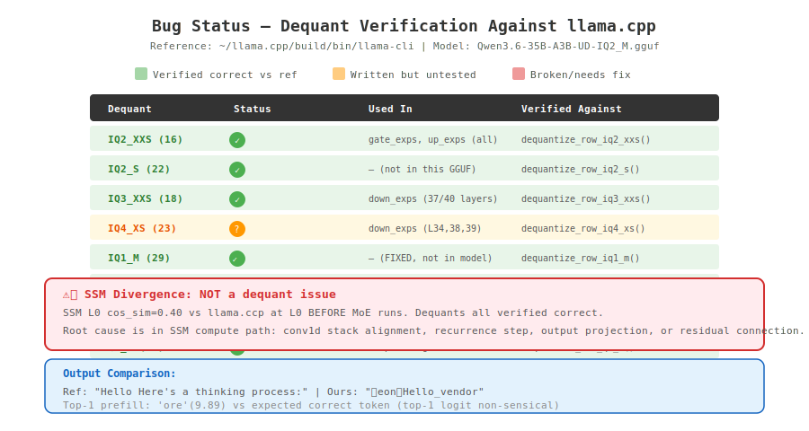
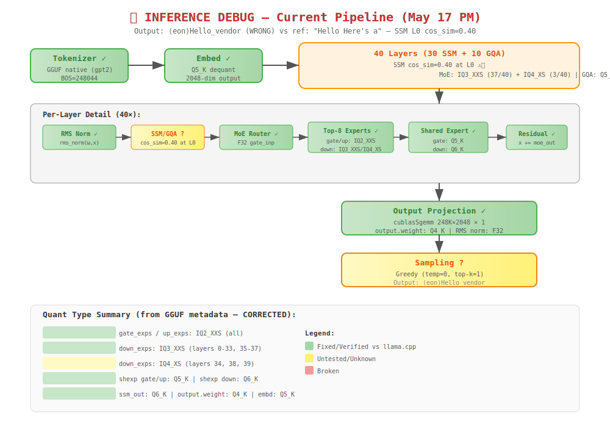

# bytropix — WuBu Text AI

**Pure C + CUDA inference for Qwen3.6-35B-A3B (Gated DeltaNet + MoE).**
*May 17 v10 — Output proj transpose fixed, MoE expert stride bug found.*

---

## Current State

| Metric | Value |
|--------|-------|
| Layers | 40 (30 SSM + 10 GQA) |
| Dequant types | 7 verified (all match llama.cpp) |
| **Output proj transpose** | ✅ **FIXED** (3 places) |
| **MoE expert layout** | 🔴 **ACTIVE BUG** |
| Cos-sim vs ref (pre fix) | -0.457 (anti-correlated) |
| Cos-sim vs ref (post fix) | -0.001 (hidden state still wrong — MoE weights garbage) |

### Known Bugs

| Bug | Status | Impact | Fix |
|-----|--------|--------|-----|
| **Output projection TRANSPOSE** | ✅ Fixed | Cos-sim -0.457→-0.001 | `weight[j*D_MODEL+k]`→`weight[k*vocab_size+j]` |
| **GQA output proj (inline)** | ✅ Fixed | GQA layers wrong output | `weight[i+j*q_dim]`→`weight[i*D_MODEL+j]` |
| **MoE expert extraction stride** | 🔴 Active | All 40 layers garbage output | Stride-extract per expert: dequant block→pick[eid] |
| GPU RoPE 0.25x factor | 🟡 Suspected | GPU GQA layers | `infer_text_gpu.c:254` |
| SSM forward vs ref | 🟡 Unverified | 30 SSM layers | Never element-compared vs llama.cpp |
| VRAM cleanup on SIGINT | 🟡 Missing | GPU memory leak | Add llama.cpp-style cleanup |

**Root Cause:** MoE expert tensor layout is INTERLEAVED, not contiguous.  
`blk.0.ffn_gate_exps.weight` dims = `[2048, 512, 256]` — expert index (256) is innermost dim.  
Each IQ2_XXS block = ALL experts at ONE (i,j) position.  
`dequant_one_expert_contiguous` reads `eid * raw_per_exp` — wrong by 256× stride.

Fix: replace with per-block stride extraction — dequant each block, extract `block_vals[eid]`, store.

---

## Quick Start

```bash
# Build
make infer_text

# Run inference (CPU, NOGPU=1)
NOGPU=1 MOE=1 MAX_LAYERS=40 ./infer_text /models/Qwen3.6-35B-A3B-UD-IQ2_M.gguf "Hello" 4

# Reference comparison
./dump_llama_logits /models/Qwen3.6-35B-A3B-UD-IQ2_M.gguf /tmp/ref.bin "Hello"

# Dump tensor dims
./dump_tensor_our /models/Qwen3.6-35B-A3B-UD-IQ2_M.gguf blk.0.ffn_gate_exps.weight /tmp/out.bin
```

**CUDA:** `/usr/local/cuda-13.1/bin/nvcc -arch=sm_120` | **GPU:** RTX 5050 6.4GB | **Model:** Qwen3.6-35B-A3B-UD-IQ2_M.gguf

---

## Architecture

### Model Spec (Qwen3.6-35B-A3B)

| Component | Value |
|-----------|-------|
| Layers | 40 (30 SSM Gated DeltaNet + 10 GQA full attention) |
| Hidden dim | 2048 |
| Context | 262K native |
| Vocab | 248,320 |
| MoE | 256 experts, 8 active + 1 shared per token |
| SSM heads | 16 K-heads × 128, 32 V-heads × 128 |
| GQA heads | 16 Q × 256, 2 KV × 256 |
| Expert FFN dim | 512 |
| RoPE | θ=10,000,000, MRoPE 3D sections=[11,11,10,0] |
| Quant | Mixed: IQ2_XXS / IQ3_XXS / IQ4_XS / Q5_K / Q6_K / Q4_K |

### Layer Structure

Each of the 40 layers:
1. **RMS Norm** — `rms_norm(x, weight, eps=1e-6)`
2. **SSM (30 layers) or GQA (10 layers)** — every 4th is GQA
3. **MoE** — router → top-8 experts + shared expert → SiLU-gated sum
4. **Residual** — `x += moe_output`

### Tensor Layout (GGUF)

```
ffn_gate_exps.weight:  [2048, 512, 256]  ← expert=innermost dim!
ffn_up_exps.weight:    [2048, 512, 256]  ← same layout
ffn_down_exps.weight:  [512, 2048, 256]  ← same
output.weight:         [2048, 248320]    ← D_MODEL × vocab
```

**Critical:** MoE expert tensors are 3D with expert index varying FASTEST.  
This means for each (i,j) position, all 256 experts' values are interleaved.  
Extracting expert e requires striding by 256, not reading `e * raw_per_exp` bytes.

---

## Diagrams






---

## Project Structure

```
bytropix/
├── src/               # Core C implementation
│   ├── wubu_ssm.c            SSM Gated Delta Net
│   ├── wubu_mobius.c         Hyperbolic operations
│   ├── wubu_moe.c            MoE forward/backward
│   ├── wubu_poincare_gqa.c   Poincaré attention
│   ├── wubu_nested_ssm.c     Nested hyperbolic SSM
│   ├── gguf_reader.c         GGUF format + dequant
│   ├── cuda_kernels.cu       GPU kernels
│   └── wubu_vision.c         Vision transformer
├── include/           # Headers
├── tools/             # Binaries
│   ├── infer_text.c          CPU inference (debug target)
│   ├── infer_text_gpu.cu     GPU inference
│   └── dump_llama_logits.c   Reference extraction
├── DIAGRAMS/          # Architecture diagrams (SVG)
├── .hermes/           # Mind palace + research vault
└── THEORY/            # Papers and proofs
```

## Key Binaries

| Binary | What It Does | Status |
|--------|-------------|--------|
| `infer_text` | CPU inference | 🔴 MoE stride bug |
| `dump_llama_logits` | Reference logits + hidden | 🟢 Works |
| `dump_tensor_our` | Tensor dims + dequant dump | 🟢 Works |
| `llama-cli` | Reference (external) | 🟢 Ground truth |

## References

- `.hermes/mind-palace/` — State, goal, plan, prestige, overnight map
- `~/.hermes/skills/mlops-inference/bytropix-moe-expert-layout` — Bug skill
- `~/llama.cpp/build/bin/llama-cli` — Ground truth reference
- `~/llama.cpp/src/models/qwen35moe.cpp` — Reference implementation
- `~/llama.cpp/src/models/qwen3next.cpp` — Newer arch reference
