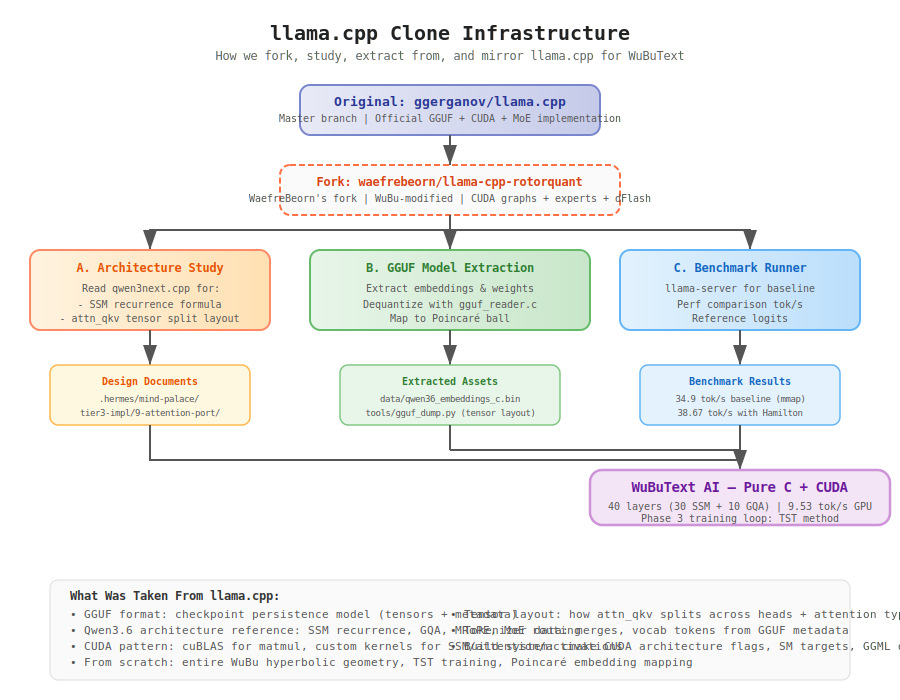
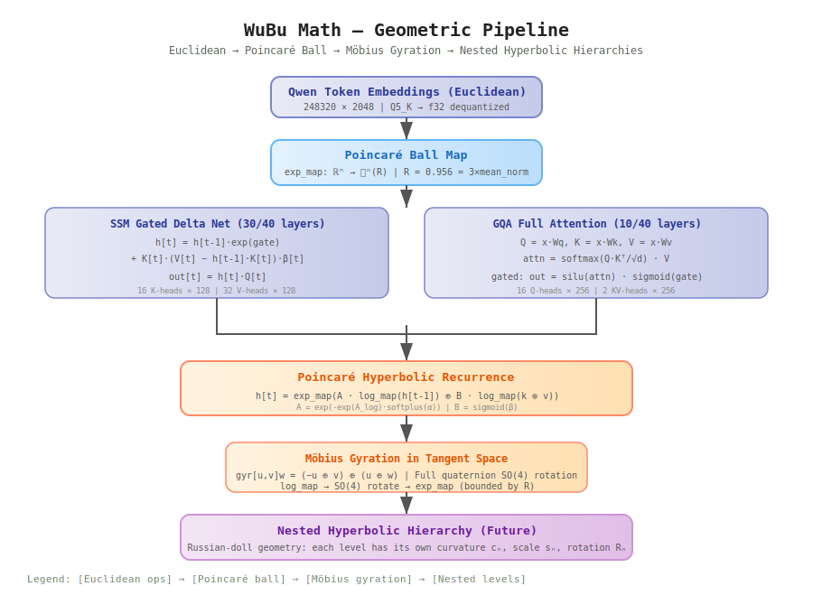

# bytropix — WuBu Text AI

**Pure C + CUDA implementation of Qwen3.6-35B-A3B with WuBu nested hyperbolic geometry.**
*In progress — training loop phase under active development.*

---

## Navigation

### Phase Roadmap (current state)


| Phase | Component | Status | Key Files |
|-------|-----------|--------|-----------|
| **0** | GGUF Tensor Layout | ✅ Complete | `tools/dump_gguf.py`, `.hermes/tensor_layout.txt` |
| **1** | Embedding Graft | ✅ Complete | `include/gguf_reader.h`, `src/gguf_reader.c`, `data/qwen36_embeddings_c.bin` |
| **2** | Attention Port | ✅ Complete | `src/wubu_ssm.c`, `src/cuda_kernels.cu`, `tools/test_gpu.c` |
| **2.5** | GPU Verification | ✅ Complete | 9.53 tok/s GPU, 47.83× vs CPU baseline |
| **3** | Training Loop | 🔄 In Progress | Tokenizer fix → TST bag training → AdamW/RSGD |
| **4** | MoE Port | ⏳ Future | 256 experts, 8 active |
| **5a** | Vision Port (Qwen 3D ViT) | ⏳ Future | 27-layer 3D ViT, native tight integration (FIRST) |
| **5b** | Vision Manifold (Moondream3) | ⏳ Future | vLLM weight dump → C ViT port → Poincaré graft (SECONDARY) |
| **5a plan** | [Qwen 3D ViT Plan](.hermes/mind-palace/tier3-impl/12-vision/README.md) | GGUF dump → C port → WuBu hyperbolic graft |
| **5b plan** | [Moondream3 Integration](.hermes/mind-palace/tier3-impl/12-vision/12b-moondream3-manifold.md) | vLLM weight dump, same C port pattern |
| **6** | CUDA Optimization | ⏳ Ongoing | Runs alongside Phase 3+ |

### Architecture Diagrams

| Diagram | Description |
|---------|-------------|
| `DIAGRAMS/gguf-rip-pipeline.svg` | How Qwen3.6 GGUF weights become WuBu hyperbolic embeddings |
| `DIAGRAMS/llamacpp-clone-infrastructure.svg` | How we fork, study, and extract from llama.cpp |
| `DIAGRAMS/wubu-math-pipeline.svg` | Euclidean → Poincaré → Möbius → Nested geometric pipeline |
| `DIAGRAMS/phase-roadmap.svg` | Full project phase roadmap with timeline and metrics |
| `DIAGRAMS/wubu-nesting-architecture.svg` | Original WuBu nesting architecture (4-level hyperbolic hierarchy) |
| `DIAGRAMS/hamilton-encoder-pipeline.svg` | Hamilton encoder pipeline (from earlier research) |
| `DIAGRAMS/research-timeline.svg` | Complete bytropix research timeline |

### Project Management

- **Master Plan**: `.hermes/mind-palace/plans/master_impl_plan_v2.md` — All 6 phases with step-by-step tasks
- **Current Focus**: `.hermes/mind-palace/tier3-impl/10-training-loop/README.md` — Phase 3 training loop details
- **TST Paper Reference**: `.hermes/references/TST_TOKEN_SUPERPOSITION.md` — Token-Superposition Training method
- **Fresh Session Prompt**: `.hermes/mind-palace/fresh_start_prompt.md` — Paste this to begin a new CLI session
- **Devil's Advocate**: `.hermes/plans/2026-05-12-devil-advocate-roadmap.md` — Risk analysis

### Mind Palace (Vault)

| Tier | Area | Description | Entry Point |
|------|------|-------------|-------------|
| **1** | Core | WuBu theory, architecture reference, C baseline | `.hermes/mind-palace/tier1-core/` |
| **2** | Research | DeepSeek, Qwen, fast attention, hyperbolic papers | `.hermes/mind-palace/tier2-research/` |
| **3** | Implementation | Embedding graft → attention → training → MoE → vision | `.hermes/mind-palace/tier3-impl/` |
| **4** | Validation | Benchmarks, debugging workflows | `.hermes/mind-palace/tier4-validation/` |

### Bytropix Research Vault

| Area | Description |
|------|-------------|
| `THEORY/` | WuBu nesting physics, philosophy, academic paper |
| `MATH/` | Formalism + Lean formal proofs (4 verified) |
| `ENCODERS/` | 6 research phases: symmetric AE → topological → generative → hash-mind → Hamilton |
| `ATTENTION/` | 4 attention variants: sparse, hyperbolic, topological, entropix |
| `DIFFUSION/` | HGA UNet + funnel diffusion |
| `AUDIO/` | WubuSynth galactic core |
| `OPTIMIZERS/` | Q-Controller, PID, toroidal gradient |

### Additional References

- **Research Papers**: `.hermes/research/papers/` — Qwen, DeepSeek architecture references
- **Lean Proofs**: `MATH/lean/wubu_proofs/` — 4 formal verification proofs
- **Presentation**: `.hermes/presentation/README.md` — Presentation layer for this repo

---

## How This Project Works

### Architecture Summary

This project builds a **Qwen3.6-35B-A3B-compatible language model from scratch in pure C**, using the WuBu nested hyperbolic geometry framework instead of standard Euclidean computation.

**Model spec:**
- 40 layers: 30 SSM (Gated Delta Net) + 10 GQA, repeating 3:1
- Hidden: 2048, Vocab: 248320, Context: 262K native
- MoE: 256 experts, 8 active + 1 shared (Phase 4)
- Training: Token-Superposition Training (2605.06546) — bag s tokens, MCE loss

### How We Rip the GGUF


1. **Read** the GGUF checkpoint with `gguf_reader.c` — locates all 733 tensors, reads metadata
2. **Extract** weights: SSM/GQA projections for C forward pass, embeddings for hyperbolic mapping
3. **Dequantize** Q5_K embedding layer → f32
4. **Map** Euclidean embeddings to Poincaré ball (R = 0.956 = 3 × mean_norm)
5. **Verify** quality: 95% nearest-neighbor preservation, 73 zero-norm special tokens at origin

### How We Study llama.cpp



We maintain a fork at `~/HASHMIND/llama-cpp-rotorquant/` for three purposes:

- **A. Architecture Study**: Read `qwen3next.cpp` to understand SSM recurrence, tensor splits, MRoPE
- **B. Source Extraction**: Pull GGUF reader patterns, dequant routines, CUDA dispatch styles
- **C. Benchmark Runner**: Run baseline `llama-server` for performance comparison and logit reference

Our WuBuText C implementation is **from scratch** — we read the llama.cpp source to understand the architecture, then write our own code with WuBu math.

### WuBu Math Flow



| Step | Operation | Location |
|------|-----------|----------|
| 1 | Token embeddings (Euclidean) | `gguf_reader.c` |
| 2 | Poincaré ball map (exp_map) | `src/wubu_mobius.c` |
| 3 | SSM Gated Delta Net recurrence | `src/wubu_ssm.c` |
| 4 | GQA full attention (10/40 layers) | `src/wubu_ssm.c` |
| 5 | Möbius gyration in tangent space | `src/wubu_mobius.c` |
| 6 | Nested hyperbolic hierarchy (future) | Phase 4+ |

### Current Active Phase: Phase 3 — Training Loop

**Method:** Token-Superposition Training (TST) from Peng/Gigant/Quesnelle (2605.06546)

The approach: during the superposition phase, bag `s` contiguous tokens, average their embeddings into one "s-token", run forward pass on the shorter sequence, predict the next bag via multi-hot cross-entropy. During the recovery phase, revert to standard next-token CE. No architecture changes needed. Validated up to 2.5× speedup on 10B A1B MoE.

**Current blocker:** BBPE tokenizer O(N²) merge lookup — needs hash table optimization before training can begin.

---

## Build & Run

```bash
# Build everything
make all

# Extract embeddings from GGUF
# (see tools/extract_and_map.c for details)

# Run GPU benchmark (all 40 layers)
make bench_e2e
./bench_e2e /path/to/Qwen3.6-35B-A3B.gguf

# GPU test (single layer comparison vs CPU)
make test_gpu_run
```

### Key Make Targets

| Target | Description |
|--------|-------------|
| `all` | Build all tools and tests |
| `test_ssm` | SSM forward pass test |
| `test_gpu` | GPU forward pass test (single layer comparison) |
| `bench_e2e` | Full 40-layer GPU vs CPU benchmark |
| `test_model` | Load full model and run forward pass |
| `clean` | Clean build artifacts |

### CUDA Setup

```bash
# nvcc available at /usr/local/cuda-13.1/bin/nvcc
# Requires cuBLAS
make test_gpu  # links against -lcublas -lcudart
```

---

## Current Status (May 13, 2026)

**Phase 1 ✅ Phase 2 ✅ Phase 2.5 ✅ Phase 3 🔄**

- Embedding extraction and Poincaré mapping: **verified** (95% NN preservation)
- All 40 layers in C: **functional** on CPU
- All 40 layers on GPU: **verified** (9.53 tok/s, 47.83× speedup)
- CUDA kernels: **SSM delta net, GQA attention, activations, norms**
- Training loop: **TST method selected, tokenizer fix in progress**
- TST paper: **downloaded, analyzed, integrated into plan**

**Next steps:** Fix tokenizer merge lookup → implement TST bag embeddings + MCE loss → stub training loop with gradient descent.

---

> This repo is a research laboratory notebook. Every file represents a moment of discovery, a failed experiment, or a breakthrough. The value is in the ideas and the journey.
