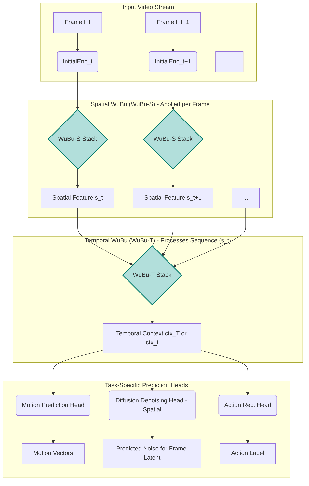

# WuBu Spatio-Temporal Nesting (時空層疊嵌套 - Shíkōng Céngdié Qiàn​tào): An Adaptive, Rotation-Aware, Nested Hyperbolic Framework for Dynamic Scene Understanding and Prediction

**Abstract**

Modeling dynamic scenes, such as those in videos, presents a profound challenge: capturing the intricate interplay of multi-scale spatial hierarchies within individual frames, the complex temporal evolution of these structures, and the inherent rotational transformations that govern both object motion and viewpoint changes. Existing methods often separate spatial and temporal modeling or lack deep geometric inductive biases for both. We introduce **WuBu Spatio-Temporal Nesting (時空層疊嵌套 - Shíkōng Céngdié Qiàn​tào: "Spatio-Temporal Layered Nesting")**, a novel framework that extends the foundational WuBu Nesting paradigm to the dynamic domain. It proposes a dual-nested architecture: First, a **Spatial WuBu (WuBu-S)** processes individual frames (or their latent representations) through a projective cascade of nested hyperbolic spaces (e.g., `H^n1 → H^n2 → ... → H^1`), where dimensionality (`n_i`), curvature (`c_i > 0`), and scale (`s_i > 0`) are adaptive. WuBu-S leverages learnable Boundary Sub-Manifolds, Level Descriptors, Level Spread Parameters, and Intra-Level Tangent Flows, with inter-level transitions featuring explicit `SO(n_i)` Rotations (e.g., via quaternions for `n_i=4`) and dimensionality-reducing Mappings in tangent space. This derives compact, geometrically-informed spatial feature vectors for each frame. Second, a **Temporal WuBu (WuBu-T)** takes the sequence of these spatial feature vectors as input. WuBu-T employs its own nested hierarchy of adaptive hyperbolic spaces to model the dynamics between frame representations. Inter-level transformations within WuBu-T, also featuring tangent space rotations (`R_τ`) and mappings (`T̃_τ`), learn complex temporal dependencies and transformations, potentially capturing phase shifts, cyclical patterns, or event-level abstractions. This hierarchical spatio-temporal processing allows the framework to explicitly model and predict components crucial for dynamic scenes, such as **motion vectors (optical flow)** or **future frame latents** within a diffusion-based generative model. By deeply integrating adaptive multi-scale hyperbolic geometry with explicit rotation-awareness both spatially and temporally, WuBu Spatio-Temporal Nesting offers a powerful new paradigm for learning the fundamental geometric and dynamic rules of visual worlds, paving the way for more robust and interpretable video understanding and generation.

---

## 1. Introduction

The automatic understanding and prediction of dynamic visual scenes from video data remains a cornerstone challenge in artificial intelligence, underpinning advancements in autonomous systems, robotics, virtual and augmented reality, and intelligent content creation [[1](#ref1), [2](#ref2)]. Videos present a rich, high-dimensional stream of information, characterized by complex spatial structures within individual frames, their intricate temporal evolution, object interactions, and the continuous geometric transformations induced by object motion, articulation, and camera movement. Effectively modeling such data demands architectures capable of capturing not only the semantic content (the "what") but also the complex dynamics and geometric interrelations (the "how") across space and time.

Current deep learning approaches to video analysis often employ Convolutional Neural Networks (CNNs) for spatial feature extraction from individual frames, followed by Recurrent Neural Networks (RNNs), LSTMs, or, more recently, Transformers for temporal aggregation and modeling [[3](#ref3), [4](#ref4), [5](#ref5)]. While these methods have achieved significant success, they predominantly operate within Euclidean geometry. This may impose limitations when modeling phenomena with inherent hierarchical structures (e.g., articulated object parts, scene composition) or when dealing with transformations that are naturally non-Euclidean, such as rotations and dynamic changes in complex systems. Diffusion models, having demonstrated remarkable success in image generation [[6](#ref6)], are now being extended to video generation and prediction [[7](#ref7), [8](#ref8)]. These models typically adapt image architectures to operate on sequences of frames or their latent representations, sometimes incorporating explicit motion cues like optical flow. However, the core denoising networks within these video diffusion models still largely rely on Euclidean operations, potentially lacking specialized geometric inductive biases that could lead to more efficient learning of complex spatio-temporal dynamics and improved generalization.

Our previous work introduced **WuBu Nesting (層疊嵌套)** [[9](#ref9) - *Self-reference to the original WuBu paper*], a comprehensive framework for modeling complex static data. It leverages adaptively nested hyperbolic spaces, learnable boundary sub-manifolds, explicit tangent space rotations, relative vector computations, level-specific descriptors, spread parameters, and intra-level tangent flows. This framework highlighted the potential of deeply integrated geometric principles for capturing multi-scale hierarchies and rotational relationships in static contexts.

This paper extends this vision to the dynamic domain with **WuBu Spatio-Temporal Nesting (時空層疊嵌套 - Shíkōng Céngdié Qiàn​tào)**. We propose that the core principles of WuBu Nesting can be hierarchically applied not only to the spatial content of individual frames but also to the temporal sequence of these frame representations. This culminates in a dual-nested architecture:

1.  **Spatial WuBu (WuBu-S): A Projective Geometric Encoder per Frame.** Each video frame (or its features/latents derived from an initial encoder like a VAE [[10](#ref10)]) is processed by a WuBu-S stack. This stack employs a cascade of nested hyperbolic levels, potentially with decreasing dimensionality (e.g., `H^4 → H^3 → H^2 → H^1`). Each level `H^n_i` adapts its geometry (curvature `c_i`, scale `s_i`) and utilizes its full suite of components (boundary manifolds, level descriptors, intra-level tangent flow) to analyze the `n_i`-dimensional representation. Inter-level transitions are mediated in tangent space, featuring explicit `SO(n_i)` rotations followed by a dimensionality-reducing mapping `T̃_i: ℝ^{n_i} → ℝ^{n_{i+1}}`. The output of WuBu-S is a compact, geometrically rich feature vector `s_t` for each frame `f_t`.
2.  **Temporal WuBu (WuBu-T): Modeling Dynamics of Spatial Features.** The sequence of these per-frame spatial feature vectors `{s_t}` is then processed by a second, distinct WuBu Nesting stack, WuBu-T. This temporal WuBu uses its own hierarchy of adaptive nested hyperbolic levels to model the relationships, transformations, and dynamics *between* these frame features over time. Rotations `R_τ` in WuBu-T can capture complex temporal phase evolutions or transformations of dynamic patterns, while its other components (boundaries, descriptors, flow) model temporal event structures and characteristic dynamic modes.

This hierarchical, deeply geometric processing allows WuBu Spatio-Temporal Nesting to learn a multi-scale, rotation-aware representation of both the spatial content within frames and the temporal dynamics across frames. We hypothesize that this architecture is particularly well-suited for tasks fundamental to dynamic scene understanding, such as:
*   **Motion Vector Prediction:** Generating dense optical flow fields by learning the geometric transformations of features between frames.
*   **Future Frame Prediction/Generation (especially within a diffusion framework):** Using the learned spatio-temporal representation to denoise future frame latents, conditioned on past information and predicted motion characteristics.
*   **Building Geometric World Models:** Learning an intrinsic, compressed model of scene dynamics that respects geometric constraints and transformations, enabling more robust long-term prediction and planning.

By explicitly incorporating adaptive hyperbolic geometries and rotation mechanisms at both spatial and temporal scales, WuBu Spatio-Temporal Nesting aims to provide a more powerful, interpretable, and potentially more sample-efficient foundation for modeling the dynamic visual world.

---

## 2. Related Work

The WuBu Spatio-Temporal Nesting framework intersects with and draws inspiration from several active research areas.

### 2.1. Hyperbolic Deep Learning
The aptitude of hyperbolic geometry for embedding hierarchical data with low distortion [[11](#ref11), [12](#ref12)] has spurred its application in diverse fields. Hyperbolic Neural Networks [[13](#ref13)] define operations like dense layers and attention within these curved spaces. Applications in computer vision have explored hyperbolic embeddings for image classification [[14](#ref14)] and segmentation [[15](#ref15)], often leveraging the geometry to model partonomic or semantic hierarchies.
*   **Critique & WuBu Distinction:** Most existing hyperbolic models use a single hyperbolic space with fixed curvature and do not natively support nested hierarchies or explicit, learnable rotations between levels of abstraction, nor do they typically address sequential data with the temporal geometric adaptations proposed by WuBu-T. WuBu-S's projective cascade and WuBu-T's temporal hierarchy are key differentiators.

### 2.2. Quaternion and Rotation-Aware Neural Networks
Quaternions provide an efficient algebra for 3D/4D rotations, leading to Quaternion Neural Networks (QNNs) [[16](#ref16), [17](#ref17)] that achieve parameter efficiency and can better model rotational symmetries. Steerable CNNs and Group Equivariant Networks [[18](#ref18), [19](#ref19)] aim to build equivariance or invariance to rotations and other transformations directly into network architectures.
*   **Critique & WuBu Distinction:** These methods primarily operate in Euclidean or specialized rotation group spaces and typically lack the hierarchical embedding capabilities of hyperbolic geometry. WuBu-ST integrates learnable `SO(n)` rotations within tangent spaces at each transition in both its spatial (WuBu-S) and temporal (WuBu-T) hierarchies, combining rotation-awareness with adaptive multi-scale hyperbolic modeling.

### 2.3. Product Manifolds and Mixed-Curvature Models
To combine benefits from different geometries, models using product spaces (e.g., `ℝ^n × S^m × H^k`) have been proposed [[20](#ref20), [21](#ref21)]. These allow simultaneous representation in spaces with varying inductive biases.
*   **Critique & WuBu Distinction:** Product manifolds offer parallel geometric capacities but do not inherently model the *nested*, recursively embedded structure of WuBu Nesting. WuBu-ST proposes a deep, hierarchical composition of adaptive geometries rather than a parallel arrangement.

### 2.4. Video Representation Learning
Traditional video understanding often relies on 3D CNNs [[3](#ref3)] that convolve across spatial and temporal dimensions, or two-stream architectures [[22](#ref22)] that separately process appearance and motion (often optical flow) before fusion. Video Transformers [[4](#ref4), [5](#ref5)], such as ViViT [[23](#ref23)] or TimeSformer [[24](#ref24)], have gained prominence by treating video as a sequence of frame patches or frame-level features and using self-attention mechanisms to capture long-range spatio-temporal dependencies.
*   **Critique & WuBu Distinction:** While powerful, these architectures predominantly operate in Euclidean space. WuBu-ST aims to infuse deep geometric inductive biases (hyperbolic nesting, explicit rotations) into both the per-frame spatial analysis (WuBu-S) and the cross-frame temporal modeling (WuBu-T), potentially capturing complex spatio-temporal structures more efficiently or robustly.

### 2.5. Optical Flow Estimation
Deep learning has revolutionized optical flow estimation, with architectures like FlowNet [[25](#ref25)], PWC-Net [[26](#ref26)], and RAFT [[27](#ref27)] achieving state-of-the-art performance. These typically use CNNs to extract features, a correlation layer to match features between frames, and iterative refinement schemes.
*   **Critique & WuBu Distinction:** These are highly specialized for flow estimation. WuBu-ST, when configured for motion prediction, would learn motion representations within its integrated geometric framework. The rotation-aware components (`R_i`) in a motion-focused WuBu could learn to canonicalize local motion patterns, and the hierarchical structure could analyze motion at multiple scales of abstraction.

### 2.6. Video Diffusion Models
Recent works are extending image diffusion models to video generation [[7](#ref7), [8](#ref8), [28](#ref28)]. Approaches include factorizing spatio-temporal generation, unrolling U-Net-like architectures temporally, incorporating temporal attention, and diffusing in pixel or latent space. Some models explicitly predict or utilize optical flow for improved temporal consistency [[29](#ref29)].
*   **Critique & WuBu Distinction:** The denoising networks in current video diffusion models are primarily Euclidean. WuBu-ST proposes a fundamentally different geometric backbone. It could serve as the core denoising network, with WuBu-S processing the spatial aspects of noisy latents and WuBu-T providing powerful temporal conditioning and context, all while respecting geometric principles of hierarchy and rotation.

### 2.7. Geometric World Models
The concept of "world models" [[30](#ref30)] involves learning a compressed representation of an environment's state and dynamics, enabling prediction and planning. Some recent efforts explore incorporating geometric priors or learning on manifolds for more structured state representations [[31](#ref31)].
*   **Critique & WuBu Distinction:** WuBu-ST aligns strongly with this ambition. By learning adaptive geometries and explicit transformations for both spatial configurations and temporal evolutions, it aims to build an intrinsic, geometrically-grounded model of dynamic scenes, which is a key step towards robust world models.

---

## 3. The WuBu Spatio-Temporal Nesting Framework

The WuBu Spatio-Temporal Nesting (WuBu-ST) framework is designed as a hierarchical system composed of two primary WuBu Nesting stacks: a Spatial WuBu (WuBu-S) for per-frame projective geometric analysis, and a Temporal WuBu (WuBu-T) for modeling the dynamics of the features extracted by WuBu-S.

### 3.1. Overall Architecture

The general processing pipeline is as follows:
1.  **Initial Frame Encoding (Optional but Recommended):** Input video frames `f_t` are typically first processed by an initial encoder (e.g., a VAE encoder for latent diffusion, or a standard CNN feature extractor) to obtain a base feature representation `z_t` for each frame. This `z_t` could be a dense feature map or a global frame descriptor.
2.  **Spatial WuBu (WuBu-S) Processing:** Each `z_t` (or features derived from it) is independently processed by the WuBu-S stack. WuBu-S employs a projective cascade of nested hyperbolic levels to transform `z_t` into a compact, geometrically-informed spatial feature vector `s_t`.
3.  **Temporal WuBu (WuBu-T) Processing:** The sequence of spatial feature vectors `{s_1, s_2, ..., s_T}` is fed into the WuBu-T stack. WuBu-T models the temporal relationships and dynamics within this sequence, producing a temporal context vector `ctx_T` (or a sequence of evolving context vectors `ctx_t`).
4.  **Task-Specific Prediction Head(s):** The output(s) from WuBu-T (and potentially intermediate features from WuBu-S) are used by one or more prediction heads tailored to the specific downstream task (e.g., motion vector prediction, noise prediction for diffusion, action classification).

**Figure 1:** Conceptual overview of the WuBu Spatio-Temporal Nesting framework.

### 3.2. Spatial WuBu (WuBu-S): Projective Hierarchical Feature Extraction

WuBu-S processes the representation of each frame `z_t` to extract a robust spatial feature vector `s_t`. It instantiates the core WuBu Nesting architecture [[9](#ref9)] with a specific focus on a projective cascade of dimensions.

*   **Input:** Frame representation `z_t`. An initial trainable linear projection maps `z_t` (or features derived from it, e.g., flattened patch embeddings if `z_t` is a feature map) to the tangent space `T_o(H^{n_1}_{S,1})` of the first hyperbolic level of WuBu-S.
*   **Nested Hyperbolic Levels (`H^{n_i}_{S,i, c_{S,i}, s_{S,i}}`):**
    *   A sequence of `L_S` levels, where `i` ranges from `1` to `L_S`.
    *   **Projective Dimensionality (`n_{S,i}`):** A key characteristic of WuBu-S is that the dimensionality `n_{S,i}` of the hyperbolic space at level `i` typically decreases with `i` (e.g., `n_{S,1}=4, n_{S,2}=3, n_{S,3}=2, n_{S,4}=1`). This forces the model to learn progressively more abstract and compressed representations of the spatial information.
    *   **Adaptive Geometry (`c_{S,i}, s_{S,i}`):** Learnable curvature and scale parameters allow each level to adapt its geometry to the `n_{S,i}}$-dimensional spatial features it processes.
    *   **Components at each level `i`:**
        *   **Boundary Sub-Manifolds (`B_{S,i,j}`):** Parameterized by learnable `n_{S,i}}$-dimensional tangent vectors. In `H^3`, they could represent canonical 3D local shapes or orientations; in `H^2`, 2D patterns.
        *   **Learnable Level Descriptor (`ld_{S,i}`):** An `n_{S,i}}$-dimensional tangent vector capturing characteristic geometric properties of spatial features at this level of abstraction and dimensionality.
        *   **Learnable Level Spread (`σ_{S,i}`):** Scalar representing uncertainty or feature density for `n_{S,i}}$-D spatial patterns.
        *   **Intra-Level Tangent Flow (`F_{S,i}`):** An `n_{S,i}}D → n_{S,i}}D` transformation modeling refinements or dynamics of spatial features within `T_o(H^{n_i}_{S,i})`.
        *   **Intra-Level Processing Module (`Proc_{S,i}`):** Combines inputs (primary tangent vector, aggregated relative vectors from previous transition, transformed descriptor from previous level, spread from previous level) to produce an output tangent vector `v_{S,i}^{out}`.

*   **Inter-Level Transformation (`T_{S, i→i+1}`):** Mediates the transition from `T_o(H^{n_i}_{S,i})` to `T_o(H^{n_{i+1}}_{S,i+1})`.
    *   **Tangent Space Rotation (`R_{S,i}`):** An `SO(n_{S,i})` rotation applied to `v_{S,i}^{out}`, boundary tangent vectors, and `ld_{S,i}$.
        *   If `n_{S,i}=4`, quaternion multiplication can be used.
        *   If `n_{S,i}=3`, standard `SO(3)` rotation matrices (e.g., parameterized via axis-angle or exponential map of skew-symmetric matrices).
        *   If `n_{S,i}=2`, `SO(2)` rotation matrices.
        This step aims to align `n_{S,i}}$-dimensional spatial features into a canonical orientation before projection.
    *   **Non-Rotational Mapping & Projection (`T̃_{S,i}`):** A learnable mapping (e.g., MLP or linear layer) from `ℝ^{n_{S,i}} → ℝ^{n_{S,i+1}}`. This performs feature transformation *and* the crucial dimensionality reduction.
    *   **Relative Vector Generation:** `d_{S,i+1,j,k}` are computed in `T_o(H^{n_{i+1}}_{S,i+1})` between the transformed primary vector and transformed boundary vectors.

*   **Output (`s_t`):** The final spatial feature vector `s_t` for frame `f_t` is derived by aggregating tangent space information from one or more levels of WuBu-S (e.g., concatenating the 1D outputs if the cascade projects down to `H^1`, or taking the output of the final level).

### 3.3. Temporal WuBu (WuBu-T): Modeling Dynamics of Spatial Features

WuBu-T takes the sequence of spatial feature vectors `{s_t}` (where each `s_t ∈ ℝ^D`) and models their temporal evolution. It instantiates another full WuBu Nesting architecture.

*   **Input:** Sequence `{s_t}`. An initial trainable linear projection maps each `s_t` to the tangent space `T_o(H^{n_1}_{T,1})` of the first temporal WuBu level. The dimensionality `n_{T,1}` would typically be `D` or related to it.
*   **Nested Hyperbolic Levels (`H^{n_j}_{T,j, c_{T,j}, s_{T,j}}`):**
    *   A sequence of `L_T` levels, where `j` ranges from `1` to `L_T`.
    *   **Dimensionality (`n_{T,j}`):** Can be fixed or also follow a projective cascade, allowing abstraction of temporal patterns. For instance, `n_{T,j}` could be `D` throughout, or reduce.
    *   **Adaptive Geometry (`c_{T,j}, s_{T,j}`):** Learnable curvature and scale for modeling the geometry of temporal sequences.
    *   **Components at each level `j`:**
        *   **Boundary Sub-Manifolds (`B_{T,j,k}`):** Parameterized by `n_{T,j}}$-dimensional tangent vectors. Could represent archetypal temporal event signatures, phases, or dynamic primitives (e.g., "oscillation," "sudden change," "stability").
        *   **Learnable Level Descriptor (`ld_{T,j}`):** An `n_{T,j}}$-dimensional tangent vector capturing characteristic properties of temporal dynamics at this level of abstraction (e.g., dominant frequencies, types of transitions).
        *   **Learnable Level Spread (`σ_{T,j}`):** Scalar representing uncertainty or density of temporal patterns.
        *   **Intra-Level Tangent Flow (`F_{T,j}`):** An `n_{T,j}}D → n_{T,j}}D` transformation modeling the evolution or refinement of the temporal state representation within `T_o(H^{n_j}_{T,j})`. This could capture complex, non-linear dynamics.
        *   **Intra-Level Processing Module (`Proc_{T,j}`):** Combines inputs to produce `v_{T,j}^{out}`.

*   **Inter-Level Transformation (`T_{T, j→j+1}`):**
    *   **Tangent Space Rotation (`R_{T,j}`):** An `SO(n_{T,j})` rotation. If `s_t` (and thus `v_{T,j}^{in}`) are, for example, 4D, `SO(4)` rotations could capture complex transformations of temporal phase spaces or cyclical dynamic modes.
    *   **Non-Rotational Mapping (`T̃_{T,j}`):** Maps `ℝ^{n_{T,j}} → ℝ^{n_{T,j+1}}`, transforming features and potentially changing dimensionality of the temporal representation.
    *   **Relative Vector Generation:** `d_{T,j+1,k,l}` capture relationships to archetypal temporal patterns.

*   **Output (`ctx_T` or `{ctx_t}`):** The final output from WuBu-T is a temporal context representation. This could be a single vector `ctx_T` summarizing the entire input sequence, or a sequence of evolving context vectors `ctx_t` (e.g., if WuBu-T has recurrent connections or is processed autoregressively).

### 3.4. Coupling and Information Flow for Prediction

The strength of WuBu-ST lies in its ability to generate rich, geometrically-informed spatial (`s_t`) and temporal (`ctx_t`) representations. These are then consumed by task-specific prediction heads:
*   **Motion Prediction:** `flow_{t→t+1} = \text{MLP_flow}(s_t, s_{t+1}, ctx_t)` or `\text{MLP_flow}(ctx_t \text{ from } \{s_k\}_{k \le t})`.
*   **Diffusion Denoising:** For predicting noise `ε` on a noisy latent `z_{t+1, k_d}` (frame `t+1`, diffusion step `k_d`):
    `ε = \text{DenoiseNet}(z_{t+1, k_d}, k_d, s_t, ctx_t)`
    where `DenoiseNet` could itself be another (potentially simpler) WuBu-S architecture, or a standard U-Net, heavily conditioned by `s_t` and `ctx_t`.
*   **Action Recognition:** `action_label = \text{Classifier}(\text{Aggregate}(\{ctx_t\}))$ or `\text{Classifier}(ctx_T)`.

---

## 4. Conceptual Mathematical Formulation

Let `f_t` be an input video frame at time `t`.
Let `Enc_0` be an initial frame encoder (e.g., VAE encoder, CNN).
`z_t = Enc_0(f_t)`.

**A. Spatial WuBu (WuBu-S) - For each frame `t`:**
Let `v_{S,0}^{(t)}` be the initial `n_{S,1}}$-D tangent vector for frame `t` derived from `z_t`.
For each WuBu-S level `i = 1 \dots L_S`:
1.  **Inputs to `Proc_{S,i}^{(t)}`:**
    *   Primary tangent vector: `v_{S,i-1}^{out,(t)}` (output from previous level/transform, or `v_{S,0}^{(t)}` for `i=1`).
    *   Aggregated relative vectors: `d_{S,i}^{agg,(t)}` (from `T_{S,i-1→i}`).
    *   Transformed level descriptor: `ld_{S,i}^{in,(t)}` (from `T_{S,i-1→i}`).
    *   Spread from previous level: `σ_{S,i-1}^{(t)}`.
2.  `v_{S,i}^{mid,(t)} = Proc_{S,i}^{(t)}(\text{inputs}_1)`.
3.  `v_{S,i}^{flowed,(t)} = v_{S,i}^{mid,(t)} + F_{S,i}(v_{S,i}^{mid,(t)})`.
4.  `v_{S,i}^{out,(t)} = v_{S,i}^{flowed,(t)} ∈ T_o(H^{n_i}_{S,i})`.
5.  If `i < L_S`, apply Inter-Level Transformation `T_{S, i→i+1}`:
    *   Rotate `v_{S,i}^{out,(t)}`, boundary params of level `i`, `ld_{S,i}^{param}` using `R_{S,i}`.
    *   Map & Project rotated vectors to `T_o(H^{n_{i+1}}_{S,i+1})` using `T̃_{S,i}` to get inputs for level `i+1`.
The final spatial feature `s_t` is aggregated from `{v_{S,i}^{out,(t)}}`.

**B. Temporal WuBu (WuBu-T) - For sequence `{s_t}`:**
Let `v_{T,0}^{(t)}` be the initial `n_{T,1}}$-D tangent vector derived from `s_t`.
(Processing can be sequential/recurrent or parallel over the sequence depending on `Proc_{T,j}` design).
For each WuBu-T level `j = 1 \dots L_T`:
1.  **Inputs to `Proc_{T,j}^{(t)}` (conceptually for element `t` of sequence, influenced by others):**
    *   Primary tangent vector: `v_{T,j-1}^{out,(t)}`.
    *   Aggregated relative vectors: `d_{T,j}^{agg,(t)}`.
    *   Transformed level descriptor: `ld_{T,j}^{in,(t)}`.
    *   Spread from previous level: `σ_{T,j-1}^{(t)}`.
2.  `v_{T,j}^{mid,(t)} = Proc_{T,j}^{(t)}(\text{inputs}_1)`.
3.  `v_{T,j}^{flowed,(t)} = v_{T,j}^{mid,(t)} + F_{T,j}(v_{T,j}^{mid,(t)})`.
4.  `v_{T,j}^{out,(t)} = v_{T,j}^{flowed,(t)} ∈ T_o(H^{n_j}_{T,j})`.
5.  If `j < L_T`, apply `T_{T, j→j+1}` similarly.
The final temporal context `ctx_T` (or `ctx_t`) is aggregated from `{v_{T,j}^{out,(t)}}`.

**C. Prediction Heads:**
*   `\text{Output} = \text{PredictionHead}(\text{Aggregated features from WuBu-S and/or WuBu-T})`.

---

## 5. Applications and Tasks in Dynamic Scenes

The WuBu-ST framework, with its deep geometric modeling capabilities, is poised to address several challenging tasks in video understanding and generation.

### 5.1. Motion Vector Prediction (Optical Flow)
Accurate optical flow estimation is crucial for many video tasks.
*   **WuBu-ST for Flow:** The framework can be trained to predict dense motion vectors `flow_{t→t+1}` between frame `f_t` and `f_{t+1}`. The inputs to WuBu-S would be features from `f_t` (and potentially `f_{t+1}`), and WuBu-T would model the temporal context leading to the motion.
*   **Geometric Advantages:**
    *   `R_{S,i}` (spatial rotations) could help identify corresponding features despite orientation changes.
    *   `R_{T,j}` (temporal rotations) could model complex motion trajectories or transformations of motion patterns themselves.
    *   Boundary manifolds in WuBu-S might learn to represent trackable keypoints or segment boundaries, while in WuBu-T they might represent canonical motion primitives (e.g., translation, rotation, scaling).
    *   Relative vectors can precisely encode the geometric displacement of features.

### 5.2. Video Generation and Prediction with Diffusion Models
WuBu-ST can serve as a powerful backbone for video diffusion models.
*   **Denoising Latent Frame Representations:**
    *   A VAE encodes frames `f_t` into latents `z_t`. Diffusion occurs on `z_t`.
    *   The denoising network `ε_θ(z_{t+1, k_d}, k_d, \text{conditioning})` would use WuBu-ST to generate strong conditioning.
    *   `s_t = \text{WuBu-S}(z_t)`.
    *   `ctx_t = \text{WuBu-T}(\{s_k\}_{k \le t})`.
    *   The actual denoising block for `z_{t+1, k_d}` could be a (potentially simpler) WuBu-S or U-Net, conditioned by `s_t`, `ctx_t`, and `k_d`.
*   **Predicting and Diffusing Motion/Residuals:**
    *   WuBu-ST predicts `flow_{t→t+1}`. Frame `f_t` is warped to `f'_{t+1}`.
    *   A residual `res_{t+1} = f_{t+1} - f'_{t+1}` is computed.
    *   The diffusion model then learns to generate/denoise this `res_{t+1}`, conditioned by WuBu-ST features. This can be more efficient than diffusing full frames.
*   **Benefits:** The strong geometric and temporal priors from WuBu-ST could lead to more coherent, realistic, and controllable video generation, potentially requiring fewer diffusion steps or less data.

### 5.3. Action Recognition and Video Understanding
The rich hierarchical features extracted by WuBu-ST can be highly discriminative for action recognition and broader video understanding.
*   `s_t` captures geometrically salient spatial information within a frame.
*   `ctx_t` or `ctx_T` captures the evolution of these salient features, representing complex events.
*   Boundary manifolds in WuBu-T could explicitly learn to detect key phases of an action. Level descriptors might encode action styles.
*   A classifier head on top of WuBu-T outputs can perform action labeling.

### 5.4. Towards Geometric World Models
WuBu-ST's emphasis on learning adaptive geometries (`c_i, s_i, n_i`), explicit transformations (rotations `R_i`, mappings `T̃_i`), and dynamics (flows `F_i`) aligns with the goals of building world models. It could learn an intrinsic representation of how objects and scenes configure themselves spatially and evolve geometrically over time, potentially capturing intuitive physics or cause-and-effect in a structured manner.

---

## 6. Implementation Considerations & Potential Experimental Setup

Implementing and evaluating WuBu-ST is a significant undertaking.

### 6.1. Computational Backbone
*   The `FullyHyperbolicWuBuNestingModel` from [[9](#ref9)] would serve as the template for both WuBu-S and WuBu-T modules.
*   Careful engineering of tensor shapes and data flow between the spatial and temporal stacks is crucial.
*   Initial Frame Encoder: Standard CNNs (e.g., ResNet, EfficientNet variants) or VAE encoders.

### 6.2. Parameterization and Stability
*   Consistent and stable implementations of (scale-aware) hyperbolic Log/Exp maps are essential. Libraries like Geoopt [[32](#ref32)] can be leveraged or extended.
*   Rotation Parameterization: For `SO(n)`, robust methods like the exponential map from skew-symmetric matrices, or Cayley transforms, are needed for `n≠4`. Unit quaternions for `n=4`.
*   Learnable Geometries: `c_i, s_i, σ_i` must be constrained (e.g., `softplus(param) + min_val`).
*   Gradient Flow: Liberal use of LayerNorm, residual connections, and gradient clipping will be vital, especially with deep WuBu-S and WuBu-T stacks.

### 6.3. Training Strategy
*   **Pre-training (Optional):** WuBu-S could be pre-trained on single images for spatial feature extraction. WuBu-T could be pre-trained on simpler sequential tasks.
*   **End-to-End Training:** For tasks like video diffusion or motion prediction, end-to-end training is likely necessary but challenging.
*   **Curriculum Learning:** Start with shorter sequences or simpler dynamics.
*   **Loss Functions:**
    *   Motion: Endpoint Error (EPE) for optical flow.
    *   Diffusion: Standard MSE loss on predicted noise.
    *   Action Recognition: Cross-entropy loss.
*   **Datasets:**
    *   Optical Flow: Sintel [[33](#ref33)], KITTI Flow [[34](#ref34)], FlyingChairs/Things [[25](#ref25)].
    *   Video Generation/Prediction: Kinetics-600 [[35](#ref35)], UCF101 [[36](#ref36)], BAIR Robot Pushing [[37](#ref37)].
    *   Action Recognition: Kinetics, UCF101, Something-Something [[38](#ref38)].

### 6.4. Baselines for Comparison
*   **Motion:** RAFT [[27](#ref27)], PWC-Net [[26](#ref26)].
*   **Video Diffusion:** LVDM [[7](#ref7)], VDM [[8](#ref8)], Make-A-Video [[28](#ref28)].
*   **Action Recognition:** Video Transformers (ViViT [[23](#ref23)]), SlowFast [[39](#ref39)], 3D CNNs.

### 6.5. Ablation Studies
Crucial for understanding the contribution of each WuBu-ST component:
*   Effect of adaptive `c_i, s_i, n_i` vs. fixed.
*   Impact of tangent space rotations `R_i` (spatial and temporal).
*   Contribution of boundary manifolds, level descriptors, spread parameters, and tangent flows.
*   Depth of WuBu-S and WuBu-T stacks.
*   Dimensionality choices in the projective cascade of WuBu-S.

---

## 7. Discussion

WuBu Spatio-Temporal Nesting offers a paradigm shift from predominantly Euclidean video modeling towards a deeply geometric approach.

### 7.1. Strengths and Potential Advantages
*   **Rich Geometric Inductive Biases:** Explicitly models hierarchy, rotation, relative spatial/temporal configurations, and scale-specific characteristics, which are often implicit or approximated in other models.
*   **Adaptivity:** Learnable curvatures, scales, and dimensionalities allow the model to tailor its geometric capacity to the data.
*   **Rotation-Awareness:** The integrated `SO(n)` rotations in tangent spaces are a unique feature for handling orientational changes in both spatial features and temporal dynamic patterns.
*   **Interpretability (Potential):** Components like boundary manifolds, level descriptors, and learned curvatures/scales might offer insights into how the model organizes and understands spatio-temporal information. For example, visualizing learned boundary points in `H^2` or `H^3` could reveal canonical local shapes or motion primitives.
*   **Sample Efficiency (Hypothesized):** Stronger priors might lead to better learning from less data, especially for tasks with significant geometric components.

### 7.2. Challenges and Limitations
*   **Complexity:** The framework is undeniably complex, with many interacting components and learnable geometric parameters.
*   **Computational Cost:** Deep stacks of WuBu-S and WuBu-T, along with hyperbolic operations and `SO(n)` transformations, will be computationally intensive.
*   **Training Stability:** Optimizing such a complex, deeply nested geometric architecture presents significant challenges. Ensuring stable gradient flow and avoiding degenerate geometries will be paramount.
*   **Parameterization of `SO(n)` for `n > 4`:** While solutions exist, efficient and stable learnable parameterizations for general `SO(n)` rotations need careful implementation.
*   **Data Requirements:** Learning meaningful adaptive geometries and complex transformations likely requires large and diverse video datasets.

### 7.3. Future Work
*   **Robust and Scalable Implementation:** Developing optimized and well-tested open-source implementations.
*   **Theoretical Analysis:** Formal investigation of the framework's expressivity, stability, and convergence properties.
*   **Advanced Geometric Operations:** Exploring more sophisticated boundary manifold parameterizations, richer tangent flow models (e.g., Neural ODEs [[40](#ref40)]), or direct geometric loss terms.
*   **Multi-Modal Extensions:** Incorporating other modalities like audio, text, or depth into the WuBu-ST framework.
*   **Applications Beyond Vision:** Exploring use in other dynamic systems with spatio-temporal structure (e.g., physics simulations, climate modeling, neuroscience).
*   **Visualization Techniques:** Developing methods to visualize the learned nested hyperbolic structures, tangent space transformations, and the evolution of features through the WuBu-ST pipeline to enhance interpretability.

---

## 8. Conclusion

WuBu Spatio-Temporal Nesting (時空層疊嵌套) extends the principles of adaptive nested hyperbolic geometry and rotation-aware tangent space transformations to the challenging domain of dynamic scene understanding and prediction. By proposing a dual architecture of a projective Spatial WuBu (WuBu-S) and a dynamic Temporal WuBu (WuBu-T), the framework aims to capture the intricate multi-scale spatial hierarchies within frames and their complex geometric evolution over time. WuBu-ST's unique integration of learnable dimensionalities, curvatures, scales, boundary manifolds, level descriptors, spread parameters, and tangent flows, all operating under explicit `SO(n)` rotational considerations, offers a novel and powerful paradigm. While computationally demanding and presenting significant implementation challenges, WuBu Spatio-Temporal Nesting holds the promise of advancing video modeling by providing a richer, more adaptable, and geometrically principled foundation for learning the fundamental rules of dynamic visual worlds, potentially leading to breakthroughs in motion prediction, video generation, action understanding, and the development of robust geometric world models.

---

## References (Illustrative and Incomplete - to be populated thoroughly)

[1] Goodfellow, I., Bengio, Y., & Courville, A. (2016). *Deep Learning*. MIT Press.
[2] LeCun, Y., Bengio, Y., & Hinton, G. (2015). Deep learning. *Nature*.
[3] Tran, D., Bourdev, L., Fergus, R., Torresani, L., & Paluri, M. (2015). Learning spatiotemporal features with 3d convolutional networks. *ICCV*.
[4] Vaswani, A., Shazeer, N., Parmar, N., Uszkoreit, J., Jones, L., Gomez, A. N., ... & Polosukhin, I. (2017). Attention is all you need. *NeurIPS*.
[5] Dosovitskiy, A., Beyer, L., Kolesnikov, A., Weissenborn, D., Zhai, X., Unterthiner, T., ... & Houlsby, N. (2020). An image is worth 16x16 words: Transformers for image recognition at scale. *ICLR*.
[6] Ho, J., Jain, A., & Abbeel, P. (2020). Denoising diffusion probabilistic models. *NeurIPS*.
[7] Ho, J., Chan, W., Saharia, C., Whang, J., Gao, R., Gritsenko, A., ... & Salimans, T. (2022). Video diffusion models. *arXiv preprint arXiv:2204.03458*.
[8] Harvey, W., Naderiparizi, S., Masrani, V., Weilbach, C., & Wood, F. (2022). Flexible Diffusion Modeling of Long Videos. *NeurIPS*.
[9] *Your Original WuBu Nesting Paper Reference Here.*
[10] Kingma, D. P., & Welling, M. (2013). Auto-encoding variational bayes. *ICLR*.
[11] Nickel, M., & Kiela, D. (2017). Poincaré embeddings for learning hierarchical representations. *NeurIPS*.
[12] Sala, F., De Sa, C., Gu, A., & Ré, C. (2018). Representation tradeoffs for hyperbolic embeddings. *ICML*.
[13] Ganea, O., Bécigneul, G., & Hofmann, T. (2018). Hyperbolic neural networks. *NeurIPS*.
[14] Khrulkov, V., Mirvakhabova, L., Ustinova, E., Oseledets, I., & Lempitsky, V. (2020). Hyperbolic image embeddings. *CVPR*.
[15] Atigh, M. G., Schoep, J., Acar, E., Van Noord, N., & Mettes, P. (2022). Hyperbolic image segmentation. *CVPR*.
[16] Parcollet, T., Morchid, M., & Linarès, G. (2018). Quaternion convolutional neural networks for heterogeneous image processing. *ICASSP*.
[17] Zhu, X., Xu, Y., Li, C., & Elgammal, A. (2018). Quaternion Convolutional Neural Networks. *ECCV*.
[18] Cohen, T., & Welling, M. (2016). Group equivariant convolutional networks. *ICML*.
[19] Weiler, M., Hamprecht, F. A., & Storath, M. (2018). Learning steerable filters for rotation equivariant cnns. *CVPR*.
[20] Gu, A., Sala, F., Gunel, B., & Ré, C. (2019). Learning Mixed-Curvature Representations in Product Spaces. *ICLR*.
[21] Skopek, O., Ganea, O. E., & Bécigneul, G. (2020). Mixed-curvature variational autoencoders. *ICLR*.
[22] Simonyan, K., & Zisserman, A. (2014). Two-stream convolutional networks for action recognition in videos. *NeurIPS*.
[23] Arnab, A., Dehghani, M., Heigold, G., Sun, C., Lučić, M., & Schmid, C. (2021). Vivit: A video vision transformer. *ICCV*.
[24] Bertasius, G., Wang, H., & Torresani, L. (2021). Is space-time attention all you need for video understanding?. *ICML*.
[25] Dosovitskiy, A., Fischer, P., Ilg, E., Hausser, P., Hazirbas, C., Golkov, V., ... & Brox, T. (2015). Flownet: Learning optical flow with convolutional networks. *ICCV*.
[26] Sun, D., Yang, X., Liu, M. Y., & Kautz, J. (2018). Pwc-net: Cnns for optical flow using pyramid, warping, and cost volume. *CVPR*.
[27] Teed, Z., & Deng, J. (2020). Raft: Recurrent all-pairs field transforms for optical flow. *ECCV*.
[28] Singer, U., Polyak, A., Hayes, T., Yin, X., An, J., Zhang, S., ... & Taigman, Y. (2022). Make-a-video: Text-to-video generation without text-video data. *arXiv preprint arXiv:2209.11855*.
[29] Blattmann, A., Rombach, R., Ling, H., Dockhorn, T., Kim, S. W., Ranjan, A., & Ommer, B. (2023). Align your latents: High-resolution video synthesis with latent diffusion models. *CVPR*.
[30] Ha, D., & Schmidhuber, J. (2018). World models. *arXiv preprint arXiv:1803.10122*.
[31] Anand, A., Racanière, S., Rezende, D. J., & Denil, M. (2022). Learning Plannable Representations with Causal InfoGAN. *ICLR*.
[32] Kochurov, M., et al. (2020). Geoopt: Riemannian Optimization in PyTorch. *GitHub*.
[33] Butler, D. J., Wulff, J., Stanley, G. B., & Black, M. J. (2012). A naturalistic open source movie for optical flow evaluation. *ECCV*.
[34] Geiger, A., Lenz, P., & Urtasun, R. (2012). Are we ready for autonomous driving? The kitti vision benchmark suite. *CVPR*.
[35] Kay, W., Carreira, J., Simonyan, K., Zhang, B., Hillier, C., Vijayanarasimhan, S., ... & Zisserman, A. (2017). The kinetics human action video dataset. *arXiv preprint arXiv:1705.06950*.
[36] Soomro, K., Zamir, A. R., & Shah, M. (2012). UCF101: A dataset of 101 human actions classes from videos in the wild. *CRCV-TR-12-01*.
[37] Ebert, F., Finn, C., Dasari, S., Xie, A., Lee, A., & Levine, S. (2017). Self-supervised visual planning with temporal skip connections. *CoRL*.
[38] Goyal, R., Epli, M., & Feichtenhofer, C. (2017). The "something something" video database for learning and evaluating visual common sense. *ICCV*.
[39] Feichtenhofer, C., Fan, H., Malik, J., & He, K. (2019). Slowfast networks for video recognition. *ICCV*.
[40] Chen, R. T. Q., Rubanova, Y., Bettencourt, J., & Duvenaud, D. K. (2018). Neural ordinary differential equations. *NeurIPS*.
