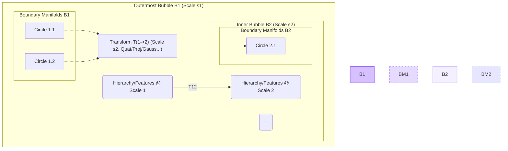

%%{init: {'theme': 'base', 'themeVariables': { 'primaryColor': '#9966FF', 'secondaryColor': '#D6C0FF', 'tertiaryColor': '#FFF', 'primaryTextColor': '#333', 'secondaryTextColor': '#555', 'tertiaryTextColor': '#777', 'primaryBorderColor': '#9966FF', 'secondaryBorderColor': '#D6C0FF', 'tertiaryBorderColor': '#EEE', 'lineColor': '#9966FF', 'clusterBkg': '#F5F0FF', 'mainBkg': '#FFFFFF', 'nodeBorder': '#9966FF', 'edgeLabelBackground':'#F5F0FF'}}}%%

# WuBu Nesting: An Adaptive Multi-Scale Geometric Framework

**Abstract**

Representing complex data with deep, multi-scale hierarchical structures and inherent rotational properties poses a significant challenge for conventional deep learning models. While hyperbolic geometry excels at embedding single-level hierarchies, and quaternions efficiently model rotations in Euclidean spaces, integrating these capabilities for recursive, multi-scale structures remains an open problem. We propose a novel conceptual framework, **WuBu Nesting**, designed to address this challenge. WuBu Nesting envisions a recursive geometric structure where hyperbolic spaces (Poincaré balls) are nested within each other, akin to Russian dolls ($\mathbb{H}^{n_1} \supset \mathbb{H}^{n_2} \supset \dots$). This nesting creates a pseudo-high-dimensional space capturing hierarchies at multiple scales. Each level includes learnable scale parameters ($s_i$) determining their relative size and can host specialized boundary sub-manifolds (e.g., lower-dimensional hyperbolic disks) representing distinct substructures. Crucially, we propose using diverse, learnable transformation functions (including quaternion operations for rotation, projections, and bridge manifolds) operating across the boundaries of these nested levels to model relationships between different scales of the hierarchy. Our framework offers unprecedented flexibility for modeling intricate data with heterogeneous geometric properties. We outline the conceptual architecture, potential benefits of this nested, multi-scale approach, and associated research directions.

## 1. Introduction

Deep learning models typically operate in Euclidean spaces, which struggle to embed data with strong hierarchical structures due to their polynomial volume growth [39]. Hyperbolic geometry, with its exponential volume growth, provides a more natural fit for such data [39, 31, 15], enabling lower-distortion embeddings of trees and graphs. Recent applications like HypCD [42] highlight its utility for tasks requiring hierarchical representations.

However, many complex systems exhibit hierarchies within hierarchies – a multi-scale structure. Furthermore, components within these hierarchies might possess intrinsic orientations, or transformations between levels might involve rotations. Existing hyperbolic models usually focus on a single level of hierarchy and do not inherently capture rotational dynamics efficiently. Quaternions are the tool of choice for efficient rotation representation [43], and Quaternion Neural Networks (QNNs) leverage this property [44, 45], but typically operate in Euclidean spaces without the capacity for hierarchical representation.

This paper introduces **WuBu Nesting**, a conceptual leap aiming to unify multi-scale hierarchical representation with rotational modeling. Instead of a single hyperbolic space or a parallel product of spaces, WuBu Nesting proposes a nested structure where hyperbolic manifolds contain other hyperbolic manifolds recursively. This creates a deep, fractal-like geometry with the following key innovations:

*   **Adaptive Nesting:** The nesting depth and relative scale ($s_i$) of each hyperbolic "bubble" are learnable parameters, allowing the geometry to adapt to the data's complexity and scale distribution.
*   **Boundary Sub-Manifolds:** Each level can host specialized lower-dimensional manifolds (e.g., hyperbolic disks visualized as "circles") representing distinct feature clusters or substructures relevant to that scale.
*   **Flexible Inter-Level Transformations:** Transitions between levels are modeled by learnable functions that may incorporate quaternion operations (for rotations), projections, Gaussian mappings, or even learned bridge manifolds connecting regions across scales.

The key hypothesis is that interactions and transformations between these nested levels can effectively model how structure and orientation at one scale relate to those at another. WuBu Nesting aims to provide a richer geometric inductive bias for complex, multi-scale, potentially rotation-dependent data.

## 2. Related Work

### 2.1 Hyperbolic Deep Learning

Hyperbolic deep learning has gained significant attention for its ability to represent hierarchical data efficiently. The pioneering work of Nickel and Kiela [39] introduced Poincaré embeddings for learning hierarchical representations, demonstrating superior performance over Euclidean embeddings for tree-like structures. Subsequent research expanded hyperbolic approaches to computer vision [31, 15, 1], natural language processing [10], and other domains.
Key developments include adapting neural network operations to hyperbolic geometry [19, 22], which allow for end-to-end training in hyperbolic space. Recent work by Liu et al. [42] applies hyperbolic geometry to category discovery, showing benefits for capturing hierarchical relationships between object categories and their parts.
However, these approaches typically employ a single hyperbolic manifold, lacking the capacity to represent multi-scale, nested hierarchical structures efficiently.

### 2.2 Quaternion Neural Networks (QNNs)

Quaternions provide a compact and efficient representation for 3D and 4D rotations [43]. Quaternion Neural Networks (QNNs) leverage this property by replacing real-valued weights and activations with quaternion values [44, 45]. They have shown benefits in parameter efficiency and capturing rotational invariances or equivariances, particularly in 3D vision, robotics, and signal processing.
QNNs excel at modeling rotational relationships but operate natively in Euclidean (or tangent) spaces without inherent support for hierarchical structure.

### 2.3 Product Manifolds and Multi-Scale Approaches

Product manifolds combine different geometric spaces (e.g., $\mathcal{M}_1 \times \mathcal{M}_2$) to capture diverse data properties simultaneously [46]. While these approaches increase representational capacity, they typically arrange manifolds in parallel rather than in a nested structure as proposed here.
Multi-scale modeling approaches from signal processing (wavelets) or computer vision (feature pyramids) address scale but often do so in Euclidean space without the rich geometric properties offered by hyperbolic spaces or quaternions.

## 3. The Enhanced WuBu Nesting Framework

WuBu Nesting represents data within an adaptive, recursively nested structure of hyperbolic spaces with associated boundary sub-manifolds and learnable inter-level transformations.

### 3.1. Conceptual Architecture

The overall architecture of WuBu Nesting involves:

*   Initial Encoding: Raw input data is encoded into an initial Euclidean feature vector.
*   Nested Hyperbolic Levels: These features are mapped through a series of nested hyperbolic spaces, with each level processing information at a different scale.
*   Boundary Manifolds: Within each level, specialized manifolds represent distinct substructures.
*   Inter-Level Transformations: Learned transformations connect different scales, potentially modeling rotational relationships.
*   Scale-Aware Aggregation: Information from relevant scales is combined for the final output.

```mermaid
graph TD;
    A[Input Data] --> B(Initial Encoding);
    B --> C{Map to Outer Tangent Space T_o(B1)};
    C --> D{Process/Transform in T_o(B1)};
    D --> E1[Map to Outer Ball B1 (exp_o^c, scale s1)];

    subgraph "Outer Ball B1 (Hyperbolic, Scale s1)"
        direction TB
        E1 --> F1{Intra-Ball Processing};
        F1 --> FB1{Boundary Manifolds (Circles) in B1};
        F1 --> G1{Identify Nesting Region / Map to Boundary Tangent Space T_p(B1)};
    end

    subgraph "Inter-Level Transformation T(1->2)"
        direction TB
        G1 & FB1 <--> H1(Learnable Transform Function: Quat, Proj, Gauss, Bridge...);
    end

    H1 --> I1{Map to Inner Tangent Space T_o(B2)};

    subgraph "Inner Ball B2 (Hyperbolic, Scale s2)"
        direction TB
        I1 --> J1[Map to Inner Ball B2 (exp_o^c, scale s2)];
        J1 --> K1{Intra-Ball Processing};
        K1 --> FB2{Boundary Manifolds (Circles) in B2};
        K1 --> L1{Identify Nesting Region / Map to Boundary Tangent Space T_p(B2)};
    end

     subgraph "Inter-Level Transformation T(2->3)"
        direction TB
        L1 & FB2 <--> H2(Learnable Transform Function ...);
    end

    H2 --> M1{... Adaptive Recursion ...};

    M1 --> N{Aggregate Information Across Levels/Scales};
    N --> O[Final Projection / Task Head];
    O --> P[Output];

    style E1 fill:#D6C0FF,stroke:#9966FF,stroke-width:2px
    style F1 fill:#D6C0FF,stroke:#9966FF,stroke-width:1px
    style FB1 fill:#E7DAFF,stroke:#9966FF,stroke-width:1px,stroke-dasharray: 5 5
    style J1 fill:#F5F0FF,stroke:#D6C0FF,stroke-width:2px
    style K1 fill:#F5F0FF,stroke:#D6C0FF,stroke-width:1px
    style FB2 fill:#E6E6FF,stroke:#D0D0FF,stroke-width:1px,stroke-dasharray: 5 5
    style H1 fill:#E7DAFF,stroke:#9966FF,stroke-width:2px,stroke-dasharray: 2 2
    style H2 fill:#E7DAFF,stroke:#9966FF,stroke-width:2px,stroke-dasharray: 2 2
```
**Figure 1:** Enhanced WuBu Nesting Conceptual Architecture with Adaptive Scales, Boundary Manifolds, and Flexible Transformations.

### 3.2. Enhanced Component Details & Concepts

#### 3.2.1 Adaptive Nesting & Scales

The number of nested levels ($k$) and the relative scale ($s_i > 0$) of each hyperbolic ball $\mathbb{H}^{n_i}_{c_i}$ (with curvature $-c_i < 0$) are key parameters. Making these learnable allows the geometry to dynamically adapt to the intrinsic complexity and scale distribution of the input data. The scale $s_i$ influences the metric tensor within the ball or the mapping functions between tangent space and the manifold.

We propose a conceptual scale-aware exponential map from the tangent space at the origin $T_o(\mathbb{H}^{n_i}_{c_i})$ to the ball:

$$\text{exp}_{o,s_i}^{c_i}(v) = \tanh\left(s_i \cdot \frac{\sqrt{c_i}\|v\|}{2}\right) \frac{v}{\sqrt{c_i}\|v\|}$$

Here, the scale factor $s_i$ modulates the mapping, effectively influencing the perceived "size" or density distribution within the hyperbolic space relative to the tangent space. (Note: The precise geometric interpretation and impact on the metric require rigorous derivation).

#### 3.2.2 Boundary Sub-Manifolds

Each level $\mathbb{H}^{n_i}_{c_i, s_i}$ can host a set of learnable, lower-dimensional sub-manifolds, $\mathcal{B}_i = \{B_{i,1}, B_{i,2}, \dots, B_{i,m_i}\}$. These could be, for instance, hyperbolic disks ($\mathbb{H}^2$) embedded within the higher-dimensional $\mathbb{H}^{n_i}$.

**Role**: They act as specialized containers for distinct types of information or substructures relevant at scale $i$. For example, different "circles" might represent different functional modules in code analysis or different types of object parts in vision.

**Parameterization**: Their position, orientation (within the higher-dimensional ball), and potentially their own internal geometry (curvature, dimension) are learned parameters.

**Interaction**: They can serve as sources or targets for the inter-level transformations, allowing information associated with specific substructures to be passed between scales.

#### 3.2.3 Boundary Detection/Mapping

A crucial mechanism, potentially implemented as a learnable neural network module (e.g., an attention mechanism or gating network). It determines:

-   When to transition to a deeper level based on the current representation $p'_i \in \mathbb{H}^{n_i}_{c_i, s_i}$.
-   Which region $\mathcal{R}_i$ or boundary manifold $B_{i,j} \in \mathcal{B}_i$ (if any) is most relevant for the transition.
-   How to map the relevant information (e.g., the point $p'_i$ or associated features) to the appropriate tangent space $T_p(\mathbb{H}^{n_i}_{c_i, s_i})$ at the point of transition $p$ for the subsequent inter-level transformation.

#### 3.2.4 Flexible Inter-Level Transformations

These learnable functions ($T_{i \rightarrow i+1}$) bridge the geometric gap between nested levels, typically operating on tangent space vectors $v \in T_p(\mathbb{H}^{n_i}_{c_i, s_i})$ to produce $v' \in T_o(\mathbb{H}^{n_{i+1}}_{c_{i+1}, s_{i+1}})$. They incorporate the scale $s_{i+1}$ and curvature $c_{i+1}$ of the target level.

Potential forms include:

*   **Quaternion Networks**: Ideal for explicitly modeling 3D/4D rotations and scaling between levels.
    $$v' = \text{QuaternionTransform}(v, s_{i+1}, c_{i+1})$$
*   **MLP Projections**: Standard feed-forward networks providing flexible, non-linear mappings between tangent spaces.
    $$v' = \text{MLP}(v, s_{i+1}, c_{i+1})$$
*   **Gaussian Processes/Mappings**: Model the transformation probabilistically, potentially useful for uncertainty estimation.
    $$v' \sim \mathcal{N}(\mu(v,s_{i+1}, c_{i+1}), \Sigma(v,s_{i+1}, c_{i+1}))$$
*   **Learned Bridge Manifolds**: More complex approaches, potentially involving learning an intermediate manifold or flow to connect regions across levels.

The choice of transformation could even be adaptive or learned per transition.

#### 3.2.5 Scale-Aware Aggregation

Combining information from different levels/scales requires a mechanism that respects the varying geometric contexts. We propose mapping representations from different levels to a common (e.g., the outermost tangent) space before aggregation:

*   **Attention Across Levels**: An attention mechanism where queries come from one level (e.g., the outermost, $i=1$), and keys/values come from representations mapped from all relevant nested levels ($j=1...k$) back to a common tangent space (e.g., $T_o(\mathbb{H}^{n_1}_{c_1, s_1})$). Let $\text{map}_{j \to 1}(x_j)$ be the mapping function.

    $$\alpha_j = \text{softmax}\left(\frac{Q_1 \cdot K_j}{\sqrt{d}}\right)$$
    $$\text{output} = \sum_j \alpha_j V_j$$

    Where $Q_1$ are queries derived from level 1 representations, and $K_j, V_j$ are keys and values derived from $\text{map}_{j \to 1}(x_j)$.

### 3.3. "Multi-Scale Nested Bubbles" Analogy

This structure embodies a "Russian doll" or nested "bubbles" concept:


**Figure 2:** Enhanced WuBu Nesting Multi-Scale Nested Space Concept with Boundary Circles and Learnable Scales/Transforms.

-   **Adaptive Scales**: Bubbles can shrink or grow relative to each other ($s_i$ learned).
-   **Specialized Substructures**: Circles ($B_{i,j}$) represent distinct features within a scale.
-   **Flexible Links**: Transformations ($T_{i \to i+1}$) between levels are learned and diverse.

## 4. Mathematical Formulation

We formally outline the conceptual WuBu Nesting structure:

### 4.1 Nested Hyperbolic Manifold

A nested hyperbolic manifold $\mathcal{M}_\text{nested}$ can be thought of recursively. The outermost level is $\mathbb{H}^{n_1}_{c_1, s_1}$. Within this level, there exists a nesting function $\mathcal{N}_1$ associated with specific regions $\mathcal{R}_1 \subset \mathbb{H}^{n_1}_{c_1, s_1}$.

$$\mathcal{M}_\text{nested} = \{\mathbb{H}^{n_1}_{c_1, s_1}, \mathcal{N}_1\}$$

Where $\mathcal{N}_i$ maps points or regions within level $i$ to potentially trigger a transition into a nested manifold at level $i+1$:

$$\mathcal{N}_i: \mathbb{H}^{n_i}_{c_i, s_i} \supset \mathcal{R}_i \mapsto \{\mathbb{H}^{n_{i+1}}_{c_{i+1}, s_{i+1}}, \mathcal{N}_{i+1}\}$$

The regions $\mathcal{R}_i$ and the nesting function $\mathcal{N}_i$ (which incorporates the boundary detection and inter-level transformation) are implicitly defined by the network architecture and learned parameters.

### 4.2 Scale-Aware Metrics (Conceptual)

Defining distances within this structure is complex.

*   **Intra-Level Distance:** Within a single level $\mathbb{H}^{n_i}_{c_i, s_i}$, the distance $d_{\mathbb{H},s_i}(x, y)$ would be based on the standard hyperbolic distance formula, but potentially modified by the scale parameter $s_i$. The exact form depends on how $s_i$ is incorporated into the metric tensor. A naive application based on the scale-aware exponential map might suggest:
    $$d_{\mathbb{H},s_i}(x, y) \approx \frac{1}{\sqrt{c_i}} \cosh^{-1}\left(1 + 2\frac{c_i \| \text{Log}_{o,s_i}^{c_i}(x) - \text{Log}_{o,s_i}^{c_i}(y) \|^2}{(1 - c_i \|\text{Log}_{o,s_i}^{c_i}(x)\|^2/s_i^2?)(1 - c_i \|\text{Log}_{o,s_i}^{c_i}(y)\|^2/s_i^2?)}\right)$$
    **(Note:** This formula is speculative and requires rigorous geometric derivation based on a chosen metric modification induced by $s_i$. Using the standard hyperbolic distance within each ball might be more practical initially.)

*   **Cross-Level Distance:** Measuring distance between a point $x_i \in \mathbb{H}^{n_i}_{c_i, s_i}$ and $y_{i+1} \in \mathbb{H}^{n_{i+1}}_{c_{i+1}, s_{i+1}}$ conceptually involves finding an optimal transition point $p \in \mathcal{R}_i$, mapping $p$ to its tangent space, transforming via $T_{i \rightarrow i+1}$, mapping the result into ball $i+1$ via $\text{exp}_{o,s_{i+1}}^{c_{i+1}}$, and then summing distances:
    $$d_\text{cross}(x_i, y_{i+1}) = \min_{p \in \mathcal{R}_i} \left( d_{\mathbb{H},s_i}(x_i, p) + d_{\mathbb{H},s_{i+1}}(\text{exp}_{o,s_{i+1}}^{c_{i+1}}(T_{i \rightarrow i+1}(\text{Log}_{p,s_i}^{c_i}(p))), y_{i+1}) \right)$$
    **(Note:** This formulation is highly conceptual and computationally intensive. Practical implementations might rely on distances within the final aggregated representation or use approximations.)

### 4.3 Boundary Manifolds

A boundary manifold $B_{i,j}$ within $\mathbb{H}^{n_i}_{c_i, s_i}$ is conceptually defined as a lower-dimensional hyperbolic space (e.g., $\mathbb{H}^{m}_{c'}$) embedded via a learned mapping $\phi_{i,j}$:

$$\phi_{i,j}: \mathbb{H}^{m}_{c'} \rightarrow \mathbb{H}^{n_i}_{c_i, s_i}$$

Where $m < n_i$, and $\phi_{i,j}$ could be designed as an isometric or conformal embedding, parameterized by its position, orientation, and potentially its own geometric properties ($m, c'$).

## 5. Potential Applications and Experiments

The enhanced WuBu Nesting framework is particularly suited for:

### 5.1 Multi-Resolution Analysis

Directly modeling data at different levels of detail simultaneously. For example, in a large knowledge graph, the outer levels could represent broad domain categorizations, while deeper nested levels capture increasingly specific relationships between closely related entities.

### 5.2 Cross-Scale Transfer Learning

Training on one scale (e.g., molecular interactions) and transferring knowledge to another (e.g., cellular behavior) via the learned inter-level transformations. The quaternion components are particularly valuable when the relationships between scales involve rotations or orientations (e.g., protein docking influencing cell signaling).

### 5.3 Generative Modeling

Generating complex, multi-scale hierarchical structures by sampling within the nested geometry. This could enable more faithful generation of complex objects like molecules, biological systems, or 3D scenes with proper hierarchical and orientational properties.

### 5.4 Interpretable AI

Potentially associating specific nested levels or boundary manifolds with understandable concepts or features at different scales. The structure naturally decomposes the representation, which could enhance explainability by analyzing activity at each level or within specific boundary manifolds.

## 6. Implementation Challenges

Realizing the WuBu Nesting framework presents significant practical challenges:

### 6.1 Mathematical Formalism

Defining consistent and differentiable operations (distance, exponential/logarithmic maps, parallel transport, transformations) across nested boundaries with potentially varying scales and curvatures is non-trivial and requires careful mathematical grounding.

### 6.2 Numerical Stability

Operations in hyperbolic space, especially near the boundary or involving multiple mappings between tangent spaces and manifolds, are prone to numerical instability (NaN/Inf gradients). Robust clipping, normalization, careful initialization, and potentially specialized optimizers (like Riemannian Adam [4]) are crucial.

### 6.3 Computational Cost

Each level of nesting adds computational overhead. Intra-ball processing (e.g., hyperbolic graph convolutions), boundary detection/mapping, and inter-level transformations require efficient implementations, potentially using approximations or sparse operations.

### 6.4 Memory Usage

Storing representations across multiple nested levels and potentially complex boundary manifolds can be memory-intensive. Techniques like reversible layers, gradient checkpointing, or parameter sharing might be necessary.

### 6.5 Optimization Landscape

The loss landscape of such a complex, multi-scale geometric model is likely highly non-convex and potentially ill-behaved. Careful initialization strategies, learning rate scheduling, regularization techniques (e.g., preventing scale collapse), and potentially curriculum learning might be required.

## 7. Proposed Implementation Strategy

To address the challenges above, we propose an incremental implementation strategy:

1.  **Fixed Two-Level Structure**: Implement a simplified WuBu Nesting with two fixed levels ($\mathbb{H}^{n_1} \supset \mathbb{H}^{n_2}$), fixed scales/curvatures, and a chosen inter-level transformation (e.g., MLP or quaternion-based). Focus on validating basic operations (exp/log maps, transformations) and ensuring numerical stability.
2.  **Add Scale Learning**: Introduce learnable scale parameters ($s_i$) with appropriate constraints (e.g., $s_i > 0$) and regularization to prevent collapse or explosion. Test stability and impact on representation.
3.  **Add Boundary Manifolds (Simplified)**: Incorporate a simple form of boundary manifold (e.g., learnable points or regions) within each level, potentially influencing the transition trigger or transformation.
4.  **Explore Transformation Options**: Systematically compare different inter-level transformation types ($T_{i \to i+1}$), evaluating performance, computational cost, and numerical stability on benchmark tasks.
5.  **Adaptive Nesting & Full Features**: Implement mechanisms for adaptive nesting depth (e.g., based on gating) and incorporate more complex, parameterized boundary manifolds. Integrate robust stability safeguards and advanced optimization techniques.

## 8. Conclusion and Future Work

The enhanced WuBu Nesting framework proposes a significant conceptual step towards adaptive, multi-scale geometric deep learning. By incorporating learnable scales, boundary sub-manifolds, and diverse inter-level transformations (including rotational capabilities via quaternions) within a nested hyperbolic structure, it offers unprecedented theoretical flexibility for modeling intricate data with hierarchical, multi-resolution, and potentially orientation-dependent properties.

Future work must focus on rigorous mathematical formalization of the concepts presented, development of numerically stable and computationally efficient implementations addressing the identified challenges, and empirical validation on complex multi-scale datasets where traditional methods struggle. Despite the significant hurdles, WuBu Nesting presents a compelling vision for a new class of geometric representation learning models capable of capturing the rich structure of complex real-world systems.

## References

[1] Atigh, M. G., Schoep, J., Acar, E., Van Noord, N., & Mettes, P. (2022). Hyperbolic image segmentation. CVPR.

[4] Becigneul, G., & Ganea, O. E. (2019). Riemannian adaptive optimization methods. ICLR.

[10] Chen, W., Han, X., Lin, Y., Zhao, H., Liu, Z., Li, P., Sun, M., & Zhou, J. (2022). Fully hyperbolic neural networks. ACL.

[15] Ermolov, A., Mirvakhabova, L., Khrulkov, V., Sebe, N., & Oseledets, I. (2022). Hyperbolic vision transformers: Combining improvements in metric learning. CVPR.

[19] Ganea, O., Bécigneul, G., & Hofmann, T. (2018). Hyperbolic neural networks. NeurIPS.

[22] Gulcehre, C., Denil, M., Malinowski, M., Razavi, A., Pascanu, R., Hermann, K. M., ... & de Freitas, N. (2019). Hyperbolic attention networks. ICLR.

[31] Khrulkov, V., Mirvakhabova, L., Ustinova, E., Oseledets, I., & Lempitsky, V. (2020). Hyperbolic image embeddings. CVPR.

[39] Nickel, M., & Kiela, D. (2017). Poincaré embeddings for learning hierarchical representations. NeurIPS.

[42] Liu, Y., He, Z., & Han, K. (2025). Hyperbolic Category Discovery. arXiv:2504.06120. *(Note: Assumed future date/preprint ID as provided)*

[43] Hamilton, W. R. (1866). Elements of quaternions. Longmans, Green, & Company.

[44] Parcollet, T., Morchid, M., Bousquet, P. M., Dufour, R., Linarès, G., & De Mori, R. (2019). Quaternion recurrent neural networks. ICLR.

[45] Grassucci, E., Comminiello, D., & Uncini, A. (2021). Quaternion neural networks: State-of-the-art and research challenges. IEEE Transactions on Neural Networks and Learning Systems.

[46] Gu, A., Sala, F., Gunel, B., & Ré, C. (2019). Learning Semantic Representations using Diffusion Kernels. NeurIPS. *(Note: This paper uses product spaces, e.g., $\mathbb{R}^n \times \mathbb{S}^m$, fitting the description in Sec 2.3)*

