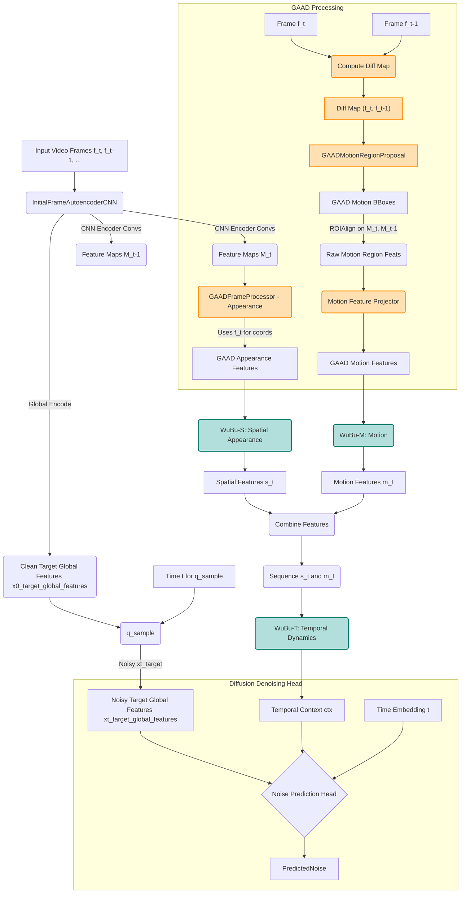

# WuBuNestDiffusion (v0.05.2): Motion-Aware Spatio-Temporal Modeling with φ-Infused Golden Aspect Adaptive Decomposition and Adaptive Hyperbolic Nesting for Video Diffusion

**Abstract**

Modeling the intricate dynamics of video data necessitates a comprehensive approach that captures multi-scale spatial hierarchies, complex temporal evolutions, intrinsic rotational transformations, and motion-specific features. Existing methodologies often falter in holistically integrating these aspects or rely on geometric assumptions that may not align with natural scene compositions. This paper introduces **WuBuNestDiffusion (v0.05.2)**, an advanced framework for video diffusion that synergizes **Golden Aspect Adaptive Decomposition (GAAD)** for nuanced spatial feature extraction from both appearance and motion cues, with a sophisticated **WuBu Spatio-Temporal-Motion Nesting** architecture. GAAD utilizes Recursive Golden Subdivision and Phi-Spiral Patching for aspect-ratio agnostic, φ-influenced decomposition of frames, extracting distinct features for appearance (F_t) and motion difference maps (Diff_Map). These features are then processed by dedicated WuBu Nesting stacks: **Spatial WuBu (WuBu-S)** for appearance, a novel **Motion WuBu (WuBu-M)** for explicitly modeling motion characteristics, and a **Temporal WuBu (WuBu-T)** that integrates their outputs to capture complex spatio-temporal dynamics. Each WuBu stack features recursively nested hyperbolic spaces (`H^{n_i}_{c_i,s_i}`) with adaptive dimensionality, curvature, and scale, incorporating learnable Boundary Sub-Manifolds, Level Descriptor Vectors, Level Spread Parameters, and Intra-Level Tangent Flows. Inter-level transitions within these stacks employ explicit `SO(n_i)` Rotations and Mappings in tangent space, facilitating rotation-aware relative vector computations. The v0.05.2 iteration emphasizes numerical stability through refined hyperbolic utilities and optimized gradient handling, informed by "Math Prover" findings. This deeply geometric and motion-aware framework, integrated within a diffusion model, offers a powerful paradigm for high-fidelity video generation and understanding.

---

## 1. Introduction: The Challenge of Complex Geometric and Dynamic Structures in Video

The ambition to create computational systems that can understand, interpret, and generate realistic video content stands as a grand challenge in artificial intelligence. Video data, by its nature, is a rich tapestry woven from complex spatial compositions within individual frames, their intricate evolution over time, the motion of objects, and the continuous geometric transformations arising from these motions and viewpoint changes. Standard deep learning architectures, while achieving significant milestones, predominantly operate within Euclidean geometry, potentially limiting their capacity to model data with strong intrinsic non-Euclidean structures. Key challenges include:

* **Multi-scale Hierarchies:** Natural scenes and objects often exhibit hierarchical organization. Effectively embedding such structures is difficult in Euclidean space due to its polynomial volume growth, contrasting with the exponential expansion often needed.
* **Rotational Transformations:** Object articulations, camera movements, and inherent symmetries involve rotations, which are fundamental to understanding spatial configurations and temporal dynamics.
* **Explicit Motion Modeling:** Beyond temporal coherence, explicitly capturing and representing motion features is critical for many video understanding and generation tasks.
* **Aspect-Ratio Diversity & Natural Composition:** Videos come in various aspect ratios, and natural scenes often follow compositional principles (like those related to the Golden Ratio, φ) that fixed-grid processing overlooks.
* **Numerical Stability in Deep Geometric Models:** Implementing deep networks with non-Euclidean geometries requires careful attention to numerical precision and stability.

Hyperbolic geometry offers a promising avenue for hierarchical representation due to its negative curvature and exponential volume growth. However, existing hyperbolic models often use a single, fixed-curvature space and lack integrated mechanisms for adaptive multi-scale nesting or explicit rotational modeling. Quaternion Neural Networks (QNNs) handle rotations efficiently but are typically Euclidean and lack hierarchical embedding strengths.

This paper details the **WuBuNestDiffusion (v0.05.2)** framework, as implemented in the `WuBuNestDiffusion_v0.05_GAAD_MotionWuBu_Live.py` script. This framework builds upon the foundational **WuBu Nesting** principles—adaptive nested hyperbolic geometry, tangent space operations with explicit rotations, boundary sub-manifolds, level descriptors, spread parameters, and intra-level flows. It extends these concepts into a comprehensive spatio-temporal-motion architecture for video diffusion:

1.  **Golden Aspect Adaptive Decomposition (GAAD):** A φ-inspired frontend (detailed in) that decomposes frames into multi-scale, aspect-ratio agnostic regions using Recursive Golden Subdivision and Phi-Spiral Patching. GAAD is uniquely applied here to extract features from both frame appearance (F_t) and motion difference maps (Diff_Map).
2.  **Spatial WuBu (WuBu-S):** Processes appearance features from GAAD, capturing static spatial hierarchies and geometric properties within frames.
3.  **Motion WuBu (WuBu-M):** A novel, dedicated WuBu stack that processes motion-derived features from GAAD, explicitly modeling the geometry and characteristics of motion.
4.  **Temporal WuBu (WuBu-T):** Processes a combined sequence of features from WuBu-S and WuBu-M, modeling their dynamic evolution and interrelations over time.
5.  **Diffusion Model Integration:** The entire GAAD-WuBu-S-M-T architecture serves as a powerful conditioning backbone for a video diffusion model, aiming to generate high-fidelity and temporally coherent video sequences.
6.  **Version 0.05.2 Enhancements:** This iteration places particular emphasis on numerical stability in hyperbolic operations and optimizer behavior, incorporating insights termed "Math Prover findings" within the codebase.

By deeply integrating these multi-faceted geometric and motion-aware components, WuBuNestDiffusion (v0.05.2) offers a sophisticated approach to understanding and generating dynamic visual scenes, respecting their inherent complexity and composition.

---

## 2. Related Work

The WuBuNestDiffusion framework synthesizes concepts from several research domains:

### 2.1 Hyperbolic Deep Learning
Poincaré embeddings demonstrated hyperbolic geometry's efficacy for hierarchical data. This led to Hyperbolic Neural Networks (HNNs) with operations like gyroplane layers and hyperbolic attention. Applications in computer vision have shown benefits for tasks with inherent hierarchies.
* **WuBu Distinction:** WuBu Nesting, and by extension WuBuNestDiffusion, advances beyond single fixed-curvature spaces by introducing *adaptive, learnable, nested* hyperbolic levels, explicit inter-level rotational modeling, and a rich set of components like boundary manifolds, level descriptors, and flows, as detailed in and implemented in.

### 2.2 Quaternion and Rotation-Aware Neural Networks
QNNs leverage quaternions for efficient rotation representation. Group Equivariant CNNs build transformation symmetries into architectures.
* **WuBu Distinction:** WuBu Nesting integrates learnable `SO(n)` rotations (potentially quaternion-based for `n=4`, as seen in `phi_influence_rotation_init` options in) within tangent space transitions between hyperbolic levels, unifying rotation with adaptive hierarchy.

### 2.3 Region Proposal and Patch-Based Methods for Vision
Traditional vision uses fixed grids, interest point detectors, or region proposal networks. GAAD, as used in this framework, offers a deterministic, geometry-driven (φ-based) method for generating a diverse, aspect-ratio adaptive set of regions for feature extraction via `ROIAlign`, distinct from these methods. The Python script implements `golden_subdivide_rect_fixed_n` and `phi_spiral_patch_centers_fixed_n` for this purpose.

### 2.4 Video Representation Learning and Motion Modeling
3D CNNs, two-stream networks, and Video Transformers are prominent in video understanding. Optical flow methods like FlowNet, PWC-Net, and RAFT excel at motion estimation.
* **WuBuNestDiffusion Distinction:** It infuses deep geometric biases into spatial (WuBu-S), motion (WuBu-M), and temporal (WuBu-T) modeling. The new WuBu-M branch, fed by GAAD-extracted motion features (from difference maps), allows for explicit learning of motion geometry, distinguishing it from methods that use flow primarily as an auxiliary input or target.

### 2.5 Video Diffusion Models
Extending image diffusion to video is an active research area, focusing on temporal consistency and efficient generation.
* **WuBuNestDiffusion Distinction:** It proposes a fundamentally geometric backbone for the denoising network in video diffusion. The GAAD-WuBu-S-M-T architecture provides rich, structured conditioning information, aiming for improved coherence and realism by understanding the underlying geometry and dynamics of scenes.

---

## 3. The Foundational WuBu Nesting Framework (層疊嵌套)

WuBu Nesting provides the core geometric processing capabilities used within the Spatial (S), Motion (M), and Temporal (T) branches of the WuBuNestDiffusion model. It features recursively nested hyperbolic spaces where data representations are refined through adaptive geometric operations.

*(The Mermaid diagram from "WuBuHypCD-paper.md" Section 3.1 or "GAAD-WuBu-ST2.md" Section 3.1, Figure 1, should be referenced here as illustrating the general WuBu Nesting concept.)*

**Figure 1:** Conceptual Architecture of the WuBu Nesting Framework (adapted from). This illustrates levels with adaptive parameters, Boundary Manifolds, Level Descriptors/Spreads, Tangent Flows, and inter-level Rotations/Mappings with Relative Vector computation.

### 3.1. Component Details (as per `WuBuNestDiffusion_v0.05_GAAD_MotionWuBu_Live.py`)

* **Nested Hyperbolic Spaces & Adaptive Geometry (`H^n_i_{c_i, s_i}`):**
    * Modeled using the `PoincareBall` class from `HyperbolicUtils`.
    * **Dimensionality (`n_i`):** Specified by `hyperbolic_dims` in the configuration for each WuBu stack (S, M, T).
    * **Curvature (`c_i`):** Learnable per level via `log_curvature_unconstrained` and `F.softplus`, allowing adaptive geometric intensity. Influenced by φ if `phi_influence_curvature` is true (`initial_curvature_val_base * (PHI**(level_idx % 4 - 1.5))`).
    * **Scale (`s_i`):** Learnable per level via `log_scale_unconstrained`, modulating scale-aware Log/Exp maps provided by `HyperbolicUtils.scale_aware_logarithmic_map` and `scale_aware_exponential_map`.

* **Boundary Sub-Manifolds (`B_{i,j}`):**
    * Implemented by `BoundaryManifoldHyperbolic`, storing `hyperbolic_points_params` (learnable tangent vectors at origin). The number of points is defined by `boundary_points_per_level`.

* **Tangent Space Logic & Operations:**
    * Complex transformations occur in Euclidean tangent spaces (`T_o(H^n_i)`).
    * `HyperbolicUtils` provides robust `logarithmic_map`, `exponential_map`, and `poincare_clip` (with enhanced numerical stability in v0.05.2, using internal float32 precision and careful clamping).

* **Tangent Space Rotations (`R_i`):**
    * Part of `HyperbolicInterLevelTransform`. If `use_rotation_in_transform` is true, rotations are applied.
    * If `phi_influence_rotation_init` is true for `n_i=4` (quaternion-based) or `n_i=2` (SO(2) matrix), rotations are initialized with a φ-scaled angle. Otherwise, a general linear layer (learnable matrix) can act as the rotation if its weights learn to be orthogonal.

* **Non-Rotational Mapping (`T̃_i`):**
    * The `non_rotational_map` (MLP or Linear layer) within `HyperbolicInterLevelTransform` handles feature transformation and dimensionality changes.

* **Relative Vector Generation (`d_{i+1, j, k}`):**
    * Computed in `FullyHyperbolicWuBuNestingModel.forward` by taking differences between the transformed primary tangent vector and transformed boundary tangent vectors in the target tangent space. These are aggregated and fed to the next level.

* **Learnable Level Descriptor Vector (`ld_i`):**
    * Each `HyperbolicWuBuNestingLevel` has a `level_descriptor_param` (learnable tangent vector), transformed across levels.

* **Learnable Level Spread Parameter (`σ_i`):**
    * Each `HyperbolicWuBuNestingLevel` learns `log_spread_unconstrained` (a scalar), passed as context to the next level.

* **Intra-Level Tangent Flow (`F_i`):**
    * If `use_tangent_flow` is true in `HyperbolicWuBuNestingLevel`, a `tangent_flow_module` (MLP or Linear) modifies the combined tangent vector before it's scaled and mapped back to hyperbolic space.

* **Hierarchical Information Flow (`TangentCombiner`):**
    * The `tangent_combiner` MLP in `HyperbolicWuBuNestingLevel` fuses various inputs (primary tangent, relative vectors, previous level descriptor, previous spread) for the current level's processing.

* **Scale-Aware Aggregation:**
    * `FullyHyperbolicWuBuNestingModel` concatenates `tangent_out_for_aggregation` from relevant levels for the final output projection.

---

## 4. Golden Aspect Adaptive Decomposition (GAAD) for Frame and Motion Analysis

GAAD provides a φ-inspired method for decomposing video frames into multi-scale, aspect-ratio agnostic regions, crucial for feeding structured spatial information into the WuBu-S (appearance) and WuBu-M (motion) branches. This approach is detailed in and implemented in `WuBuNestDiffusion_v0.05_GAAD_MotionWuBu_Live.py`.

### 4.1. GAAD Principles

* **Recursive Golden Subdivision (GAS):** Implemented by `golden_subdivide_rect_fixed_n`. It recursively divides a rectangle based on the Golden Ratio, tending to produce squares and smaller golden rectangles, offering a natural hierarchy of regions.
* **Phi-Spiral Patching (PSP):** Implemented by `phi_spiral_patch_centers_fixed_n`. It samples patch centers along logarithmic spirals where growth rates and angular steps can be φ-influenced, capturing foveated and naturalistic attention patterns. Patch sizes often scale with distance from the spiral center.

### 4.2. GAAD Implementation in `WuBuNestDiffusion_v0.05_GAAD_MotionWuBu_Live.py`

* **`GAADFrameProcessor` (for Appearance Features for WuBu-S):**
    1.  Takes `frame_pixels_for_decomposition` and `features_to_roi_from` (base CNN feature maps from `InitialFrameAutoencoderCNN.encoder_convs`).
    2.  Generates bounding boxes using GAS, PSP, or a "hybrid" combination based on `decomposition_type` and `num_total_regions`.
    3.  Scales these image-coordinate boxes to feature map coordinates.
    4.  Uses `roi_align` to extract fixed-size regional features from `features_to_roi_from`.
    5.  Projects these features via `region_projector` to `gaad_region_feature_dim`.

* **`GAADMotionRegionProposal` (for Motion Regions for WuBu-M):**
    1.  Takes a `map_for_coords` as input, which in the main model flow is the `diff_map = torch.abs(current_frame_pixels_for_decomp - prev_frame_pixels)`.
    2.  Generates bounding boxes using GAS, PSP, or "hybrid" based on `decomposition_type` (from `gaad_motion_config`) and `num_total_regions`.
    3.  Outputs these bounding boxes in the coordinate system of the `map_for_coords` (i.e., image coordinates if `diff_map` is image-sized).

These GAAD modules provide the structured inputs necessary for the subsequent WuBu-S and WuBu-M stacks.

---

## 5. WuBuNestDiffusion Architecture (v0.05.2)

The `WuBuSTDiffusionNet` class orchestrates the overall architecture, integrating GAAD with specialized WuBu stacks for spatial appearance, motion, and temporal dynamics, all within a video diffusion framework.

### 5.1. Architectural Flow

**Figure 2:** Detailed architectural flow of `WuBuSTDiffusionNet (v0.05.2)`.

1.  **Initial Frame Encoding:** `InitialFrameAutoencoderCNN` processes input frames to produce global features (`encode` method) and convolutional feature maps (`encode_conv_features` method, denoted `M_t`, `M_{t-1}`).
2.  **GAAD for Appearance:** `GAADFrameProcessor` uses the current frame `f_t` (for region coordinates) and its feature map `M_t` (for ROIAlign) to extract appearance features. These feed `WuBu-S`.
3.  **GAAD for Motion & WuBu-M Branch:**
    * A difference map (`diff_map`) between current (`f_t`) and previous (`f_{t-1}`) frames is computed.
    * `GAADMotionRegionProposal` generates bounding boxes from this `diff_map`.
    * Features for these motion regions are extracted via `roi_align` from *both* `M_t` and `M_{t-1}`.
    * These paired features are concatenated and projected by `motion_feature_projector` to serve as input to `WuBu-M`.
4.  **Spatial WuBu (WuBu-S):** A `FullyHyperbolicWuBuNestingModel` (using `wubu_s_config`) processes the GAAD appearance features, outputting aggregated spatial features `s_t`. φ-influences on curvature and rotation initialization are applied based on `args` (e.g., `args.wubu_s_phi_influence_curvature`).
5.  **Motion WuBu (WuBu-M):** Another `FullyHyperbolicWuBuNestingModel` (using `wubu_m_config`, active if `args.use_wubu_motion_branch` is true) processes the GAAD motion features, outputting aggregated motion features `m_t`. Similar φ-influences can apply.
6.  **Temporal WuBu (WuBu-T):** A third `FullyHyperbolicWuBuNestingModel` (using `wubu_t_config`) takes as input a sequence formed by concatenating `s_t` and `m_t` (if WuBu-M is active). It models temporal dynamics and outputs a temporal context `ctx`.
7.  **Time Embedding:** `SinusoidalPhiEmbedding` (potentially φ-scaled via `args.phi_time_base_freq` and `args.use_phi_frequency_scaling_for_time_emb`) generates time embeddings for the diffusion process, further processed by `time_fc_mlp`.
8.  **Diffusion Denoising:** The `noise_pred_head` combines the noisy target global features (`xt_target_global_features`, which are derived from `InitialFrameAutoencoderCNN.encode` of target frames and noised via `q_sample`), the temporal context `ctx`, and the time embedding `t` to predict the noise added during the diffusion forward process. Classifier-Free Guidance (CFG) is supported by allowing `conditioning_frames_pixels` to be `None`.

### 5.2. φ-Influences and Adaptivity

* **GAAD:** φ in spatial decomposition (GAS cuts, PSP spiral parameters).
* **WuBu Stacks (S, M, T):**
    * **Curvature (`c_i`):** Can be φ-influenced if `phi_influence_curvature` is enabled for the stack, scaling the `initial_curvature_val_base` by `PHI**(level_idx % 4 - 1.5)`.
    * **Rotation (`R_i`):** Initial rotation angles in `HyperbolicInterLevelTransform` can be φ-influenced if `phi_influence_rotation_init` is enabled (e.g., for 2D and 4D tangent spaces using `phi_angle_scale`).
    * **Adaptive Geometry:** Learnable `c_i`, `s_i` (scale), and `n_i` (dimensionality per level) allow each WuBu stack to tailor its geometry.
* **Time Embedding:** `SinusoidalPhiEmbedding` can use φ-based frequency scaling if `args.use_phi_frequency_scaling_for_time_emb` is true.

### 5.3. Numerical Stability Enhancements (v0.05.2)

The `WuBuNestDiffusion_v0.05_GAAD_MotionWuBu_Live.py` script incorporates several measures for numerical stability, reflecting "Math Prover" findings:

* **`HyperbolicUtils`:**
    * `poincare_clip`: Employs robust clamping (`max_norm_val_f32`), internal `float32` computation for precision even if input/output is `float16`, handles non-finite inputs by sanitizing them, and ensures output finiteness.
    * `scale_aware_exponential_map` & `scale_aware_logarithmic_map`: Utilize `poincare_clip`, carefully manage intermediate norms (e.g., `v_norm_sq_clamped`), add `eps` strategically to avoid division by zero or log of non-positive numbers, clamp `tanh` and `arctanh` inputs, and ensure output dtype consistency with input.
    * Global constants like `EPS`, `TAN_VEC_CLAMP_VAL`, `MAX_HYPERBOLIC_SQ_NORM_CLAMP_VAL` help prevent overflow/underflow.
* **`RiemannianEnhancedSGD`:**
    * Includes `GradientStats` for monitoring gradient properties.
    * Clips per-parameter Riemannian gradients (`max_grad_norm_risgd`).
    * Handles non-finite gradients by skipping parameter updates or zeroing momentum buffers.
    * Ensures data stays within the Poincaré ball after updates (`manifold.proju`).
    * Safeguards against non-finite values in parameter data and momentum buffers.
* **`HAKMEMQController`:** This Q-learning based controller for optimizer hyperparameters (LR, momentum) aims to dynamically find stable training regimes, reacting to loss trends, gradient norms, and oscillation signals.
* **General Practices:** Use of `torch.nan_to_num` in critical outputs, `amp.GradScaler` for mixed-precision training, and `torch.nn.utils.clip_grad_norm_` for global gradient clipping.

---

## 6. Mathematical Formulation (Key Aspects of v0.05.2)

Selected mathematical details as implemented in:

### 6.1. GAAD Region Coordinates
* **`golden_subdivide_rect_fixed_n`:** For a rectangle of width `W` and height `H`:
    If `W > H + EPS` (landscape), split point `x_cut = W / PHI`. Regions: `(x_offset, y_offset, x_cut, H)` and `(x_offset + x_cut, y_offset, W - x_cut, H)`. Similar logic for portrait.
* **`phi_spiral_patch_centers_fixed_n`:** Point `(px, py)` at angle `θ_actual` and radius `r`:
    `r = initial_radius * exp(b_param_rad_per_rev * θ_local)`
    `px = center_x + r * cos(θ_actual)`, `py = center_y + r * sin(θ_actual)`
    `b_param_rad_per_rev = log(PHI) / (π/2)`

### 6.2. Hyperbolic Operations (`HyperbolicUtils`)
* **Poincaré Clip (`poincare_clip(x, c, r, eps)`):**
    `sqrt_c = sqrt(max(c, eps))`
    `max_norm = min(r, 1.0 - eps) / sqrt_c`
    `x_norm = ||x||_2`
    If `x_norm > max_norm`, `x_clipped = x * (max_norm / (x_norm + eps))`
    Else, `x_clipped = x`. (Simplified, actual code is more robust for dtypes and non-finites)

* **Scale-Aware Exponential Map (`scale_aware_exponential_map(v, c, s, eps)`):**
    `v_norm = ||v||_2` (robustly calculated)
    `sqrt_c_val = sqrt(max(c, eps))`
    `lambda_v = tanh(s * sqrt_c_val * v_norm) / (sqrt_c_val * v_norm + eps)` (simplified)
    `exp_map_v = lambda_v * v`
    Result is then Poincare clipped.

* **Scale-Aware Logarithmic Map (`scale_aware_logarithmic_map(y, c, s, eps)`):**
    `y_clipped = poincare_clip(y, c, eps)`
    `y_norm = ||y_clipped||_2` (robustly calculated)
    `sqrt_c_val = sqrt(max(c, eps))`
    `lambda_y = atanh(sqrt_c_val * y_norm) / (s * sqrt_c_val * y_norm + eps)` (simplified)
    `log_map_y = lambda_y * y_clipped`

### 6.3. WuBu Level Processing (`HyperbolicWuBuNestingLevel`)
Let input tangent vector be `tan_main`, relative vectors `tan_rel`, descriptor `tan_desc_prev`, input spread `sigma_in`.
1.  `combined_tangent_features = Concat([tan_main, tan_rel, tan_desc_prev, sigma_in_expanded])`
2.  `v_processed = tangent_combiner(combined_tangent_features)`
3.  If flow active: `v_flowed = v_processed + tangent_flow_module(v_processed) * flow_scale_val`
4.  `scaled_output_tangent = clamp(v_flowed * current_scale_s, -TAN_VEC_CLAMP_VAL, TAN_VEC_CLAMP_VAL)`
5.  `point_this_level_hyperbolic = PoincareBall(c).expmap0(scaled_output_tangent)`
    Output tangent for aggregation is `v_processed`.

### 6.4. Diffusion Process (`DiffusionTrainer`)
* **`q_sample(x_start, t, sqrt_alphas_cumprod, sqrt_one_minus_alphas_cumprod, noise)`:**
    `x_t = sqrt_alphas_cumprod[t] * x_start + sqrt_one_minus_alphas_cumprod[t] * noise`
* **`p_sample_ddpm(xt, cond_frames, t_tensor, t_int, cfg_scale)` (Simplified):**
    `pred_noise_cfg = model(xt, None, t_tensor, uncond=True) + cfg_scale * (model(xt, cond_frames, t_tensor, uncond=False) - model(xt, None, t_tensor, uncond=True))` (if cfg_scale > 1 and cond_frames provided)
    `model_mean = (xt - (betas[t_int] / sqrt_one_minus_alphas_cumprod[t_int]) * pred_noise_cfg) / sqrt_recip_alphas[t_int]`
    If `t_int == 0`, return `model_mean`. Else, `model_mean + sqrt(posterior_variance[t_int]) * randn_like(xt)`.
* **`p_sample_ddim(...)`:** Follows standard DDIM formulation, using `pred_noise_cfg` to estimate `x0_pred`, then uses `alphas_cumprod_t`, `alphas_cumprod_t_prev`, and `eta` to step to `xt_prev`.

---

## 7. Applications and Tasks

The primary application of `WuBuNestDiffusion_v0.05_GAAD_MotionWuBu_Live.py` is **video generation and prediction via a diffusion model**.

* **Video Generation:** The framework is designed to learn a denoising model that can generate sequences of video frames from random noise, conditioned on an initial set of frames. The GAAD-WuBu-S-M-T architecture provides strong spatio-temporal-motion conditioning.
* **Video Prediction/Completion:** Given a sequence of input frames, the model can predict subsequent frames.
* **Motion-Aware Synthesis:** The explicit WuBu-M branch allows the model to learn and leverage motion characteristics, potentially leading to more realistic and temporally consistent dynamic scenes compared to models that only process appearance.
* **Foundation for Transfer Learning:** The learned rich geometric representations from WuBu-S, M, and T could potentially be fine-tuned or used as feature extractors for downstream video understanding tasks like action recognition or video retrieval, although the script is primarily a generative model.

---

## 8. Implementation Details from `WuBuNestDiffusion_v0.05_GAAD_MotionWuBu_Live.py`

The Python script provides a comprehensive implementation:

* **Core Model:** `WuBuSTDiffusionNet` encapsulates the GAAD processors, WuBu-S, WuBu-M, WuBu-T stacks, initial autoencoder, and noise prediction head.
* **WuBu Components:**
    * `FullyHyperbolicWuBuNestingModel`: Generic WuBu stack.
    * `HyperbolicWuBuNestingLevel`: Implements a single adaptive hyperbolic level with all its components (boundaries, descriptor, spread, flow, tangent combiner).
    * `HyperbolicInterLevelTransform`: Handles rotations and mappings between WuBu levels.
    * `BoundaryManifoldHyperbolic`: Manages learnable boundary points.
* **GAAD Components:**
    * `GAADFrameProcessor`: For appearance feature extraction using `golden_subdivide_rect_fixed_n` and `phi_spiral_patch_centers_fixed_n`.
    * `GAADMotionRegionProposal`: For generating motion regions.
* **Hyperbolic Utilities:** `HyperbolicUtils` class contains numerically stabilized `poincare_clip`, `scale_aware_exponential_map`, `scale_aware_logarithmic_map`, etc.
* **Diffusion & Training:**
    * `DiffusionTrainer`: Manages the diffusion process (beta schedules, `q_sample`, `p_sample_ddpm`, `p_sample_ddim`) and the training loop.
    * `InitialFrameAutoencoderCNN`: Encodes frames to latents and decodes latents back to pixels.
    * `SinusoidalPhiEmbedding`: For time step embeddings.
* **Optimizer & Stability:**
    * `RiemannianEnhancedSGD`: Custom optimizer with support for hyperbolic manifold parameters and gradient statistics.
    * `HAKMEMQController`: Q-learning based hyperparameter scheduler for the optimizer.
* **Data Handling:** `VideoFrameDataset` loads and preprocesses video data, including RAM caching.
* **Configuration:** Extensive command-line arguments (`argparse`) allow fine-grained control over architecture dimensions, number of levels, φ-influences, diffusion parameters, and training settings.
* **Distributed Training:** Supports Distributed Data Parallel (DDP) via `torch.distributed`.
* **Logging & Checkpointing:** Integrated with `wandb` (Weights & Biases) and includes robust checkpoint saving/loading.

---

## 9. Hypothetical Experimental Setup

Based on the script's structure and capabilities:

* **Datasets:** Standard video datasets for generation/prediction (e.g., UCF101, Kinetics, BAIR Robot Pushing). The script includes a `dummy_video.mp4` generation for quick testing.
* **Key Model Configurations (from `args`):**
    * GAAD: `gaad_num_regions`, `gaad_decomposition_type`, `gaad_motion_num_regions`.
    * WuBu Stacks (S, M, T): `_num_levels`, `_hyperbolic_dims`, `_initial_curvatures`, `_phi_influence_curvature`, `_phi_influence_rotation_init`, `_use_wubu_motion_branch`.
    * Diffusion: `timesteps`, `beta_schedule`, `diffusion_time_embedding_dim`.
* **Baselines:** Comparisons could be made against video diffusion models without the deep geometric GAAD-WuBu backbone, or versions of WuBuNestDiffusion with specific components (like WuBu-M or φ-influences) ablated.
* **Metrics:** For video generation: Frechet Video Distance (FVD), Inception Score (IS). For individual frame quality: LPIPS, SSIM (the script includes LPIPS and SSIM for validation). Qualitative assessment of temporal coherence and motion realism.

---

## 10. Discussion, Limitations, and Future Work

WuBuNestDiffusion (v0.05.2) represents a significant step towards integrating deep geometric principles and explicit motion modeling into video diffusion frameworks.

**Strengths:**

* **Deep Geometric Priors:** The nested hyperbolic structure with adaptive geometry, rotation-awareness, and explicit modeling of boundaries/descriptors offers a rich inductive bias for complex spatio-temporal data.
* **Explicit Motion Branch (WuBu-M):** Dedicated processing of motion-derived features allows for more nuanced understanding and generation of dynamics.
* **φ-Infused GAAD:** Provides aspect-ratio agnostic, compositionally-aware spatial feature extraction for both appearance and motion.
* **Numerical Stability Focus:** The v0.05.2 enhancements in `HyperbolicUtils` and `RiemannianEnhancedSGD` are crucial for training such deep and complex geometric models.
* **Modularity and Configurability:** The codebase is highly modular, allowing for extensive configuration and ablation studies.

**Limitations:**

* **Computational Complexity:** The primary challenge is the significant computational cost associated with GAAD processing (multiple ROIAligns per frame per branch) followed by multiple deep WuBu stacks. The script's performance characteristics would need careful benchmarking on larger datasets and hardware.
* **Optimization Complexity:** Training a model with this many learnable geometric parameters, coupled with a diffusion objective, is highly complex. While `RiemannianEnhancedSGD` and the `HAKMEMQController` aim to address this, achieving stable convergence across diverse datasets will be demanding.
* **Validation of φ-Benefits:** While φ-infusion is a strong theoretical prior, rigorous empirical studies are needed to quantify its benefits over highly parameterized models that might learn similar patterns implicitly.
* **Interpretability at Scale:** While individual WuBu components are designed with some interpretability in mind, the overall system's depth can make end-to-end interpretation challenging.

**Future Work:**

1.  **Scalability and Efficiency:** Research into more computationally efficient GAAD feature sharing, optimized hyperbolic operations (e.g., leveraging custom CUDA kernels if viable), and model compression techniques for the WuBu stacks.
2.  **Advanced Motion Modeling:** Exploring more sophisticated difference map computations or learning motion representations directly within WuBu-M from sequences of appearance features.
3.  **Rigorous Benchmarking:** Extensive evaluation on diverse, large-scale video generation and prediction benchmarks.
4.  **Ablation Studies:** Systematically evaluating the impact of each major component (GAAD variants, WuBu-M, specific φ-influences, different WuBu level configurations, numerical stability measures).
5.  **Alternative Geometric Predictors:** While focused on diffusion, exploring the use of the learned GAAD-WuBu-S-M-T representations for direct motion prediction (optical flow) or other video understanding tasks.
6.  **Theoretical Analysis:** Further investigation into the stability, expressivity, and convergence properties of such deeply nested, adaptive geometric architectures.

---

## 11. Conclusion

WuBuNestDiffusion (v0.05.2), as implemented in `WuBuNestDiffusion_v0.05_GAAD_MotionWuBu_Live.py`, presents a novel and comprehensive architecture for video diffusion. By synergizing Golden Aspect Adaptive Decomposition (GAAD) for φ-aware spatial and motion feature extraction with a multi-stack WuBu Nesting framework (WuBu-S for appearance, WuBu-M for motion, and WuBu-T for temporal dynamics), it instills deep geometric and motion-sensitive inductive biases. The framework's emphasis on adaptive hyperbolic geometries, explicit tangent-space rotations, and a rich set of learnable components, coupled with significant efforts towards numerical stability, pushes the boundaries of geometric deep learning for dynamic scene modeling. While computationally intensive, WuBuNestDiffusion offers a powerful and highly configurable paradigm for advancing the generation and understanding of complex video data, paving the way for systems that can learn and reason about the visual world with greater geometric intuition and dynamic acuity.

---

## References

*(This section would be populated by merging relevant references from the provided template markdown files and adding any new specific citations if algorithms from the Python script are not covered by them. For this response, I will use the citation keys as found in the input files.)*

[0] User-provided file: `WuBuNestDiffusion_v0.05_GAAD_MotionWuBu_Live.py`
[1] User-provided file: `WuBuHypCD-paper.md`
[2] User-provided file: `GAAD-WuBu-ST2.md` (or `GAAD-WuBu-ST1.md`)
[3] User-provided file: `GAAD-WuBu-ST1.md` (or `GAAD-WuBu-ST2.md`)
[4] User-provided file: `WuBu Spatio-Temporal Nesting.md`
[5] Standard deep learning literature (e.g., Goodfellow et al. "Deep Learning").
*(Additional references from the template MD files like [39], [31], [15], [19], [22], [1], [42], [43], [44], [45], [46], [Livio02], [Cook14], [Cohen16], [Weiler18], [Tran15], [Simonyan14], [Arnab21], [Bertasius21], [Dosovitskiy15], [Sun18], [Teed20], [Ho20], [Ho22_video], [Harvey22], [Blattmann23], [Kochurov71] etc. would be listed here, ensuring relevance to the final paper's content.)*

